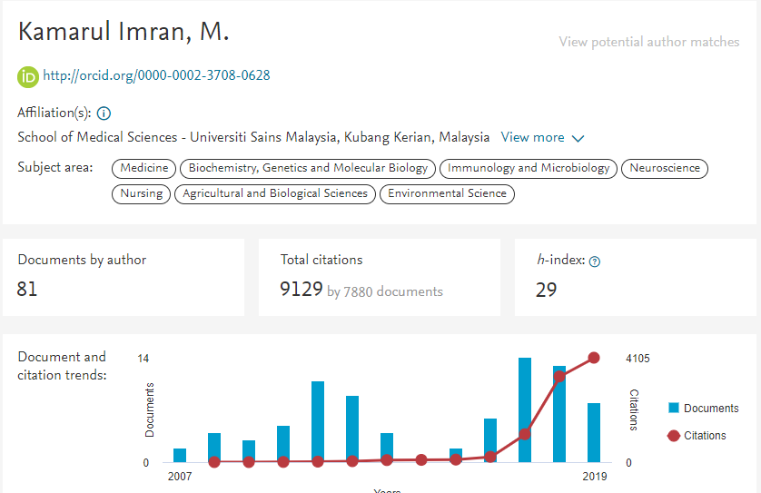

```{r setup, include=FALSE}
knitr::opts_chunk$set(echo = TRUE)
```

\newpage

# Introduction

## About myself

My name is Kamarul Imran, but just call me KIM. 

I hold the position of Associate Professor in Epidemiology and Statistics at the School of Medical Sciences, Universiti Sains Malaysia. 

My academic profile is available here http://www.medic.usm.my/jpm/index.php/en/academic-information/587-prof-madya-dr-kamarul-imran-musa

Currently also a teaching associate (sessional lecturer) at Monash Universiti Malaysia. I teach business analytics course for a Master programme. 


## Research profiles

My research profile at Google Scholar is available here  https://scholar.google.com/citations?user=XVf2_QcAAAAJ&hl=en&authuser=1. 

My SCOPUS author ID is 57194536466

```{r  scopus, echo=FALSE, message =FALSE, out.width='70%', fig.align='center'}
library(here)
knitr::include_graphics(here("image","scopus.PNG")) 
```



## Research interests

My research interests include medical epidemiology, statistical modelling and machine learning. 

Recently, I was awarded with the FRGS grant (RM125,000) to understand the roles of  mammography images and clinical conditions on the performance of machine learning and statistical models to predict breast cancer. 

Email: drkamarul@usm.my 

Twitter: @kamarul_imran

Personal page: https://myanalytics.com.my/

```{r  webpage1, echo=FALSE, out.width='60%', fig.align='center'}
knitr::include_graphics(here("image","myweb.PNG")) 
```

## Our R course

We conduct regular R courses. But we also receive invitation to conduct trainings on R and on data and statistical analysis.

```{r  webpage2, echo=FALSE, out.width='50%',  fig.align='center'}
knitr::include_graphics(here("image","short-course.PNG")) 
```


# Regression (5 mins)

In statistical modeling, regression analysis is a set of statistical processes for estimating the relationships among variables. 

It includes many techniques for modeling and analyzing several variables, when the focus is on the relationship between a dependent variable and one or more independent variables (or 'predictors').

Most commonly, regression analysis estimates the conditional expectation of the dependent variable given the independent variables – that is, the average value of the dependent variable when the independent variables are fixed. 

Source: https://en.wikipedia.org/wiki/Regression_analysis

# Motivation (5 mins)

## Linear regression

Analysis of data with the outcome variable as a continuous variable and the expected outcome follows Gaussian distribution (as a function of covariates). 

## Logistic regression

Analysis of data with the outcome variable is  a binary categorical variable and the expected outcome follows Bernoulli distribution (as a function of covariates). 

## Poisson regression

Analysis of data with the outcome variable is a count variable and the expected outcome follows the Poisson distribution (as a function of covariates).

## Cox proportional hazard regression

Analysis of data with the outcome variable is time-to-event variable, a Cox semi-parametric regression is the most regression. 

# Setting up R environment (10 min)

We will be using RStudio Cloud. 

I have prepared the environment for our workshop in RStudio Cloud.

Click this link http://bit.ly/Reg_in_med.

Please:

- Click on the link
- Register
- Log in
- Click on the project **Regression Analysis in Health and Medicine**

```{r  cloud1, echo=FALSE, out.width='50%', fig.align='center'}
knitr::include_graphics(here("image","rstudio_cloud1.PNG")) 
```

```{r  cloud2, echo=FALSE, out.width='50%',  fig.align='center'}
knitr::include_graphics(here("image","rstudio_cloud2.PNG")) 
```

```{r  cloud3, echo=FALSE, out.width='50%',  fig.align='center'}
knitr::include_graphics(here("image","rstudio_cloud3.PNG")) 
```


On its webpage, it is stated the THE MISSION as 

*We created RStudio Cloud to make it easy for professionals, hobbyists, trainers, teachers and students to do, share, teach and learn data science using R.*

# Style of presentation

**Code-along** 

Type and try to understand

```{r  coding, echo=FALSE, out.width='50%', fig.cap='https://giphy.com/gifs/batman-arkham-footage-QHE5gWI0QjqF2', fig.align='center'}
knitr::include_graphics(here("image","code.gif")) 
```

# Load required libraries

```{r}
library(tidyverse)
library(here)
library(haven)
library(readxl)
library(kableExtra)
library(broom)
library(cdata)
library(corrplot)
library(survival)
```


# Linear regression (25 mins)

## Statistical concepts

In multiple regression model, we assume that a linear relationship exists between some variable $Y$, which we call the dependent variable (or the outcome or the regressand), and $k$ independent variables (or the predictor, covariate, explanatory or the regressor) such as $X_1 ,X_2 ,...,X_k$.

The independent variables are sometimes referred to as explanatory variables, because of their use in explaining the variation in $Y$. They are also called predictor variables, because of their use in predicting $Y$ and covariates.

## Model assumptions 

Figure \@ref(fig:LinearityAssumption) sums the first 3 assumptions:

```{r  LinearityAssumption, echo=FALSE, out.width='50%', fig.cap='Linearity Assumptions', fig.align='center'}
knitr::include_graphics(here("image","linearity2.png")) 
```

Generally, the equation of multiple linear regression model is:

$$Y_i = \beta_0 + \beta_1X_{1i} + ... + \beta_kX_{ki} + \epsilon_i$$

## Read data

This is the data that our research team collected among the Malaysian general population. It is part of a larger dataset. 

We would like to understand the problem of Metabolic Syndrome among Malaysians. 

There were more than 4000 participants. 

We use **readxl::read_xlsx()** to read MS Excel datasets. 

And then use **dplyr::glimpse()** to briefly view the data.  

```{r, warning=FALSE}
met <- read_xlsx(here('datasets', 'metab_syndrome.xlsx'))
glimpse(met)
```

You will see that there are a mix of variables

- character (correctly and wrongly assigned)
- double 

That justify that MS Excel is not a good collection or data storage medium. You may want to use other alternatives like EpiData Entry or ODK. 


## Data wrangling

Let us get the summary of the data. You can use **summary()** to provide you with a brief but insightful summary or descriptive statistics for your data. 

You will notice that there is no summary statistics for variables of class character. 


```{r}
summary(met)
```

We will convert the character variables (wrongly classed) to the correct numeric class variables. 

We will use **dplyr::mutate_at()**

```{r}
met <- met %>% mutate_at(vars(-ID), ~as.numeric(.))
```

Let us see the summary statistics again

```{r}
summary(met)
```

Look at variables for outliers and NA for variable PULSE, MOGTT2H, TOTCHOL, FBS.

## Exploratory data analysis

For example, let us explore variable Hba1c

```{r}
met %>% ggplot(aes(x = HBA1C)) + geom_histogram() 
```


Let us do some more data wrangling using

- filter()
- mutate()


```{r}
met <- met %>% filter(HBA1C > 2.5, HBA1C < 25.0, 
                      LDL > 0.5, HDL > 0.2,  
                      TOTCHOL > 2.0, TOTCHOL < 15.0,
                      FBS > 2, FBS < 20,
                      PULSE < 140) %>% 
  mutate(BMI = WEIGHT/(HEIGHT^2)) %>% 
  mutate(OVERWEIGHT = if_else(BMI >=25.0,'overwt','not_overwt')) 
```

Let us check the summary stat again

```{r}
summary(met)
```

What happen to Hba1c?

```{r}
met %>% ggplot(aes(x = HBA1C)) + geom_histogram() +
  facet_wrap(~DMDX)
```

## Further EDA

We could do correlational analysis to give us idea for possible multicollinearity issues.

Multicollinerity is the situation where one pair or more than one pairs of variables are higly correlated with each other. 

If we include collinear variables in the model (as covariates), the regression parameters will be biased (wrong). 

```{r}
met_num <- met %>% select_if(is.numeric)
```

The results of correlation matrix are:

```{r}
cor.met <- cor(met_num, use="complete.obs", method="pearson")
head(round(cor.met,2))
```

This the correlogram to represent the correlation matrix:

```{r}
corrplot(cor.met, method="circle")
```


## Estimation

When we assume that the expected values for the outcome variable given the covariates are normally distributed, then we can perform linear regression. 

In R, this can be done using `lm()`. This is the model where the expected values of HBA1C is model as a function of FBS (fasting blood sugar).

```{r}
met_hba1c <- lm(HBA1C ~ FBS, data = met)
summary(met_hba1c)
```

Run another linear regression model with these covariates:

```{r}
met_hba1c_mv <- lm(HBA1C ~ FBS + AGE + MSBPR + MDBPR, data = met)
summary(met_hba1c_mv)
```

Should we add Diabetes Status (DMDX)?

```{r}
met_hba1c_mv2 <- lm(HBA1C ~ FBS + AGE + MSBPR + MDBPR + BMI + HDL + LDL +
                      factor(DMDX), data = met)
summary(met_hba1c_mv2)
```


### Adding interaction

We will add an interaction term (DMDX with AGE) in the covariates

```{r}
met_hba1c_ia <- lm(HBA1C ~ FBS + AGE + MSBPR + MDBPR + BMI + HDL + LDL + 
                     BMI + factor(DMDX):AGE, data = met)
summary(met_hba1c_ia)
```

## Inference

We can take advantage of **broom** package to produce better outputs

```{r}
tidy(met_hba1c_mv2, conf.int = TRUE)
```

To get the predicted values

```{r}
pred_met <- augment(met_hba1c_mv2)
head(pred_met)
```


## Model checking

Remember the LINE assumptions


```{r}
ggplot(data = pred_met, aes(x = .fitted)) +
  geom_histogram()
```

Next,

```{r}
ggplot(data = pred_met, aes(x = .fitted, y = .std.resid)) +
  geom_point()
```

Perhaps, we should do further treatment of our data. 

```{r}
pred_met %>% filter(between(.std.resid, -3, 3)) %>% 
                      ggplot(aes(x = .fitted, y = .std.resid)) +
                      geom_point() 
```


```{r child = "regression_analysis2.Rmd"}
```

```{r child = "regression_analysis3.Rmd"}
```


# QA (5 mins)
