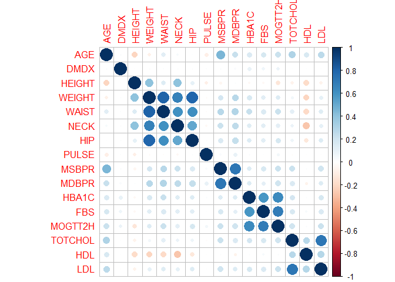

# Introduction

## About myself

My name is Kamarul Imran. I am the Associate Professor in Epidemiology and Statistics at the School of Medical Sciences, Universiti Sains Malaysia. My academic profile is available here http://www.medic.usm.my/jpm/index.php/en/academic-information/587-prof-madya-dr-kamarul-imran-musa

## Research profiles

My research profile at Google Scholar is available here  https://scholar.google.com/citations?user=XVf2_QcAAAAJ&hl=en&authuser=1. My SCOPUS author ID is here 

## Research interest

My research interests include medical epidemiology, statistical modelling and machine learning. Recently, I was awarded with the FRGS grant (RM125,000) to understand the roles of machine learning and statistical models on mammography images to predict breast cancer.  

# Regression (5 mins)

In statistical modeling, regression analysis is a set of statistical processes for estimating the relationships among variables. It includes many techniques for modeling and analyzing several variables, when the focus is on the relationship between a dependent variable and one or more independent variables (or 'predictors').

Most commonly, regression analysis estimates the conditional expectation of the dependent variable given the independent variables – that is, the average value of the dependent variable when the independent variables are fixed. 

Source: https://en.wikipedia.org/wiki/Regression_analysis

# Motivation (5 mins)

## Linear regression

When the outcome is continuous and follows Gaussian distribution as a function of covariates. 

## Logistic regression

When the outcome is categorical, binary especially and it follows Bernoulli distribution is a function of covariates. 

## Poisson regression

When the outcome is count and it follows the Poisson distribution as a function of covariates

## Cox proportional hazard regression

When the outcome is time-to-event, a Cox semi-parametric regression is the most regression. 

# Setting up R environment

We will be using RStudio Cloud. 

On its webpage, it is stated the THE MISSION as 

*We created RStudio Cloud to make it easy for professionals, hobbyists, trainers, teachers and students to do, share, teach and learn data science using R.*

I have prepared the environment for our workshop in RStudio Cloud. Click this link http://bit.ly/Reg_in_med

# Style of presentation

**Code-along** 

# Load required libraries


```r
library(tidyverse)
```

```
## -- Attaching packages ------------------------------------------------------------------ tidyverse 1.2.1 --
```

```
## v ggplot2 3.2.1     v purrr   0.3.2
## v tibble  2.1.3     v dplyr   0.8.3
## v tidyr   1.0.0     v stringr 1.4.0
## v readr   1.3.1     v forcats 0.4.0
```

```
## -- Conflicts --------------------------------------------------------------------- tidyverse_conflicts() --
## x dplyr::filter() masks stats::filter()
## x dplyr::lag()    masks stats::lag()
```

```r
library(here)
```

```
## here() starts at C:/Users/drkim/OneDrive - Universiti Sains Malaysia/1_Codes_Programming/my_GIT_repo/MY_R_Conference
```

```r
library(haven)
library(readxl)
library(kableExtra)
```

```
## 
## Attaching package: 'kableExtra'
```

```
## The following object is masked from 'package:dplyr':
## 
##     group_rows
```

```r
library(cdata)
library(corrplot)
```

```
## corrplot 0.84 loaded
```

```r
library(survival)
```


# Linear regression (15 mins)

## Statistical concepts

In multiple regression model, we assume that a linear relationship exists between some variable $Y$, which we call the dependent variable (or the outcome or the regressand), and $k$ independent variables (or the predictor, covariate, explanatory or the regressor) such as $X_1 ,X_2 ,...,X_k$.

The independent variables are sometimes referred to as explanatory variables, because of their use in explaining the variation in $Y$. They are also called predictor variables, because of their use in predicting $Y$ and covariates.

## Model assumptions 

The assumptions in simple linear regression still apply in multiple linear regression. As in simple linear regression, we test the assumptions after running the analysis (in our case using a statistical software).

The assumptions for multiple linear regression are:

1.  The $X_i$ are non-random (fixed) variables. This condition indicates that any inferences that are drawn from sample data apply only to the set of $X$ values observed and not to some larger collection of $X_s$.
2.  For each set of $X_i$ values there is a subpopulation of $Y$ values which are normally distributed. To construct certain confidence intervals and test hypotheses, it must be known, or the researcher must be willing to assume, that these subpopulations of Y values are normally distributed.
3. The variances of the sub-populations of $Y$ are all equal.
4. The $Y$ values are independent. That is, the values of $Y$ selected for one set of $X$ values do not depend on the values of $Y$ selected at another set of $X$ values.

Figure \@ref(fig:LinearityAssumption) sums the first 3 assumptions:

<div class="figure" style="text-align: center">

<p class="caption">Linearity Assumptions</p>
</div>

Generally, the equation of multiple linear regression model is:

$$Y_i = \beta_0 + \beta_1X_{1i} + ... + \beta_kX_{ki} + \epsilon_i$$

## Read data


```r
met <- read_xlsx(here('datasets', 'metab_syndrome.xlsx'))
```

```
## Warning in read_fun(path = enc2native(normalizePath(path)), sheet_i =
## sheet, : Expecting numeric in C2373 / R2373C3: got '#NULL!'
```

```
## Warning in read_fun(path = enc2native(normalizePath(path)), sheet_i =
## sheet, : Expecting numeric in F2406 / R2406C6: got '#NULL!'
```

```
## Warning in read_fun(path = enc2native(normalizePath(path)), sheet_i =
## sheet, : Expecting numeric in G2406 / R2406C7: got '#NULL!'
```

```
## Warning in read_fun(path = enc2native(normalizePath(path)), sheet_i =
## sheet, : Expecting numeric in H2406 / R2406C8: got '#NULL!'
```

```
## Warning in read_fun(path = enc2native(normalizePath(path)), sheet_i =
## sheet, : Expecting numeric in F2421 / R2421C6: got '#NULL!'
```

```
## Warning in read_fun(path = enc2native(normalizePath(path)), sheet_i =
## sheet, : Expecting numeric in G2421 / R2421C7: got '#NULL!'
```

```
## Warning in read_fun(path = enc2native(normalizePath(path)), sheet_i =
## sheet, : Expecting numeric in H2421 / R2421C8: got '#NULL!'
```

```
## Warning in read_fun(path = enc2native(normalizePath(path)), sheet_i =
## sheet, : Expecting numeric in G2493 / R2493C7: got '#NULL!'
```

```
## Warning in read_fun(path = enc2native(normalizePath(path)), sheet_i =
## sheet, : Expecting numeric in E4002 / R4002C5: got '#NULL!'
```

```
## Warning in read_fun(path = enc2native(normalizePath(path)), sheet_i =
## sheet, : Expecting numeric in G4041 / R4041C7: got '#NULL!'
```

```
## Warning in read_fun(path = enc2native(normalizePath(path)), sheet_i =
## sheet, : Expecting numeric in G4227 / R4227C7: got '#NULL!'
```

```
## Warning in read_fun(path = enc2native(normalizePath(path)), sheet_i =
## sheet, : Expecting numeric in E4250 / R4250C5: got '#NULL!'
```

```r
glimpse(met)
```

```
## Observations: 4,341
## Variables: 17
## $ ID      <chr> "A11", "B11", "C12", "D11", "E11", "F11", "G12", "H12"...
## $ AGE     <chr> "46", "47", "48", "63", "39", "74", "43", "55", "22", ...
## $ DMDX    <dbl> 0, 0, 0, 1, 0, 0, 0, 1, 0, 0, 0, 1, 0, 0, 0, 0, 0, 0, ...
## $ HEIGHT  <chr> "1.6", "1.68", "1.47", "1.5", "1.51", "1.43", "1.77", ...
## $ WEIGHT  <dbl> 70.0, 52.0, 88.6, 81.0, 63.5, 50.0, 90.3, 69.0, 74.0, ...
## $ WAIST   <dbl> 89.0, 89.0, 84.0, 125.0, 87.0, 85.0, 101.0, 94.0, 87.0...
## $ NECK    <dbl> 38.0, 38.0, 32.0, 34.0, 40.0, 34.5, 39.0, 43.3, 34.0, ...
## $ HIP     <dbl> 97.0, 98.0, 94.0, 95.0, 105.0, 95.0, 112.0, 103.0, 106...
## $ PULSE   <chr> "80", "83", "78", "94", "99", "96", "82", "89", "75", ...
## $ MSBPR   <dbl> 133.0, 163.0, 146.5, 206.5, 129.0, 190.5, 160.0, 138.0...
## $ MDBPR   <dbl> 83.5, 84.0, 93.5, 94.0, 70.0, 92.0, 101.0, 86.0, 63.5,...
## $ HBA1C   <chr> "5.3", "5.6", "5.7", "7.2", "5.4", "5.7", "5.099999999...
## $ FBS     <chr> "5.82", "6.29", "8.2899999999999991", "8.39", "5.23", ...
## $ MOGTT2H <chr> "7.89", "6.05", "17.39", "#NULL!", "7.84", "14.88", "7...
## $ TOTCHOL <chr> "5.27", "6.77", "5.87", "8.09", "5.55", "6.33", "7.48"...
## $ HDL     <chr> "0.84", "1.45", "0.82", "1.79", "1.04", "1.62", "1.57"...
## $ LDL     <chr> "3.45", "3.7", "3.96", "4.68", "4.33", "3.03", "4.59",...
```

## data wrangling


```r
summary(met)
```

```
##       ID                AGE                 DMDX           HEIGHT         
##  Length:4341        Length:4341        Min.   :0.0000   Length:4341       
##  Class :character   Class :character   1st Qu.:0.0000   Class :character  
##  Mode  :character   Mode  :character   Median :0.0000   Mode  :character  
##                                        Mean   :0.1083                     
##                                        3rd Qu.:0.0000                     
##                                        Max.   :1.0000                     
##                                        NA's   :1                          
##      WEIGHT           WAIST             NECK            HIP        
##  Min.   : 30.00   Min.   : 50.80   Min.   :22.00   Min.   : 61.00  
##  1st Qu.: 53.80   1st Qu.: 77.00   1st Qu.:33.00   1st Qu.: 91.00  
##  Median : 62.00   Median : 86.00   Median :35.00   Median : 97.00  
##  Mean   : 63.75   Mean   : 86.32   Mean   :35.38   Mean   : 97.88  
##  3rd Qu.: 71.95   3rd Qu.: 95.00   3rd Qu.:38.00   3rd Qu.:104.00  
##  Max.   :187.80   Max.   :154.50   Max.   :50.00   Max.   :160.00  
##  NA's   :2        NA's   :2        NA's   :5       NA's   :2       
##     PULSE               MSBPR           MDBPR           HBA1C          
##  Length:4341        Min.   : 68.5   Min.   : 41.50   Length:4341       
##  Class :character   1st Qu.:117.0   1st Qu.: 70.00   Class :character  
##  Mode  :character   Median :130.0   Median : 77.50   Mode  :character  
##                     Mean   :133.5   Mean   : 78.46                     
##                     3rd Qu.:146.5   3rd Qu.: 86.00                     
##                     Max.   :237.0   Max.   :128.50                     
##                                                                        
##      FBS              MOGTT2H            TOTCHOL         
##  Length:4341        Length:4341        Length:4341       
##  Class :character   Class :character   Class :character  
##  Mode  :character   Mode  :character   Mode  :character  
##                                                          
##                                                          
##                                                          
##                                                          
##      HDL                LDL           
##  Length:4341        Length:4341       
##  Class :character   Class :character  
##  Mode  :character   Mode  :character  
##                                       
##                                       
##                                       
## 
```


```r
met <- met %>% mutate_at(vars(-ID), ~as.numeric(.))
```

```
## Warning in ~as.numeric(.): NAs introduced by coercion
```

```
## Warning in ~as.numeric(.): NAs introduced by coercion
```

```
## Warning in ~as.numeric(.): NAs introduced by coercion
```

```
## Warning in ~as.numeric(.): NAs introduced by coercion
```

```
## Warning in ~as.numeric(.): NAs introduced by coercion
```

```
## Warning in ~as.numeric(.): NAs introduced by coercion
```

```
## Warning in ~as.numeric(.): NAs introduced by coercion
```

```
## Warning in ~as.numeric(.): NAs introduced by coercion
```

```
## Warning in ~as.numeric(.): NAs introduced by coercion
```

```r
summary(met)
```

```
##       ID                 AGE             DMDX            HEIGHT     
##  Length:4341        Min.   :18.00   Min.   :0.0000   Min.   :1.270  
##  Class :character   1st Qu.:38.00   1st Qu.:0.0000   1st Qu.:1.510  
##  Mode  :character   Median :48.00   Median :0.0000   Median :1.560  
##                     Mean   :47.84   Mean   :0.1083   Mean   :1.568  
##                     3rd Qu.:58.00   3rd Qu.:0.0000   3rd Qu.:1.630  
##                     Max.   :89.00   Max.   :1.0000   Max.   :1.960  
##                     NA's   :1       NA's   :1        NA's   :1      
##      WEIGHT           WAIST             NECK            HIP        
##  Min.   : 30.00   Min.   : 50.80   Min.   :22.00   Min.   : 61.00  
##  1st Qu.: 53.80   1st Qu.: 77.00   1st Qu.:33.00   1st Qu.: 91.00  
##  Median : 62.00   Median : 86.00   Median :35.00   Median : 97.00  
##  Mean   : 63.75   Mean   : 86.32   Mean   :35.38   Mean   : 97.88  
##  3rd Qu.: 71.95   3rd Qu.: 95.00   3rd Qu.:38.00   3rd Qu.:104.00  
##  Max.   :187.80   Max.   :154.50   Max.   :50.00   Max.   :160.00  
##  NA's   :2        NA's   :2        NA's   :5       NA's   :2       
##      PULSE            MSBPR           MDBPR            HBA1C       
##  Min.   : 24.00   Min.   : 68.5   Min.   : 41.50   Min.   : 0.200  
##  1st Qu.: 70.00   1st Qu.:117.0   1st Qu.: 70.00   1st Qu.: 5.100  
##  Median : 78.00   Median :130.0   Median : 77.50   Median : 5.400  
##  Mean   : 79.27   Mean   :133.5   Mean   : 78.46   Mean   : 5.805  
##  3rd Qu.: 86.00   3rd Qu.:146.5   3rd Qu.: 86.00   3rd Qu.: 5.800  
##  Max.   :975.00   Max.   :237.0   Max.   :128.50   Max.   :15.000  
##  NA's   :8                                         NA's   :70      
##       FBS            MOGTT2H          TOTCHOL            HDL       
##  Min.   : 0.160   Min.   : 0.160   Min.   : 0.180   Min.   :0.080  
##  1st Qu.: 4.400   1st Qu.: 5.150   1st Qu.: 4.970   1st Qu.:1.110  
##  Median : 5.150   Median : 6.600   Median : 5.700   Median :1.320  
##  Mean   : 5.622   Mean   : 7.343   Mean   : 5.792   Mean   :1.346  
##  3rd Qu.: 5.982   3rd Qu.: 8.410   3rd Qu.: 6.530   3rd Qu.:1.540  
##  Max.   :34.270   Max.   :37.370   Max.   :23.140   Max.   :4.430  
##  NA's   :117      NA's   :608      NA's   :54       NA's   :52     
##       LDL       
##  Min.   : 0.14  
##  1st Qu.: 2.79  
##  Median : 3.46  
##  Mean   : 3.55  
##  3rd Qu.: 4.25  
##  Max.   :10.56  
##  NA's   :53
```

## EDA


```r
met_num <- met %>% select_if(is.numeric)
```

The results of correlation matrix


```r
cor.met <- cor(met_num, use="complete.obs", method="pearson")
head(round(cor.met,2))
```

```
##          AGE  DMDX HEIGHT WEIGHT WAIST NECK  HIP PULSE MSBPR MDBPR HBA1C
## AGE     1.00  0.02  -0.21  -0.07  0.13 0.04 0.00 -0.09  0.45  0.23  0.15
## DMDX    0.02  1.00  -0.01   0.02  0.01 0.02 0.01  0.01  0.02  0.03  0.09
## HEIGHT -0.21 -0.01   1.00   0.41  0.15 0.40 0.11 -0.09 -0.05  0.01 -0.04
## WEIGHT -0.07  0.02   0.41   1.00  0.80 0.67 0.80 -0.02  0.19  0.27  0.17
## WAIST   0.13  0.01   0.15   0.80  1.00 0.60 0.62 -0.01  0.27  0.29  0.22
## NECK    0.04  0.02   0.40   0.67  0.60 1.00 0.51 -0.04  0.21  0.25  0.14
##          FBS MOGTT2H TOTCHOL   HDL   LDL
## AGE     0.17    0.21    0.31  0.16  0.26
## DMDX    0.07    0.09    0.00  0.00  0.00
## HEIGHT -0.04   -0.14   -0.07 -0.19 -0.07
## WEIGHT  0.13    0.15    0.05 -0.22  0.10
## WAIST   0.15    0.21    0.12 -0.20  0.14
## NECK    0.13    0.12    0.08 -0.28  0.10
```

This the correlogram


```r
corrplot(cor.met, method="circle")
```

<!-- -->


## Estimation


```r
met_hba1c <- lm(HBA1C ~ FBS, data = met)
summary(met_hba1c)
```

```
## 
## Call:
## lm(formula = HBA1C ~ FBS, data = met)
## 
## Residuals:
##     Min      1Q  Median      3Q     Max 
## -8.7901 -0.4813 -0.1234  0.2879  8.5037 
## 
## Coefficients:
##             Estimate Std. Error t value Pr(>|t|)    
## (Intercept) 3.694079   0.038342   96.34   <2e-16 ***
## FBS         0.375933   0.006171   60.92   <2e-16 ***
## ---
## Signif. codes:  0 '***' 0.001 '**' 0.01 '*' 0.05 '.' 0.1 ' ' 1
## 
## Residual standard error: 1.056 on 4199 degrees of freedom
##   (140 observations deleted due to missingness)
## Multiple R-squared:  0.4692,	Adjusted R-squared:  0.4691 
## F-statistic:  3711 on 1 and 4199 DF,  p-value: < 2.2e-16
```


```r
met_hba1c_mv <- lm(HBA1C ~ FBS + AGE + MSBPR + MDBPR, data = met)
summary(met_hba1c_mv)
```

```
## 
## Call:
## lm(formula = HBA1C ~ FBS + AGE + MSBPR + MDBPR, data = met)
## 
## Residuals:
##     Min      1Q  Median      3Q     Max 
## -8.6043 -0.4846 -0.1237  0.2943  8.6385 
## 
## Coefficients:
##              Estimate Std. Error t value Pr(>|t|)    
## (Intercept)  3.186079   0.112838  28.236  < 2e-16 ***
## FBS          0.368395   0.006282  58.641  < 2e-16 ***
## AGE          0.008505   0.001280   6.645 3.41e-11 ***
## MSBPR       -0.004956   0.001100  -4.504 6.84e-06 ***
## MDBPR        0.010263   0.001961   5.233 1.75e-07 ***
## ---
## Signif. codes:  0 '***' 0.001 '**' 0.01 '*' 0.05 '.' 0.1 ' ' 1
## 
## Residual standard error: 1.048 on 4195 degrees of freedom
##   (141 observations deleted due to missingness)
## Multiple R-squared:  0.4771,	Adjusted R-squared:  0.4766 
## F-statistic: 956.8 on 4 and 4195 DF,  p-value: < 2.2e-16
```

### model comparison


```r
#anova(met_hba1c, met_hba1c_mv)
```


## Inference

## Model checking

# Logistic regression (15 mins)

## Read data


```r
PUP2 <- read_excel(here('datasets', 'PUP2.xlsx'))
```

## Data wrangling and EDA


```r
library(summarytools)
```

```
## Registered S3 method overwritten by 'pryr':
##   method      from
##   print.bytes Rcpp
```

```
## 
## Attaching package: 'summarytools'
```

```
## The following object is masked from 'package:tibble':
## 
##     view
```

```r
descr(PUP2)
```

```
## Non-numerical variable(s) ignored: gender, citizenship, race, epigastric_pain, vomiting, nausea, fever, diarrhea, malena, onset_more_24_hrs, diabetes, hypertension, ihd, CKD, COAD, cirrhosis, active_malignant, trad_med_steroid, NSAIDS, acute_renal_f, septic_shock, previous_OGDS, inotropes, tenderness, guarding, albumin, degree_perforation, side_perforation, management, ICU, SSSI, anast_leak, rep_surgery, prolong_ventilation, CVS_complications, thromboembolic_complications, sepsis, outcome
```

```
## Descriptive Statistics  
## PUP2  
## N: 121  
## 
##                     admission_to_op_hrs      age      ASA   creatinine   diastolic   hemoglobin
## ----------------- --------------------- -------- -------- ------------ ----------- ------------
##              Mean                 10.07    60.43     1.55       147.40       72.07        12.32
##           Std.Dev                  9.44    18.05     0.62       119.23       13.99         3.33
##               Min                  1.00    19.00     1.00        37.00       38.00         3.30
##                Q1                  5.00    49.00     1.00        78.00       63.00        10.00
##            Median                  8.00    64.00     1.00       113.00       71.00        12.00
##                Q3                 12.00    75.00     2.00       168.00       81.00        15.00
##               Max                 72.00    97.00     3.00       843.00      116.00        19.40
##               MAD                  5.93    17.79     0.00        63.75       13.34         2.97
##               IQR                  7.00    26.00     1.00        90.00       18.00         5.00
##                CV                  0.94     0.30     0.40         0.81        0.19         0.27
##          Skewness                  3.36    -0.55     0.66         2.87        0.12        -0.22
##       SE.Skewness                  0.22     0.22     0.22         0.22        0.22         0.22
##          Kurtosis                 15.95    -0.53    -0.55        10.58        0.22         0.02
##           N.Valid                121.00   121.00   121.00       121.00      121.00       121.00
##         Pct.Valid                100.00   100.00   100.00       100.00      100.00       100.00
## 
## Table: Table continues below
## 
##  
## 
##                         no   perforation   platelet     PULP    pulse   systolic   temperature      twc
## ----------------- -------- ------------- ---------- -------- -------- ---------- ------------- --------
##              Mean    61.00          1.22     314.43     3.53    94.69     128.56         37.06    13.03
##           Std.Dev    35.07          0.91     140.32     2.28    19.63      24.51          0.42     6.66
##               Min     1.00          0.30      11.00     0.00    55.00      67.00         35.00     2.00
##                Q1    31.00          0.50     224.00     2.00    82.00     112.00         37.00     9.00
##            Median    61.00          1.00     308.00     3.00    95.00     128.00         37.00    12.00
##                Q3    91.00          1.50     392.00     5.00   105.00     143.00         37.00    16.00
##               Max   121.00          5.00     798.00     9.00   155.00     197.00         39.00    37.00
##               MAD    44.48          0.74     124.54     2.97    19.27      22.24          0.00     5.93
##               IQR    60.00          1.00     168.00     3.00    23.00      31.00          0.00     7.00
##                CV     0.57          0.74       0.45     0.65     0.21       0.19          0.01     0.51
##          Skewness     0.00          1.66       0.75     0.25     0.49       0.36          0.22     0.78
##       SE.Skewness     0.22          0.22       0.22     0.22     0.22       0.22          0.22     0.22
##          Kurtosis    -1.23          3.34       1.02    -0.91     0.48       0.58          8.59     0.60
##           N.Valid   121.00        121.00     121.00   121.00   121.00     121.00        121.00   121.00
##         Pct.Valid   100.00        100.00     100.00   100.00   100.00     100.00        100.00   100.00
```


```r
descr(PUP2[PUP2$outcome == 'dead',], stats = c('mean', 'sd', 'min', 'med', 'max'),
      transpose = TRUE)
```

```
## Non-numerical variable(s) ignored: gender, citizenship, race, epigastric_pain, vomiting, nausea, fever, diarrhea, malena, onset_more_24_hrs, diabetes, hypertension, ihd, CKD, COAD, cirrhosis, active_malignant, trad_med_steroid, NSAIDS, acute_renal_f, septic_shock, previous_OGDS, inotropes, tenderness, guarding, albumin, degree_perforation, side_perforation, management, ICU, SSSI, anast_leak, rep_surgery, prolong_ventilation, CVS_complications, thromboembolic_complications, sepsis, outcome
```

```
## Descriptive Statistics  
## PUP2  
## N: 38  
## 
##                               Mean   Std.Dev     Min   Median      Max
## ------------------------- -------- --------- ------- -------- --------
##       admission_to_op_hrs    10.45      8.13    2.00     7.50    36.00
##                       age    65.29     16.14   23.00    68.50    92.00
##                       ASA     1.68      0.57    1.00     2.00     3.00
##                creatinine   220.58    175.48   48.00   157.50   843.00
##                 diastolic    69.50     13.75   38.00    67.00   100.00
##                hemoglobin    11.41      3.57    3.30    11.25    17.00
##                        no    58.76     40.97    1.00    51.00   121.00
##               perforation     1.82      1.16    0.30     1.50     5.00
##                  platelet   316.13    168.38   11.00   326.00   798.00
##                      PULP     4.34      1.89    1.00     4.00     8.00
##                     pulse    98.63     21.27   55.00   100.00   155.00
##                  systolic   123.34     22.71   67.00   122.00   197.00
##               temperature    37.01      0.43   35.00    37.00    38.00
##                       twc    13.64      7.96    2.00    12.00    37.00
```


```r
descr(PUP2[PUP2$outcome == 'alive',], stats = c('mean', 'sd', 'min', 'med', 'max'),
      transpose = TRUE)
```

```
## Non-numerical variable(s) ignored: gender, citizenship, race, epigastric_pain, vomiting, nausea, fever, diarrhea, malena, onset_more_24_hrs, diabetes, hypertension, ihd, CKD, COAD, cirrhosis, active_malignant, trad_med_steroid, NSAIDS, acute_renal_f, septic_shock, previous_OGDS, inotropes, tenderness, guarding, albumin, degree_perforation, side_perforation, management, ICU, SSSI, anast_leak, rep_surgery, prolong_ventilation, CVS_complications, thromboembolic_complications, sepsis, outcome
```

```
## Descriptive Statistics  
## PUP2  
## N: 83  
## 
##                               Mean   Std.Dev      Min   Median      Max
## ------------------------- -------- --------- -------- -------- --------
##       admission_to_op_hrs     9.89     10.02     1.00     8.00    72.00
##                       age    58.20     18.53    19.00    62.00    97.00
##                       ASA     1.48      0.63     1.00     1.00     3.00
##                creatinine   113.89     57.37    37.00    97.00   368.00
##                 diastolic    73.25     14.02    40.00    72.00   116.00
##                hemoglobin    12.74      3.14     4.50    12.00    19.40
##                        no    62.02     32.24     6.00    62.00   120.00
##               perforation     0.95      0.60     0.30     0.70     3.00
##                  platelet   313.65    126.56   133.00   290.00   754.00
##                      PULP     3.16      2.35     0.00     3.00     9.00
##                     pulse    92.89     18.68    57.00    94.00   150.00
##                  systolic   130.95     25.06    70.00   129.00   197.00
##               temperature    37.09      0.41    36.00    37.00    39.00
##                       twc    12.75      6.00     3.70    12.00    32.00
```

Categorical and numerical


```r
glimpse(PUP2)
```

```
## Observations: 121
## Variables: 52
## $ no                           <dbl> 105, 107, 94, 103, 109, 111, 79, ...
## $ age                          <dbl> 42, 66, 67, 19, 77, 39, 62, 71, 6...
## $ gender                       <chr> "male", "female", "male", "male",...
## $ citizenship                  <chr> "malaysian", "malaysian", "malays...
## $ race                         <chr> "chinese", "malay", "chinese", "c...
## $ epigastric_pain              <chr> "yes", "yes", "yes", "yes", "yes"...
## $ vomiting                     <chr> "no", "no", "no", "no", "yes", "n...
## $ nausea                       <chr> "no", "no", "no", "no", "yes", "n...
## $ fever                        <chr> "no", "no", "no", "no", "no", "ye...
## $ diarrhea                     <chr> "no", "no", "yes", "no", "no", "n...
## $ malena                       <chr> "no", "no", "no", "no", "no", "no...
## $ onset_more_24_hrs            <chr> "no", "no", "no", "yes", "yes", "...
## $ diabetes                     <chr> "no", "no", "no", "no", "no", "no...
## $ hypertension                 <chr> "no", "no", "no", "no", "no", "no...
## $ ihd                          <chr> "no", "no", "no", "no", "no", "no...
## $ CKD                          <chr> "no", "no", "no", "no", "yes", "n...
## $ COAD                         <chr> "no", "no", "no", "no", "no", "no...
## $ cirrhosis                    <chr> "no", "no", "no", "no", "no", "no...
## $ active_malignant             <chr> "no", "no", "no", "no", "no", "no...
## $ trad_med_steroid             <chr> "no", "no", "no", "no", "no", "no...
## $ NSAIDS                       <chr> "no", "no", "yes", "no", "no", "n...
## $ acute_renal_f                <chr> "no", "no", "no", "no", "no", "no...
## $ septic_shock                 <chr> "no", "no", "no", "no", "no", "no...
## $ previous_OGDS                <chr> "no", "no", "no", "yes", "no", "n...
## $ ASA                          <dbl> 1, 1, 1, 1, 2, 1, 2, 2, 1, 1, 2, ...
## $ temperature                  <dbl> 37, 36, 37, 37, 37, 37, 37, 37, 3...
## $ systolic                     <dbl> 141, 197, 126, 90, 147, 115, 103,...
## $ diastolic                    <dbl> 98, 88, 73, 40, 82, 86, 55, 68, 7...
## $ inotropes                    <chr> "no", "no", "no", "no", "no", "no...
## $ pulse                        <dbl> 109, 126, 64, 112, 89, 96, 100, 5...
## $ tenderness                   <chr> "generalized", "generalized", "ge...
## $ guarding                     <chr> "yes", "yes", "yes", "yes", "no",...
## $ hemoglobin                   <dbl> 18.0, 12.0, 12.0, 12.0, 11.0, 18....
## $ twc                          <dbl> 6.0, 6.0, 13.0, 20.0, 21.0, 4.0, ...
## $ platelet                     <dbl> 415, 292, 201, 432, 324, 260, 461...
## $ creatinine                   <dbl> 135, 66, 80, 64, 137, 102, 69, 92...
## $ albumin                      <chr> "27", "28", "32", "42", "38", "38...
## $ PULP                         <dbl> 2, 3, 3, 2, 7, 1, 2, 5, 3, 4, 2, ...
## $ admission_to_op_hrs          <dbl> 2, 2, 3, 3, 3, 3, 4, 4, 4, 4, 4, ...
## $ perforation                  <dbl> 0.5, 1.0, 0.5, 0.5, 1.0, 1.0, 3.0...
## $ degree_perforation           <chr> "small", "small", "small", "small...
## $ side_perforation             <chr> "distal stomach", "distal stomach...
## $ management                   <chr> "suture closure", "suture closure...
## $ ICU                          <chr> "no", "no", "no", "no", "yes", "n...
## $ SSSI                         <chr> "no", "no", "no", "no", "no", "no...
## $ anast_leak                   <chr> "no", "no", "no", "no", "no", "no...
## $ rep_surgery                  <chr> "no", "no", "no", "no", "no", "no...
## $ prolong_ventilation          <chr> "no", "no", "no", "no", "no", "no...
## $ CVS_complications            <chr> "no", "no", "no", "no", "no", "no...
## $ thromboembolic_complications <chr> "no", "no", "no", "no", "no", "no...
## $ sepsis                       <chr> "no", "no", "no", "no", "no", "no...
## $ outcome                      <chr> "alive", "alive", "alive", "alive...
```

```r
desc_cat <- PUP2 %>% group_by(outcome) %>% summarize_if(is.numeric, mean)
desc_cat
```

```
## # A tibble: 2 x 15
##   outcome    no   age   ASA temperature systolic diastolic pulse hemoglobin
##   <chr>   <dbl> <dbl> <dbl>       <dbl>    <dbl>     <dbl> <dbl>      <dbl>
## 1 alive    62.0  58.2  1.48        37.1     131.      73.3  92.9       12.7
## 2 dead     58.8  65.3  1.68        37.0     123.      69.5  98.6       11.4
## # ... with 6 more variables: twc <dbl>, platelet <dbl>, creatinine <dbl>,
## #   PULP <dbl>, admission_to_op_hrs <dbl>, perforation <dbl>
```

```r
pivot_to_rowrecs(desc_cat, columnToTakeKeysFrom = 'outcome', columnToTakeValuesFrom = 'age',
                 rowKeyColumns = c()) %>% print(.)
```

```
## # A tibble: 1 x 15
##      no   ASA temperature systolic diastolic pulse hemoglobin   twc
##   <dbl> <dbl>       <dbl>    <dbl>     <dbl> <dbl>      <dbl> <dbl>
## 1  62.0  1.48        37.1     131.      73.3  92.9       12.7  12.7
## # ... with 7 more variables: platelet <dbl>, creatinine <dbl>, PULP <dbl>,
## #   admission_to_op_hrs <dbl>, perforation <dbl>, alive <dbl>, dead <dbl>
```


## Estimation

### univariate 


```r
library(broom)
options(scipen = 999)
glimpse(PUP2)
```

```
## Observations: 121
## Variables: 52
## $ no                           <dbl> 105, 107, 94, 103, 109, 111, 79, ...
## $ age                          <dbl> 42, 66, 67, 19, 77, 39, 62, 71, 6...
## $ gender                       <chr> "male", "female", "male", "male",...
## $ citizenship                  <chr> "malaysian", "malaysian", "malays...
## $ race                         <chr> "chinese", "malay", "chinese", "c...
## $ epigastric_pain              <chr> "yes", "yes", "yes", "yes", "yes"...
## $ vomiting                     <chr> "no", "no", "no", "no", "yes", "n...
## $ nausea                       <chr> "no", "no", "no", "no", "yes", "n...
## $ fever                        <chr> "no", "no", "no", "no", "no", "ye...
## $ diarrhea                     <chr> "no", "no", "yes", "no", "no", "n...
## $ malena                       <chr> "no", "no", "no", "no", "no", "no...
## $ onset_more_24_hrs            <chr> "no", "no", "no", "yes", "yes", "...
## $ diabetes                     <chr> "no", "no", "no", "no", "no", "no...
## $ hypertension                 <chr> "no", "no", "no", "no", "no", "no...
## $ ihd                          <chr> "no", "no", "no", "no", "no", "no...
## $ CKD                          <chr> "no", "no", "no", "no", "yes", "n...
## $ COAD                         <chr> "no", "no", "no", "no", "no", "no...
## $ cirrhosis                    <chr> "no", "no", "no", "no", "no", "no...
## $ active_malignant             <chr> "no", "no", "no", "no", "no", "no...
## $ trad_med_steroid             <chr> "no", "no", "no", "no", "no", "no...
## $ NSAIDS                       <chr> "no", "no", "yes", "no", "no", "n...
## $ acute_renal_f                <chr> "no", "no", "no", "no", "no", "no...
## $ septic_shock                 <chr> "no", "no", "no", "no", "no", "no...
## $ previous_OGDS                <chr> "no", "no", "no", "yes", "no", "n...
## $ ASA                          <dbl> 1, 1, 1, 1, 2, 1, 2, 2, 1, 1, 2, ...
## $ temperature                  <dbl> 37, 36, 37, 37, 37, 37, 37, 37, 3...
## $ systolic                     <dbl> 141, 197, 126, 90, 147, 115, 103,...
## $ diastolic                    <dbl> 98, 88, 73, 40, 82, 86, 55, 68, 7...
## $ inotropes                    <chr> "no", "no", "no", "no", "no", "no...
## $ pulse                        <dbl> 109, 126, 64, 112, 89, 96, 100, 5...
## $ tenderness                   <chr> "generalized", "generalized", "ge...
## $ guarding                     <chr> "yes", "yes", "yes", "yes", "no",...
## $ hemoglobin                   <dbl> 18.0, 12.0, 12.0, 12.0, 11.0, 18....
## $ twc                          <dbl> 6.0, 6.0, 13.0, 20.0, 21.0, 4.0, ...
## $ platelet                     <dbl> 415, 292, 201, 432, 324, 260, 461...
## $ creatinine                   <dbl> 135, 66, 80, 64, 137, 102, 69, 92...
## $ albumin                      <chr> "27", "28", "32", "42", "38", "38...
## $ PULP                         <dbl> 2, 3, 3, 2, 7, 1, 2, 5, 3, 4, 2, ...
## $ admission_to_op_hrs          <dbl> 2, 2, 3, 3, 3, 3, 4, 4, 4, 4, 4, ...
## $ perforation                  <dbl> 0.5, 1.0, 0.5, 0.5, 1.0, 1.0, 3.0...
## $ degree_perforation           <chr> "small", "small", "small", "small...
## $ side_perforation             <chr> "distal stomach", "distal stomach...
## $ management                   <chr> "suture closure", "suture closure...
## $ ICU                          <chr> "no", "no", "no", "no", "yes", "n...
## $ SSSI                         <chr> "no", "no", "no", "no", "no", "no...
## $ anast_leak                   <chr> "no", "no", "no", "no", "no", "no...
## $ rep_surgery                  <chr> "no", "no", "no", "no", "no", "no...
## $ prolong_ventilation          <chr> "no", "no", "no", "no", "no", "no...
## $ CVS_complications            <chr> "no", "no", "no", "no", "no", "no...
## $ thromboembolic_complications <chr> "no", "no", "no", "no", "no", "no...
## $ sepsis                       <chr> "no", "no", "no", "no", "no", "no...
## $ outcome                      <chr> "alive", "alive", "alive", "alive...
```

```r
PUP2 <- PUP2 %>% mutate(oc2 = factor(outcome))

PUP2 %>% select(oc2, age, sepsis, SSSI) %>% 
  map(~glm(oc2 ~ .x, family = binomial, data = PUP2)) %>%
  map_dfr(., tidy, .id = 'variable')
```

```
## Warning: glm.fit: algorithm did not converge
```

```
## # A tibble: 8 x 6
##   variable term        estimate  std.error statistic  p.value
##   <chr>    <chr>          <dbl>      <dbl>     <dbl>    <dbl>
## 1 oc2      (Intercept) -26.6    39090.     -0.000680 9.99e- 1
## 2 oc2      .xdead       53.1    69753.      0.000762 9.99e- 1
## 3 age      (Intercept)  -2.25       0.784  -2.86     4.18e- 3
## 4 age      .x            0.0237     0.0120  1.98     4.79e- 2
## 5 sepsis   (Intercept)  -2.90       0.513  -5.66     1.55e- 8
## 6 sepsis   .xyes         4.13       0.627   6.58     4.58e-11
## 7 SSSI     (Intercept)  -0.639      0.201  -3.19     1.44e- 3
## 8 SSSI     .xyes       -16.9     1193.     -0.0142   9.89e- 1
```

```r
PUP2 %>% select(oc2, age, sepsis, SSSI) %>% 
  map(~glm(oc2 ~ .x, family = binomial, data = PUP2)) %>%
  map_dfr(., broom::tidy, .id = 'variable')
```

```
## Warning: glm.fit: algorithm did not converge
```

```
## # A tibble: 8 x 6
##   variable term        estimate  std.error statistic  p.value
##   <chr>    <chr>          <dbl>      <dbl>     <dbl>    <dbl>
## 1 oc2      (Intercept) -26.6    39090.     -0.000680 9.99e- 1
## 2 oc2      .xdead       53.1    69753.      0.000762 9.99e- 1
## 3 age      (Intercept)  -2.25       0.784  -2.86     4.18e- 3
## 4 age      .x            0.0237     0.0120  1.98     4.79e- 2
## 5 sepsis   (Intercept)  -2.90       0.513  -5.66     1.55e- 8
## 6 sepsis   .xyes         4.13       0.627   6.58     4.58e-11
## 7 SSSI     (Intercept)  -0.639      0.201  -3.19     1.44e- 3
## 8 SSSI     .xyes       -16.9     1193.     -0.0142   9.89e- 1
```

```r
PUP2 %>% select(oc2, age, sepsis, SSSI) %>% 
  map_dfr(~tidy(glm(oc2 ~ .x, family = binomial, data = PUP2), conf.int = T), .id = 'variable')
```

```
## Warning: glm.fit: algorithm did not converge
```

```
## Warning: glm.fit: fitted probabilities numerically 0 or 1 occurred

## Warning: glm.fit: fitted probabilities numerically 0 or 1 occurred

## Warning: glm.fit: fitted probabilities numerically 0 or 1 occurred

## Warning: glm.fit: fitted probabilities numerically 0 or 1 occurred

## Warning: glm.fit: fitted probabilities numerically 0 or 1 occurred

## Warning: glm.fit: fitted probabilities numerically 0 or 1 occurred

## Warning: glm.fit: fitted probabilities numerically 0 or 1 occurred

## Warning: glm.fit: fitted probabilities numerically 0 or 1 occurred

## Warning: glm.fit: fitted probabilities numerically 0 or 1 occurred

## Warning: glm.fit: fitted probabilities numerically 0 or 1 occurred

## Warning: glm.fit: fitted probabilities numerically 0 or 1 occurred

## Warning: glm.fit: fitted probabilities numerically 0 or 1 occurred

## Warning: glm.fit: fitted probabilities numerically 0 or 1 occurred

## Warning: glm.fit: fitted probabilities numerically 0 or 1 occurred

## Warning: glm.fit: fitted probabilities numerically 0 or 1 occurred

## Warning: glm.fit: fitted probabilities numerically 0 or 1 occurred

## Warning: glm.fit: fitted probabilities numerically 0 or 1 occurred

## Warning: glm.fit: fitted probabilities numerically 0 or 1 occurred

## Warning: glm.fit: fitted probabilities numerically 0 or 1 occurred

## Warning: glm.fit: fitted probabilities numerically 0 or 1 occurred
```

```
## Warning in regularize.values(x, y, ties, missing(ties)): collapsing to
## unique 'x' values
```

```
## Warning: glm.fit: fitted probabilities numerically 0 or 1 occurred

## Warning: glm.fit: fitted probabilities numerically 0 or 1 occurred

## Warning: glm.fit: fitted probabilities numerically 0 or 1 occurred

## Warning: glm.fit: fitted probabilities numerically 0 or 1 occurred

## Warning: glm.fit: fitted probabilities numerically 0 or 1 occurred

## Warning: glm.fit: fitted probabilities numerically 0 or 1 occurred

## Warning: glm.fit: fitted probabilities numerically 0 or 1 occurred

## Warning: glm.fit: fitted probabilities numerically 0 or 1 occurred

## Warning: glm.fit: fitted probabilities numerically 0 or 1 occurred

## Warning: glm.fit: fitted probabilities numerically 0 or 1 occurred
```

```
## # A tibble: 8 x 8
##   variable term   estimate  std.error statistic  p.value conf.low conf.high
##   <chr>    <chr>     <dbl>      <dbl>     <dbl>    <dbl>    <dbl>     <dbl>
## 1 oc2      (Inte~ -26.6    39090.     -0.000680 9.99e- 1 -1.46e+4   1.34e+3
## 2 oc2      .xdead  53.1    69753.      0.000762 9.99e- 1 -3.13e+3   2.19e+4
## 3 age      (Inte~  -2.25       0.784  -2.86     4.18e- 3 -3.90e+0  -7.94e-1
## 4 age      .x       0.0237     0.0120  1.98     4.79e- 2  1.09e-3   4.84e-2
## 5 sepsis   (Inte~  -2.90       0.513  -5.66     1.55e- 8 -4.09e+0  -2.03e+0
## 6 sepsis   .xyes    4.13       0.627   6.58     4.58e-11  3.00e+0   5.50e+0
## 7 SSSI     (Inte~  -0.639      0.201  -3.19     1.44e- 3 -1.04e+0  -2.53e-1
## 8 SSSI     .xyes  -16.9     1193.     -0.0142   9.89e- 1 NA         7.12e+1
```

### for co-morbid


```r
options(scipen = 999)
crude_b_co <- PUP2 %>% select(diabetes, hypertension, systolic, diastolic, tenderness,
                                guarding, PULP, trad_med_steroid, NSAIDS, admission_to_op_hrs,
                              hemoglobin, platelet) %>%
  map(~glm(oc2 ~ .x, family = binomial, data = PUP2)) %>%
  map_dfr(~tidy(., conf.int = TRUE), .id = 'variable')
crude_b_co
```

```
## # A tibble: 24 x 8
##    variable  term   estimate std.error statistic p.value conf.low conf.high
##    <chr>     <chr>     <dbl>     <dbl>     <dbl>   <dbl>    <dbl>     <dbl>
##  1 diabetes  (Inte~  -0.902    0.224      -4.03  5.69e-5  -1.36    -0.475  
##  2 diabetes  .xyes    0.565    0.471       1.20  2.30e-1  -0.377    1.48   
##  3 hyperten~ (Inte~  -1.03     0.260      -3.95  7.73e-5  -1.56    -0.537  
##  4 hyperten~ .xyes    0.624    0.401       1.56  1.19e-1  -0.163    1.41   
##  5 systolic  (Inte~   0.919    1.09        0.845 3.98e-1  -1.18     3.12   
##  6 systolic  .x      -0.0134   0.00851    -1.57  1.16e-1  -0.0308   0.00281
##  7 diastolic (Inte~   0.630    1.04        0.604 5.46e-1  -1.41     2.72   
##  8 diastolic .x      -0.0198   0.0145     -1.36  1.73e-1  -0.0491   0.00814
##  9 tenderne~ (Inte~  -0.916    0.242      -3.79  1.48e-4  -1.41    -0.457  
## 10 tenderne~ .xloc~   0.420    0.416       1.01  3.13e-1  -0.407    1.23   
## # ... with 14 more rows
```

```r
crude_or_co <- PUP2 %>% select(diabetes, hypertension, systolic, diastolic, tenderness,
                                guarding, PULP, trad_med_steroid, NSAIDS, admission_to_op_hrs,
                               hemoglobin, platelet) %>%
  map(~glm(oc2 ~ .x, family = binomial, data = PUP2)) %>%
  map_dfr(~tidy(., exponentiate = TRUE, conf.int = TRUE), .id = 'variable')
crude_or_co
```

```
## # A tibble: 24 x 8
##    variable  term   estimate std.error statistic p.value conf.low conf.high
##    <chr>     <chr>     <dbl>     <dbl>     <dbl>   <dbl>    <dbl>     <dbl>
##  1 diabetes  (Inte~    0.406   0.224      -4.03  5.69e-5    0.258     0.622
##  2 diabetes  .xyes     1.76    0.471       1.20  2.30e-1    0.686     4.41 
##  3 hyperten~ (Inte~    0.357   0.260      -3.95  7.73e-5    0.209     0.585
##  4 hyperten~ .xyes     1.87    0.401       1.56  1.19e-1    0.850     4.11 
##  5 systolic  (Inte~    2.51    1.09        0.845 3.98e-1    0.307    22.6  
##  6 systolic  .x        0.987   0.00851    -1.57  1.16e-1    0.970     1.00 
##  7 diastolic (Inte~    1.88    1.04        0.604 5.46e-1    0.245    15.1  
##  8 diastolic .x        0.980   0.0145     -1.36  1.73e-1    0.952     1.01 
##  9 tenderne~ (Inte~    0.4     0.242      -3.79  1.48e-4    0.245     0.633
## 10 tenderne~ .xloc~    1.52    0.416       1.01  3.13e-1    0.666     3.43 
## # ... with 14 more rows
```

```r
model_comorbid <- data.frame(crude_b_co, crude_or_co)
model_comorbid
```

```
##               variable        term      estimate   std.error   statistic
## 1             diabetes (Intercept) -0.9019019944 0.224069137 -4.02510585
## 2             diabetes       .xyes  0.5654297578 0.470781849  1.20104409
## 3         hypertension (Intercept) -1.0296194172 0.260493819 -3.95256755
## 4         hypertension       .xyes  0.6241543091 0.400561633  1.55819794
## 5             systolic (Intercept)  0.9192235666 1.087395709  0.84534412
## 6             systolic          .x -0.0133812956 0.008510334 -1.57235839
## 7            diastolic (Intercept)  0.6301160581 1.043475193  0.60386300
## 8            diastolic          .x -0.0197761509 0.014496812 -1.36417243
## 9           tenderness (Intercept) -0.9162907319 0.241522791 -3.79380649
## 10          tenderness .xlocalized  0.4198538456 0.416221198  1.00872768
## 11            guarding (Intercept) -1.0608719607 0.386745903 -2.74307226
## 12            guarding       .xyes  0.3851165228 0.448997768  0.85772481
## 13                PULP (Intercept) -1.6645298721 0.409874793 -4.06106914
## 14                PULP          .x  0.2361061897 0.090639823  2.60488362
## 15    trad_med_steroid (Intercept) -0.8013607652 0.203450018 -3.93885817
## 16    trad_med_steroid       .xyes  0.2905351414 0.758106334  0.38323798
## 17              NSAIDS (Intercept) -0.9490805547 0.240407190 -3.94780436
## 18              NSAIDS       .xyes  0.5436154466 0.420527329  1.29269945
## 19 admission_to_op_hrs (Intercept) -0.8431923396 0.285322589 -2.95522462
## 20 admission_to_op_hrs          .x  0.0060960380 0.020238411  0.30121129
## 21          hemoglobin (Intercept)  0.7138661811 0.757347500  0.94258736
## 22          hemoglobin          .x -0.1237477926 0.061574874 -2.00971248
## 23            platelet (Intercept) -0.8211677784 0.482516531 -1.70184382
## 24            platelet          .x  0.0001267539 0.001398377  0.09064362
##          p.value     conf.low    conf.high          variable.1      term.1
## 1  0.00005694969 -1.356607771 -0.474524033            diabetes (Intercept)
## 2  0.22973409855 -0.377217483  1.484925556            diabetes       .xyes
## 3  0.00007731709 -1.563877428 -0.536795998        hypertension (Intercept)
## 4  0.11918633423 -0.162634256  1.414483947        hypertension       .xyes
## 5  0.39791873516 -1.179863054  3.119614617            systolic (Intercept)
## 6  0.11586745784 -0.030828097  0.002813388            systolic          .x
## 7  0.54593473149 -1.406818373  2.716634326           diastolic (Intercept)
## 8  0.17251330218 -0.049126684  0.008135402           diastolic          .x
## 9  0.00014835531 -1.408123007 -0.456670807          tenderness (Intercept)
## 10 0.31310525064 -0.407189743  1.233378955          tenderness .xlocalized
## 11 0.00608672889 -1.875947665 -0.340205990            guarding (Intercept)
## 12 0.39104443962 -0.470375766  1.305700356            guarding       .xyes
## 13 0.00004884850 -2.515595017 -0.898762680                PULP (Intercept)
## 14 0.00919054728  0.062493108  0.420117383                PULP          .x
## 15 0.00008187031 -1.211640816 -0.411352596    trad_med_steroid (Intercept)
## 16 0.70154331842 -1.336933574  1.750779220    trad_med_steroid       .xyes
## 17 0.00007887121 -1.439046527 -0.492016381              NSAIDS (Intercept)
## 18 0.19611502883 -0.290418392  1.367272581              NSAIDS       .xyes
## 19 0.00312441483 -1.413990306 -0.284046647 admission_to_op_hrs (Intercept)
## 20 0.76325338105 -0.037381678  0.045927345 admission_to_op_hrs          .x
## 21 0.34589200759 -0.761731711  2.236964339          hemoglobin (Intercept)
## 22 0.04446162885 -0.249333730 -0.005755458          hemoglobin          .x
## 23 0.08878464881 -1.786346864  0.118800781            platelet (Intercept)
## 24 0.92777576980 -0.002685888  0.002854204            platelet          .x
##    estimate.1 std.error.1 statistic.1     p.value.1 conf.low.1 conf.high.1
## 1   0.4057971 0.224069137 -4.02510585 0.00005694969 0.25753291   0.6221811
## 2   1.7602041 0.470781849  1.20104409 0.22973409855 0.68576691   4.4146368
## 3   0.3571429 0.260493819 -3.95256755 0.00007731709 0.20932286   0.5846184
## 4   1.8666667 0.400561633  1.55819794 0.11918633423 0.84990198   4.1143627
## 5   2.5073428 1.087395709  0.84534412 0.39791873516 0.30732082  22.6376538
## 6   0.9867078 0.008510334 -1.57235839 0.11586745784 0.96964224   1.0028173
## 7   1.8778285 1.043475193  0.60386300 0.54593473149 0.24492129  15.1293161
## 8   0.9804181 0.014496812 -1.36417243 0.17251330218 0.95206051   1.0081686
## 9   0.4000000 0.241522791 -3.79380649 0.00014835531 0.24460197   0.6333888
## 10  1.5217391 0.416221198  1.00872768 0.31310525064 0.66551790   3.4328093
## 11  0.3461538 0.386745903 -2.74307226 0.00608672889 0.15320971   0.7116237
## 12  1.4697856 0.448997768  0.85772481 0.39104443962 0.62476746   3.6902727
## 13  0.1892796 0.409874793 -4.06106914 0.00004884850 0.08081481   0.4070730
## 14  1.2663088 0.090639823  2.60488362 0.00919054728 1.06448712   1.5221402
## 15  0.4487179 0.203450018 -3.93885817 0.00008187031 0.29770839   0.6627532
## 16  1.3371429 0.758106334  0.38323798 0.70154331842 0.26264983   5.7590885
## 17  0.3870968 0.240407190 -3.94780436 0.00007887121 0.23715377   0.6113924
## 18  1.7222222 0.420527329  1.29269945 0.19611502883 0.74795057   3.9246320
## 19  0.4303346 0.285322589 -2.95522462 0.00312441483 0.24317102   0.7527315
## 20  1.0061147 0.020238411  0.30121129 0.76325338105 0.96330839   1.0469983
## 21  2.0418703 0.757347500  0.94258736 0.34589200759 0.46685726   9.3648596
## 22  0.8836027 0.061574874 -2.00971248 0.04446162885 0.77931985   0.9942611
## 23  0.4399176 0.482516531 -1.70184382 0.08878464881 0.16757121   1.1261455
## 24  1.0001268 0.001398377  0.09064362 0.92777576980 0.99731772   1.0028583
```

```r
write_csv(model_comorbid, 'uni_var_comorbid.csv')
```

### for co-clinical


```r
options(scipen = 999)
crude_b_clin <- PUP2 %>% select(age, ASA, gender, vomiting, nausea, fever, diarrhea, malena,
                           onset_more_24_hrs, degree_perforation) %>%
  map(~glm(oc2 ~ .x, family = binomial, data = PUP2)) %>%
  map_dfr(~tidy(., conf.int = TRUE), .id = 'variable')
crude_b_clin
```

```
## # A tibble: 21 x 8
##    variable term    estimate std.error statistic p.value conf.low conf.high
##    <chr>    <chr>      <dbl>     <dbl>     <dbl>   <dbl>    <dbl>     <dbl>
##  1 age      (Inter~  -2.25      0.784     -2.86  4.18e-3 -3.90    -0.794   
##  2 age      .x        0.0237    0.0120     1.98  4.79e-2  0.00109  0.0484  
##  3 ASA      (Inter~  -1.61      0.546     -2.94  3.23e-3 -2.72    -0.563   
##  4 ASA      .x        0.522     0.315      1.66  9.77e-2 -0.0942   1.15    
##  5 gender   (Inter~  -0.0800    0.400     -0.200 8.42e-1 -0.879    0.711   
##  6 gender   .xmale   -0.910     0.462     -1.97  4.86e-2 -1.82     0.000767
##  7 vomiting (Inter~  -0.693     0.240     -2.89  3.90e-3 -1.18    -0.233   
##  8 vomiting .xyes    -0.256     0.416     -0.615 5.39e-1 -1.10     0.547   
##  9 nausea   (Inter~  -0.801     0.203     -3.94  8.19e-5 -1.21    -0.411   
## 10 nausea   .xyes     0.291     0.758      0.383 7.02e-1 -1.34     1.75    
## # ... with 11 more rows
```

```r
crude_or_clin <- PUP2 %>% select(age, ASA, gender, vomiting, nausea, fever, diarrhea, malena,
                           onset_more_24_hrs, degree_perforation) %>% 
  map(~glm(oc2 ~ .x, family = binomial, data = PUP2)) %>%
  map_dfr(~tidy(., exponentiate = TRUE, conf.int = TRUE), .id = 'variable')
crude_or_clin
```

```
## # A tibble: 21 x 8
##    variable term    estimate std.error statistic p.value conf.low conf.high
##    <chr>    <chr>      <dbl>     <dbl>     <dbl>   <dbl>    <dbl>     <dbl>
##  1 age      (Inter~    0.106    0.784     -2.86  4.18e-3   0.0203     0.452
##  2 age      .x         1.02     0.0120     1.98  4.79e-2   1.00       1.05 
##  3 ASA      (Inter~    0.201    0.546     -2.94  3.23e-3   0.0662     0.570
##  4 ASA      .x         1.69     0.315      1.66  9.77e-2   0.910      3.17 
##  5 gender   (Inter~    0.923    0.400     -0.200 8.42e-1   0.415      2.04 
##  6 gender   .xmale     0.402    0.462     -1.97  4.86e-2   0.162      1.00 
##  7 vomiting (Inter~    0.5      0.240     -2.89  3.90e-3   0.308      0.793
##  8 vomiting .xyes      0.774    0.416     -0.615 5.39e-1   0.334      1.73 
##  9 nausea   (Inter~    0.449    0.203     -3.94  8.19e-5   0.298      0.663
## 10 nausea   .xyes      1.34     0.758      0.383 7.02e-1   0.263      5.76 
## # ... with 11 more rows
```

```r
model_clin <- data.frame(crude_b_clin, crude_or_clin)
model_clin
```

```
##              variable        term    estimate  std.error  statistic
## 1                 age (Intercept) -2.24668886 0.78432065 -2.8645030
## 2                 age          .x  0.02367401 0.01196909  1.9779287
## 3                 ASA (Intercept) -1.60657528 0.54554872 -2.9448796
## 4                 ASA          .x  0.52241825 0.31546162  1.6560438
## 5              gender (Intercept) -0.08004271 0.40032038 -0.1999466
## 6              gender      .xmale -0.91035600 0.46152311 -1.9725036
## 7            vomiting (Intercept) -0.69314718 0.24019219 -2.8858024
## 8            vomiting       .xyes -0.25593337 0.41627337 -0.6148204
## 9              nausea (Intercept) -0.80136077 0.20345002 -3.9388582
## 10             nausea       .xyes  0.29053514 0.75810633  0.3832380
## 11              fever (Intercept) -0.83739679 0.22227930 -3.7673180
## 12              fever       .xyes  0.26203264 0.47224906  0.5548611
## 13           diarrhea (Intercept) -0.74579091 0.19961843 -3.7360824
## 14           diarrhea       .xyes -0.86364700 1.11348440 -0.7756256
## 15             malena (Intercept) -0.81093022 0.20030832 -4.0484100
## 16             malena       .xyes  0.81093022 1.01986441  0.7951353
## 17  onset_more_24_hrs (Intercept) -1.09861229 0.33333305 -3.2958397
## 18  onset_more_24_hrs       .xyes  0.50656122 0.41333890  1.2255348
## 19 degree_perforation (Intercept)  0.63598877 0.41223125  1.5427961
## 20 degree_perforation  .xmoderate -1.25502798 0.62427140 -2.0103884
## 21 degree_perforation     .xsmall -2.10780530 0.50769735 -4.1516964
##          p.value     conf.low     conf.high         variable.1      term.1
## 1  0.00417664194 -3.895437329 -0.7936808094                age (Intercept)
## 2  0.04793675422  0.001092926  0.0483811167                age          .x
## 3  0.00323080378 -2.715011586 -0.5629705698                ASA (Intercept)
## 4  0.09771294841 -0.094177436  1.1523982138                ASA          .x
## 5  0.84152232931 -0.878975798  0.7105500298             gender (Intercept)
## 6  0.04855214541 -1.822538836  0.0007671579             gender      .xmale
## 7  0.00390417236 -1.178570906 -0.2325100149           vomiting (Intercept)
## 8  0.53867331531 -1.095134949  0.5469741502           vomiting       .xyes
## 9  0.00008187031 -1.211640816 -0.4113525958             nausea (Intercept)
## 10 0.70154331842 -1.336933574  1.7507792197             nausea       .xyes
## 11 0.00016501079 -1.287467050 -0.4125122139              fever (Intercept)
## 12 0.57898965567 -0.694781312  1.1744354706              fever       .xyes
## 13 0.00018690943 -1.147482745 -0.3623820735           diarrhea (Intercept)
## 14 0.43797008601 -3.835217407  1.0070827054           diarrhea       .xyes
## 15 0.00005156676 -1.214784310 -0.4269354547             malena (Intercept)
## 16 0.42653479191 -1.340650455  2.9630141410             malena       .xyes
## 17 0.00098127987 -1.794226108 -0.4749175507  onset_more_24_hrs (Intercept)
## 18 0.22037376809 -0.288926356  1.3414592994  onset_more_24_hrs       .xyes
## 19 0.12288025377 -0.149335744  1.4893723673 degree_perforation (Intercept)
## 20 0.04439009810 -2.527856822 -0.0599349910 degree_perforation  .xmoderate
## 21 0.00003300198 -3.144278017 -1.1400385990 degree_perforation     .xsmall
##    estimate.1 std.error.1 statistic.1     p.value.1 conf.low.1 conf.high.1
## 1   0.1057488  0.78432065  -2.8645030 0.00417664194 0.02033448   0.4521773
## 2   1.0239565  0.01196909   1.9779287 0.04793675422 1.00109352   1.0495706
## 3   0.2005733  0.54554872  -2.9448796 0.00323080378 0.06620419   0.5695148
## 4   1.6861001  0.31546162   1.6560438 0.09771294841 0.91012126   3.1657760
## 5   0.9230769  0.40032038  -0.1999466 0.84152232931 0.41520795   2.0351103
## 6   0.4023810  0.46152311  -1.9725036 0.04855214541 0.16161492   1.0007675
## 7   0.5000000  0.24019219  -2.8858024 0.00390417236 0.30771818   0.7925418
## 8   0.7741935  0.41627337  -0.6148204 0.53867331531 0.33449446   1.7280164
## 9   0.4487179  0.20345002  -3.9388582 0.00008187031 0.29770839   0.6627532
## 10  1.3371429  0.75810633   0.3832380 0.70154331842 0.26264983   5.7590885
## 11  0.4328358  0.22227930  -3.7673180 0.00016501079 0.27596891   0.6619851
## 12  1.2995690  0.47224906   0.5548611 0.57898965567 0.49918360   3.2363154
## 13  0.4743590  0.19961843  -3.7360824 0.00018690943 0.31743483   0.6960164
## 14  0.4216216  1.11348440  -0.7756256 0.43797008601 0.02159664   2.7376030
## 15  0.4444444  0.20030832  -4.0484100 0.00005156676 0.29677402   0.6525057
## 16  2.2500000  1.01986441   0.7951353 0.42653479191 0.26167541  19.3562263
## 17  0.3333333  0.33333305  -3.2958397 0.00098127987 0.16625607   0.6219363
## 18  1.6595745  0.41333890   1.2255348 0.22037376809 0.74906737   3.8246207
## 19  1.8888889  0.41223125   1.5427961 0.12288025377 0.86127990   4.4343115
## 20  0.2850679  0.62427140  -2.0103884 0.04439009810 0.07982993   0.9418258
## 21  0.1215043  0.50769735  -4.1516964 0.00003300198 0.04309803   0.3198067
```

```r
write_csv(model_clin, 'uni_var_clinical.csv')
```


### Multivariables analysis

Outcome - oc2
primary variables - ASA, degree of perforation, PULP, NSAIDS, Hg, malena, onset more than 24 
confounding - age, gender, diabetes, hypertension, 


```r
model_mv <- glm(oc2 ~ ASA + degree_perforation + onset_more_24_hrs + PULP + 
                  hemoglobin + malena + age + gender + diabetes +  hypertension, 
                family = binomial(link = 'logit'), data = PUP2)
summary(model_mv)
```

```
## 
## Call:
## glm(formula = oc2 ~ ASA + degree_perforation + onset_more_24_hrs + 
##     PULP + hemoglobin + malena + age + gender + diabetes + hypertension, 
##     family = binomial(link = "logit"), data = PUP2)
## 
## Deviance Residuals: 
##     Min       1Q   Median       3Q      Max  
## -1.9448  -0.7407  -0.5263   0.9022   2.0627  
## 
## Coefficients:
##                            Estimate Std. Error z value Pr(>|z|)    
## (Intercept)                -0.43989    1.79263  -0.245 0.806158    
## ASA                         0.29377    0.49554   0.593 0.553302    
## degree_perforationmoderate -1.26634    0.67430  -1.878 0.060380 .  
## degree_perforationsmall    -2.03653    0.58522  -3.480 0.000501 ***
## onset_more_24_hrsyes        0.30369    0.49751   0.610 0.541583    
## PULP                        0.06703    0.16601   0.404 0.686413    
## hemoglobin                  0.05039    0.08254   0.611 0.541515    
## malenayes                   0.15810    1.29364   0.122 0.902730    
## age                         0.00337    0.01950   0.173 0.862759    
## gendermale                 -0.87131    0.58195  -1.497 0.134338    
## diabetesyes                 0.32206    0.68544   0.470 0.638455    
## hypertensionyes            -0.22820    0.59259  -0.385 0.700174    
## ---
## Signif. codes:  0 '***' 0.001 '**' 0.01 '*' 0.05 '.' 0.1 ' ' 1
## 
## (Dispersion parameter for binomial family taken to be 1)
## 
##     Null deviance: 150.60  on 120  degrees of freedom
## Residual deviance: 126.37  on 109  degrees of freedom
## AIC: 150.37
## 
## Number of Fisher Scoring iterations: 4
```

## Model checking

### ROC curve

### Hosmer-Lemeshow test

## Final model


```r
model_ASA <- glm(oc2 ~ factor(ASA) + age + gender + diabetes + hypertension, 
                family = binomial(link = 'logit'), data = PUP2)
model_perf <- glm(oc2 ~ degree_perforation + age + gender + diabetes + hypertension, 
                family = binomial(link = 'logit'), data = PUP2)
model_PULP <- glm(oc2 ~ PULP + age + gender + diabetes + hypertension, 
                family = binomial(link = 'logit'), data = PUP2)
model_24hrs <- glm(oc2 ~ onset_more_24_hrs + age + gender + diabetes + hypertension, 
                family = binomial(link = 'logit'), data = PUP2)
m_ASA <- tidy(model_ASA, exponentiate = TRUE, conf.int = TRUE)
m_perf <- tidy(model_perf,  exponentiate = TRUE, conf.int = TRUE)
m_pulp <- tidy(model_PULP,  exponentiate = TRUE, conf.int = TRUE)
m_24 <- tidy(model_24hrs,  exponentiate = TRUE, conf.int = TRUE)
multi_var <- bind_rows(m_ASA, m_perf, m_pulp, m_24) %>% 
  filter(term %in% c("factor(ASA)2", "factor(ASA)3", 
                     "degree_perforationmoderate", "degree_perforationsmall",
                     "PULP", "onset_more_24_hrsyes"))
```

# Poisson regression (10 mins)

## Read data

## Estimation

## Inference

## Model checking

# Cox proportional hazard regression (10 min)

Survival analysis is just another name for time to event  analysis. The term survival analysis is predominately used in biomedical sciences where the interest is in observing time to death either of patients or of laboratory animals. Time to event analysis has also been used widely in the social sciences where interest is on analyzing time to events such as job changes, marriage, birth of children and so forth.

Regression is popular because plausible model can be fitted. In survival analysis, one method of analyses is the Cox proportional hazard regression. In survival analysis, the outcome variable (dependent variable) is TIME TO THE OCCURRENCE OF AN EVENT or shortly known as the time-to-event variable.

## Survival data

In survival analysis, we follow a subject of interest until a certain time (the last follow up). Different patients will have different follow-up times.

For example, we observe a group of patients; with the outcome variable named as 'status' and the outcome coded as 'death' or 'alive'. The status at the last follow up, can be an event either of 'death' or of other than death - 'non-death'. The researcher must choose between 'death' and 'non-death to consider if the event of interest has occurred or not. If he chooses (interested in) 'death', then any patient (who is under the follow-up) who dies during the follow-up will be considered as a 'failure'. Any other patients who are under  the same follow-up and still survive until the latest follow-up is known as a 'censor' case.


In survival data, time (duration of follow up) is the 'survival time' (example months, weeks, days) and event is 'the failure status' (for example death, relapse and recurrence)

## Read data


```r
stroke <- read_dta(here('datasets', 'stroke_outcome.dta'))
str(stroke)
```

```
## Classes 'tbl_df', 'tbl' and 'data.frame':	226 obs. of  9 variables:
##  $ id     : chr  "B179568" "B454143" "B221072" "B455158" ...
##   ..- attr(*, "label")= chr "id"
##   ..- attr(*, "format.stata")= chr "%8s"
##  $ sex    : 'haven_labelled' num  2 1 2 2 1 2 2 2 1 1 ...
##   ..- attr(*, "label")= chr "sex"
##   ..- attr(*, "format.stata")= chr "%6.0f"
##   ..- attr(*, "labels")= Named num  1 2
##   .. ..- attr(*, "names")= chr  "male" "female"
##  $ days   : num  4 3 16 23 5 4 22 14 4 2 ...
##   ..- attr(*, "label")= chr "days"
##   ..- attr(*, "format.stata")= chr "%9.0g"
##  $ gcs    : num  15 15 15 11 15 7 5 13 15 15 ...
##   ..- attr(*, "label")= chr "earliest Glasgow Coma Scale"
##   ..- attr(*, "format.stata")= chr "%2.0f"
##  $ sbp    : num  150 152 231 110 199 190 145 161 222 161 ...
##   ..- attr(*, "label")= chr "earliest systolic BP (mmHg)"
##   ..- attr(*, "format.stata")= chr "%3.0f"
##  $ dbp    : num  87 108 117 79 134 101 102 96 129 107 ...
##   ..- attr(*, "label")= chr "earliest diastolic BP (mmHg)"
##   ..- attr(*, "format.stata")= chr "%3.0f"
##  $ age    : num  69 64 63 67 66 78 55 65 67 56 ...
##   ..- attr(*, "label")= chr "age in years"
##   ..- attr(*, "format.stata")= chr "%10.0g"
##  $ outcome: 'haven_labelled' num  1 0 0 0 0 1 0 1 0 0 ...
##   ..- attr(*, "label")= chr "status @discharge 1=dead, 0=alive"
##   ..- attr(*, "format.stata")= chr "%9.0g"
##   ..- attr(*, "labels")= Named num  0 1
##   .. ..- attr(*, "names")= chr  "alive" "dead"
##  $ icd10  : 'haven_labelled' num  0 0 2 2 2 2 2 0 0 0 ...
##   ..- attr(*, "label")= chr "0=Cerebral Isch or others, 1=SAH, 2=Haemorrhagic"
##   ..- attr(*, "format.stata")= chr "%22.0g"
##   ..- attr(*, "labels")= Named num  0 1 2
##   .. ..- attr(*, "names")= chr  "CI,Others" "SAH" "ICB, Other Haemorrhage"
##  - attr(*, "label")= chr "Data file created by EpiData based on DEADALIVEHUSM2.REC"
```

```r
glimpse(stroke)
```

```
## Observations: 226
## Variables: 9
## $ id      <chr> "B179568", "B454143", "B221072", "B455158", "B099206",...
## $ sex     <dbl+lbl> 2, 1, 2, 2, 1, 2, 2, 2, 1, 1, 2, 1, 2, 2, 1, 1, 2,...
## $ days    <dbl> 4, 3, 16, 23, 5, 4, 22, 14, 4, 2, 22, 2, 43, 2, 4, 4, ...
## $ gcs     <dbl> 15, 15, 15, 11, 15, 7, 5, 13, 15, 15, 10, 15, 14, 9, 1...
## $ sbp     <dbl> 150, 152, 231, 110, 199, 190, 145, 161, 222, 161, 149,...
## $ dbp     <dbl> 87, 108, 117, 79, 134, 101, 102, 96, 129, 107, 90, 61,...
## $ age     <dbl> 69, 64, 63, 67, 66, 78, 55, 65, 67, 56, 50, 78, 59, 83...
## $ outcome <dbl+lbl> 1, 0, 0, 0, 0, 1, 0, 1, 0, 0, 0, 0, 0, 1, 0, 0, 1,...
## $ icd10   <dbl+lbl> 0, 0, 2, 2, 2, 2, 2, 0, 0, 0, 0, 0, 2, 0, 0, 0, 1,...
```

## Data wrangling


```r
stroke2 <- stroke %>% mutate_if(is.labelled, funs(as_factor(.))) 
```

```
## Warning: funs() is soft deprecated as of dplyr 0.8.0
## Please use a list of either functions or lambdas: 
## 
##   # Simple named list: 
##   list(mean = mean, median = median)
## 
##   # Auto named with `tibble::lst()`: 
##   tibble::lst(mean, median)
## 
##   # Using lambdas
##   list(~ mean(., trim = .2), ~ median(., na.rm = TRUE))
## This warning is displayed once per session.
```

```r
glimpse(stroke2)
```

```
## Observations: 226
## Variables: 9
## $ id      <chr> "B179568", "B454143", "B221072", "B455158", "B099206",...
## $ sex     <fct> female, male, female, female, male, female, female, fe...
## $ days    <dbl> 4, 3, 16, 23, 5, 4, 22, 14, 4, 2, 22, 2, 43, 2, 4, 4, ...
## $ gcs     <dbl> 15, 15, 15, 11, 15, 7, 5, 13, 15, 15, 10, 15, 14, 9, 1...
## $ sbp     <dbl> 150, 152, 231, 110, 199, 190, 145, 161, 222, 161, 149,...
## $ dbp     <dbl> 87, 108, 117, 79, 134, 101, 102, 96, 129, 107, 90, 61,...
## $ age     <dbl> 69, 64, 63, 67, 66, 78, 55, 65, 67, 56, 50, 78, 59, 83...
## $ outcome <fct> dead, alive, alive, alive, alive, dead, alive, dead, a...
## $ icd10   <fct> "CI,Others", "CI,Others", "ICB, Other Haemorrhage", "I...
```

The data must have at least

1.  duration taken to develop event of interest (time variable)
2.  event of interest (event variable)

You can calculate the duration from the starting point (for example, date of admission, date of discharge) until the point of event occurs (for example, date of death, date of relapse)

<div class="figure" style="text-align: center">

<p class="caption">Types of censoring</p>
</div>

Figure \@ref(fig:censoring) shows types of censoring.

Censoring is a problem is the survival analysis. Censoring occurs when we know the survival time for an individual but we do not know the survival time exactly. The common causes of censor are:

1.  study ends - no event even after study ends
2.  lost to follow up - abscond
3.  withdraws

## Estimation

### The Cox proportional haazard regression

In medicine and epidemiology, the most used survival model uses the Cox proportional hazard regression. It is a semi-parametric model. This is because we do not specify the exact distribution of the baseline hazard.

The formula for Cox PH model $h(t,X) = h_0(t)\exp^{\sum_{i=1}^p\beta_iX_i}$

where $h_0(t)$ is the baseline hazard and $\exp^{\sum_{i=1}^p\beta_iX_i}$ is the exponential of the linear predictors.

### Null model


```r
cox.null <- coxph(Surv(time = days, event = outcome == 'dead') ~ 1,
                 data = stroke2)
summary(cox.null)
```

```
## Call:  coxph(formula = Surv(time = days, event = outcome == "dead") ~ 
##     1, data = stroke2)
## 
## Null model
##   log likelihood= -228.691 
##   n= 226
```

### Conditional model


```r
cox.sbp <- coxph(Surv(time = days, event = outcome == 'dead') ~ sbp,
                 data = stroke2)
summary(cox.sbp)
```

```
## Call:
## coxph(formula = Surv(time = days, event = outcome == "dead") ~ 
##     sbp, data = stroke2)
## 
##   n= 225, number of events= 52 
##    (1 observation deleted due to missingness)
## 
##          coef exp(coef)  se(coef)      z Pr(>|z|)
## sbp -0.001470  0.998531  0.004291 -0.343    0.732
## 
##     exp(coef) exp(-coef) lower .95 upper .95
## sbp    0.9985      1.001    0.9902     1.007
## 
## Concordance= 0.513  (se = 0.058 )
## Likelihood ratio test= 0.12  on 1 df,   p=0.7
## Wald test            = 0.12  on 1 df,   p=0.7
## Score (logrank) test = 0.12  on 1 df,   p=0.7
```

Main effect model


```r
cox.gcs.age <- coxph(Surv(time = days, event = outcome == 'dead') ~ gcs +
                       age + gcs:age, data = stroke2)
summary(cox.gcs.age)
```

```
## Call:
## coxph(formula = Surv(time = days, event = outcome == "dead") ~ 
##     gcs + age + gcs:age, data = stroke2)
## 
##   n= 225, number of events= 52 
##    (1 observation deleted due to missingness)
## 
##              coef exp(coef)  se(coef)      z Pr(>|z|)  
## gcs     -0.371286  0.689846  0.179678 -2.066   0.0388 *
## age      0.006273  1.006293  0.026607  0.236   0.8136  
## gcs:age  0.002740  1.002744  0.002811  0.975   0.3297  
## ---
## Signif. codes:  0 '***' 0.001 '**' 0.01 '*' 0.05 '.' 0.1 ' ' 1
## 
##         exp(coef) exp(-coef) lower .95 upper .95
## gcs        0.6898     1.4496    0.4851    0.9811
## age        1.0063     0.9937    0.9552    1.0602
## gcs:age    1.0027     0.9973    0.9972    1.0083
## 
## Concordance= 0.81  (se = 0.031 )
## Likelihood ratio test= 43.14  on 3 df,   p=0.000000002
## Wald test            = 38.07  on 3 df,   p=0.00000003
## Score (logrank) test = 48.93  on 3 df,   p=0.0000000001
```

Model with interaction


```r
cox.gcs.age.noia <- coxph(Surv(time = days, event = outcome == 'dead') ~ gcs +
                       age, data = stroke2)
summary(cox.gcs.age.noia)
```

```
## Call:
## coxph(formula = Surv(time = days, event = outcome == "dead") ~ 
##     gcs + age, data = stroke2)
## 
##   n= 225, number of events= 52 
##    (1 observation deleted due to missingness)
## 
##         coef exp(coef) se(coef)      z      Pr(>|z|)    
## gcs -0.20001   0.81872  0.03288 -6.082 0.00000000118 ***
## age  0.02982   1.03027  0.01129  2.642       0.00823 ** 
## ---
## Signif. codes:  0 '***' 0.001 '**' 0.01 '*' 0.05 '.' 0.1 ' ' 1
## 
##     exp(coef) exp(-coef) lower .95 upper .95
## gcs    0.8187     1.2214    0.7676    0.8732
## age    1.0303     0.9706    1.0077    1.0533
## 
## Concordance= 0.814  (se = 0.03 )
## Likelihood ratio test= 42.2  on 2 df,   p=0.0000000007
## Wald test            = 41  on 2 df,   p=0.000000001
## Score (logrank) test = 47.67  on 2 df,   p=0.00000000004
```

## Inference

## Model checking


### Testing the assumption of proportional hazard 

We can use `survival::cox.zph()`


```r
prop.h <- cox.zph(cox.gcs.age.noia, transform = 'km', global = TRUE)
prop.h
```

```
##            rho chisq     p
## gcs     0.0779 0.262 0.609
## age    -0.0857 0.515 0.473
## GLOBAL      NA 0.706 0.703
```

# QA (5 mins)
