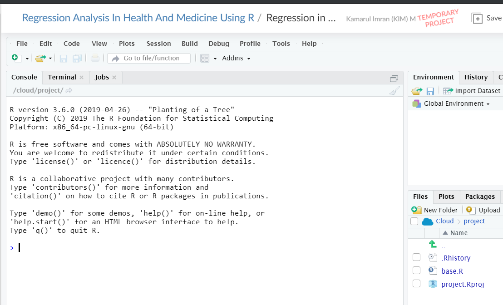
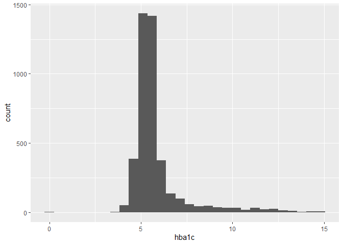
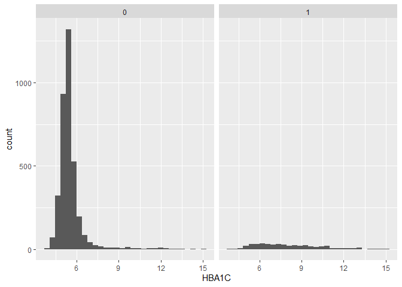
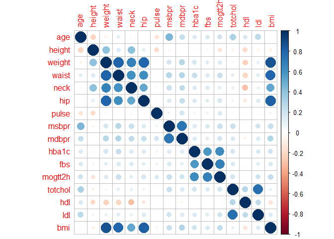
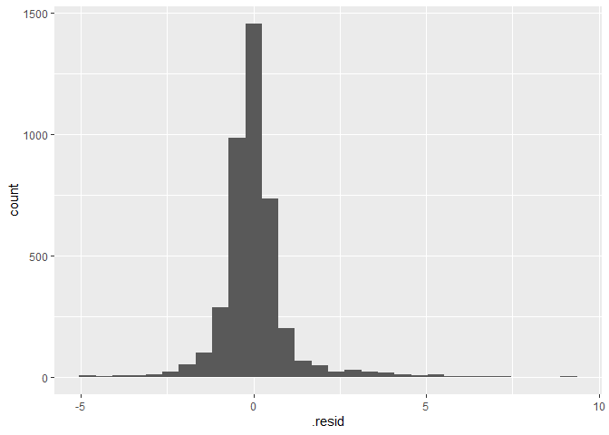
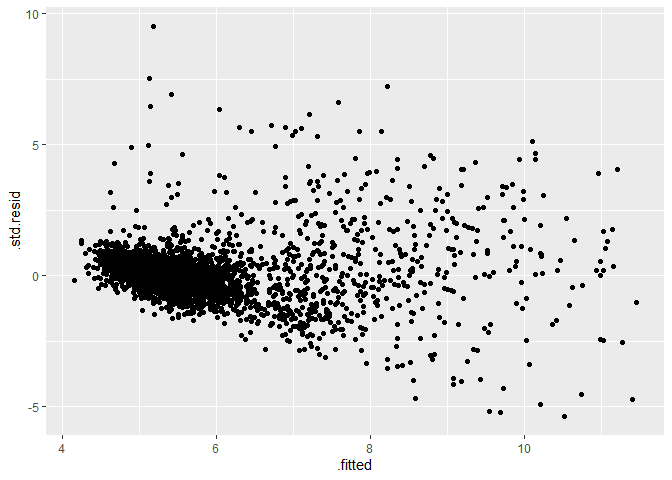
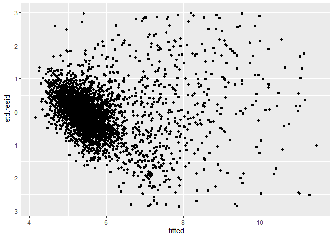
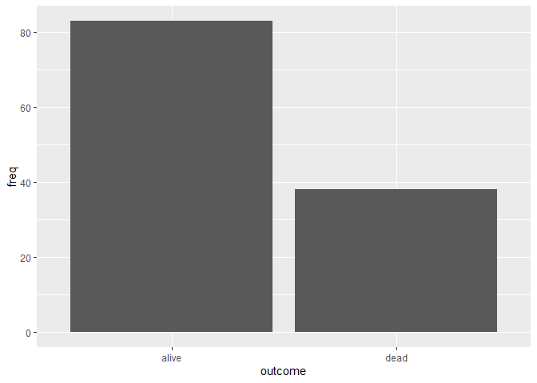

\newpage

# Introduction

## About myself

My name is Kamarul Imran, but just call me KIM. 

I hold the position of Associate Professor in Epidemiology and Statistics at the School of Medical Sciences, Universiti Sains Malaysia. 

My academic profile is available here http://www.medic.usm.my/jpm/index.php/en/academic-information/587-prof-madya-dr-kamarul-imran-musa

Currently also a teaching associate (sessional lecturer) at Monash Universiti Malaysia. I teach business analytics course for a Master programme. 


## Research profiles

My research profile at Google Scholar is available here  https://scholar.google.com/citations?user=XVf2_QcAAAAJ&hl=en&authuser=1. 

My SCOPUS author ID is 57194536466


## Research interests

My research interests include medical epidemiology, statistical modelling and machine learning. 

Recently, I was awarded with the FRGS grant (RM125,000) to understand the roles of  mammography images and clinical conditions on the performance of machine learning and statistical models to predict breast cancer. 

Email: drkamarul@usm.my 

Twitter: @kamarul_imran

Personal page: https://myanalytics.com.my/


## Our R course

We conduct regular R courses. But we also receive invitation to conduct trainings on R and on data and statistical analysis.


# Regression (5 mins)

In statistical modeling, regression analysis is a set of statistical processes for estimating the relationships among variables. 

It includes many techniques for modeling and analyzing several variables, when the focus is on the relationship between a dependent variable and one or more independent variables (or 'predictors').

Most commonly, regression analysis estimates the conditional expectation of the dependent variable given the independent variables – that is, the average value of the dependent variable when the independent variables are fixed. 

Source: https://en.wikipedia.org/wiki/Regression_analysis

# Motivation (5 mins)

## Linear regression

Analysis of data with the outcome variable as a continuous variable and the expected outcome follows Gaussian distribution (as a function of covariates). 

## Logistic regression

Analysis of data with the outcome variable is  a binary categorical variable and the expected outcome follows Bernoulli distribution (as a function of covariates). 

## Poisson regression

Analysis of data with the outcome variable is a count variable and the expected outcome follows the Poisson distribution (as a function of covariates).

## Cox proportional hazard regression

Analysis of data with the outcome variable is time-to-event variable, a Cox semi-parametric regression is the most regression. 

# Setting up R environment (10 min)

We will be using RStudio Cloud. 

I have prepared the environment for our workshop in RStudio Cloud.

Click this link http://bit.ly/Reg_in_med.

Please:

- Click on the link
- Register
- Log in
- Click on the project **Regression Analysis in Health and Medicine**





On its webpage, it is stated the THE MISSION as 

*We created RStudio Cloud to make it easy for professionals, hobbyists, trainers, teachers and students to do, share, teach and learn data science using R.*

# Style of presentation

**Code-along** 

Type and try to understand!


# Load required libraries


```r
library(tidyverse)
```

```
## -- Attaching packages ------------------------------------------------------------------------------ tidyverse 1.2.1 --
```

```
## v ggplot2 3.2.1     v purrr   0.3.2
## v tibble  2.1.3     v dplyr   0.8.3
## v tidyr   1.0.0     v stringr 1.4.0
## v readr   1.3.1     v forcats 0.4.0
```

```
## -- Conflicts --------------------------------------------------------------------------------- tidyverse_conflicts() --
## x dplyr::filter() masks stats::filter()
## x dplyr::lag()    masks stats::lag()
```

```r
library(here)
```

```
## here() starts at C:/Users/drkim/OneDrive - Universiti Sains Malaysia/1_Codes_Programming/my_GIT_repo/MY_R_Conference
```

```r
library(haven)
library(readxl)
library(kableExtra)
```

```
## 
## Attaching package: 'kableExtra'
```

```
## The following object is masked from 'package:dplyr':
## 
##     group_rows
```

```r
library(broom)
library(cdata)
library(corrplot)
```

```
## corrplot 0.84 loaded
```

```r
library(survival)
```


# Linear regression (25 mins)

## Statistical concepts

In multiple regression model, we assume that a linear relationship exists between some variable $Y$, which we call the dependent variable (or the outcome or the regressand), and $k$ independent variables (or the predictor, covariate, explanatory or the regressor) such as $X_1 ,X_2 ,...,X_k$.

The independent variables are sometimes referred to as explanatory variables, because of their use in explaining the variation in $Y$. They are also called predictor variables, because of their use in predicting $Y$ and covariates.

## Model assumptions 

Figure \@ref(fig:LinearityAssumption) sums the first 3 assumptions:

<div class="figure" style="text-align: center">

<p class="caption">(\#fig:LinearityAssumption)Linearity Assumptions</p>
</div>

Generally, the equation of multiple linear regression model is:

$$Y_i = \beta_0 + \beta_1X_{1i} + ... + \beta_kX_{ki} + \epsilon_i$$

## Read data

This is the data that our research team collected among the Malaysian general population. It is part of a larger dataset. 

We would like to understand the problem of Metabolic Syndrome among Malaysians. 

There were more than 4000 participants. 

We use **readxl::read_xlsx()** to read MS Excel datasets. 

And then use **dplyr::glimpse()** to briefly view the data.  


```r
met <- read_xlsx(here('datasets', 'metab_syndrome.xlsx'))
glimpse(met)
```

```
## Observations: 4,341
## Variables: 17
## $ ID      <chr> "A11", "B11", "C12", "D11", "E11", "F11", "G12", "H12"...
## $ AGE     <chr> "46", "47", "48", "63", "39", "74", "43", "55", "22", ...
## $ DMDX    <dbl> 0, 0, 0, 1, 0, 0, 0, 1, 0, 0, 0, 1, 0, 0, 0, 0, 0, 0, ...
## $ HEIGHT  <chr> "1.6", "1.68", "1.47", "1.5", "1.51", "1.43", "1.77", ...
## $ WEIGHT  <dbl> 70.0, 52.0, 88.6, 81.0, 63.5, 50.0, 90.3, 69.0, 74.0, ...
## $ WAIST   <dbl> 89.0, 89.0, 84.0, 125.0, 87.0, 85.0, 101.0, 94.0, 87.0...
## $ NECK    <dbl> 38.0, 38.0, 32.0, 34.0, 40.0, 34.5, 39.0, 43.3, 34.0, ...
## $ HIP     <dbl> 97.0, 98.0, 94.0, 95.0, 105.0, 95.0, 112.0, 103.0, 106...
## $ PULSE   <chr> "80", "83", "78", "94", "99", "96", "82", "89", "75", ...
## $ MSBPR   <dbl> 133.0, 163.0, 146.5, 206.5, 129.0, 190.5, 160.0, 138.0...
## $ MDBPR   <dbl> 83.5, 84.0, 93.5, 94.0, 70.0, 92.0, 101.0, 86.0, 63.5,...
## $ HBA1C   <chr> "5.3", "5.6", "5.7", "7.2", "5.4", "5.7", "5.099999999...
## $ FBS     <chr> "5.82", "6.29", "8.2899999999999991", "8.39", "5.23", ...
## $ MOGTT2H <chr> "7.89", "6.05", "17.39", "#NULL!", "7.84", "14.88", "7...
## $ TOTCHOL <chr> "5.27", "6.77", "5.87", "8.09", "5.55", "6.33", "7.48"...
## $ HDL     <chr> "0.84", "1.45", "0.82", "1.79", "1.04", "1.62", "1.57"...
## $ LDL     <chr> "3.45", "3.7", "3.96", "4.68", "4.33", "3.03", "4.59",...
```

You will see that there are a mix of variables

- character (correctly and wrongly assigned)
- double 

That justify that MS Excel is not a good collection or data storage medium. You may want to use other alternatives like EpiData Entry or ODK. 


## Data wrangling

Let us get the summary of the data. You can use **summary()** to provide you with a brief but insightful summary or descriptive statistics for your data. 

You will notice that there is no summary statistics for variables of class character. 


```r
summary(met)
```

```
##       ID                AGE                 DMDX           HEIGHT         
##  Length:4341        Length:4341        Min.   :0.0000   Length:4341       
##  Class :character   Class :character   1st Qu.:0.0000   Class :character  
##  Mode  :character   Mode  :character   Median :0.0000   Mode  :character  
##                                        Mean   :0.1083                     
##                                        3rd Qu.:0.0000                     
##                                        Max.   :1.0000                     
##                                        NA's   :1                          
##      WEIGHT           WAIST             NECK            HIP        
##  Min.   : 30.00   Min.   : 50.80   Min.   :22.00   Min.   : 61.00  
##  1st Qu.: 53.80   1st Qu.: 77.00   1st Qu.:33.00   1st Qu.: 91.00  
##  Median : 62.00   Median : 86.00   Median :35.00   Median : 97.00  
##  Mean   : 63.75   Mean   : 86.32   Mean   :35.38   Mean   : 97.88  
##  3rd Qu.: 71.95   3rd Qu.: 95.00   3rd Qu.:38.00   3rd Qu.:104.00  
##  Max.   :187.80   Max.   :154.50   Max.   :50.00   Max.   :160.00  
##  NA's   :2        NA's   :2        NA's   :5       NA's   :2       
##     PULSE               MSBPR           MDBPR           HBA1C          
##  Length:4341        Min.   : 68.5   Min.   : 41.50   Length:4341       
##  Class :character   1st Qu.:117.0   1st Qu.: 70.00   Class :character  
##  Mode  :character   Median :130.0   Median : 77.50   Mode  :character  
##                     Mean   :133.5   Mean   : 78.46                     
##                     3rd Qu.:146.5   3rd Qu.: 86.00                     
##                     Max.   :237.0   Max.   :128.50                     
##                                                                        
##      FBS              MOGTT2H            TOTCHOL         
##  Length:4341        Length:4341        Length:4341       
##  Class :character   Class :character   Class :character  
##  Mode  :character   Mode  :character   Mode  :character  
##                                                          
##                                                          
##                                                          
##                                                          
##      HDL                LDL           
##  Length:4341        Length:4341       
##  Class :character   Class :character  
##  Mode  :character   Mode  :character  
##                                       
##                                       
##                                       
## 
```

We will convert the character variables (wrongly classed) to the correct numeric class variables. 

We will use **dplyr::mutate_at()**


```r
met <- met %>% mutate_at(vars(-ID), ~as.numeric(.))
```

```
## Warning in ~as.numeric(.): NAs introduced by coercion
```

```
## Warning in ~as.numeric(.): NAs introduced by coercion
```

```
## Warning in ~as.numeric(.): NAs introduced by coercion
```

```
## Warning in ~as.numeric(.): NAs introduced by coercion
```

```
## Warning in ~as.numeric(.): NAs introduced by coercion
```

```
## Warning in ~as.numeric(.): NAs introduced by coercion
```

```
## Warning in ~as.numeric(.): NAs introduced by coercion
```

```
## Warning in ~as.numeric(.): NAs introduced by coercion
```

```
## Warning in ~as.numeric(.): NAs introduced by coercion
```

Let us see the summary statistics again


```r
summary(met)
```

```
##       ID                 AGE             DMDX            HEIGHT     
##  Length:4341        Min.   :18.00   Min.   :0.0000   Min.   :1.270  
##  Class :character   1st Qu.:38.00   1st Qu.:0.0000   1st Qu.:1.510  
##  Mode  :character   Median :48.00   Median :0.0000   Median :1.560  
##                     Mean   :47.84   Mean   :0.1083   Mean   :1.568  
##                     3rd Qu.:58.00   3rd Qu.:0.0000   3rd Qu.:1.630  
##                     Max.   :89.00   Max.   :1.0000   Max.   :1.960  
##                     NA's   :1       NA's   :1        NA's   :1      
##      WEIGHT           WAIST             NECK            HIP        
##  Min.   : 30.00   Min.   : 50.80   Min.   :22.00   Min.   : 61.00  
##  1st Qu.: 53.80   1st Qu.: 77.00   1st Qu.:33.00   1st Qu.: 91.00  
##  Median : 62.00   Median : 86.00   Median :35.00   Median : 97.00  
##  Mean   : 63.75   Mean   : 86.32   Mean   :35.38   Mean   : 97.88  
##  3rd Qu.: 71.95   3rd Qu.: 95.00   3rd Qu.:38.00   3rd Qu.:104.00  
##  Max.   :187.80   Max.   :154.50   Max.   :50.00   Max.   :160.00  
##  NA's   :2        NA's   :2        NA's   :5       NA's   :2       
##      PULSE            MSBPR           MDBPR            HBA1C       
##  Min.   : 24.00   Min.   : 68.5   Min.   : 41.50   Min.   : 0.200  
##  1st Qu.: 70.00   1st Qu.:117.0   1st Qu.: 70.00   1st Qu.: 5.100  
##  Median : 78.00   Median :130.0   Median : 77.50   Median : 5.400  
##  Mean   : 79.27   Mean   :133.5   Mean   : 78.46   Mean   : 5.805  
##  3rd Qu.: 86.00   3rd Qu.:146.5   3rd Qu.: 86.00   3rd Qu.: 5.800  
##  Max.   :975.00   Max.   :237.0   Max.   :128.50   Max.   :15.000  
##  NA's   :8                                         NA's   :70      
##       FBS            MOGTT2H          TOTCHOL            HDL       
##  Min.   : 0.160   Min.   : 0.160   Min.   : 0.180   Min.   :0.080  
##  1st Qu.: 4.400   1st Qu.: 5.150   1st Qu.: 4.970   1st Qu.:1.110  
##  Median : 5.150   Median : 6.600   Median : 5.700   Median :1.320  
##  Mean   : 5.622   Mean   : 7.343   Mean   : 5.792   Mean   :1.346  
##  3rd Qu.: 5.982   3rd Qu.: 8.410   3rd Qu.: 6.530   3rd Qu.:1.540  
##  Max.   :34.270   Max.   :37.370   Max.   :23.140   Max.   :4.430  
##  NA's   :117      NA's   :608      NA's   :54       NA's   :52     
##       LDL       
##  Min.   : 0.14  
##  1st Qu.: 2.79  
##  Median : 3.46  
##  Mean   : 3.55  
##  3rd Qu.: 4.25  
##  Max.   :10.56  
##  NA's   :53
```

Look at variables for outliers and NA for variable PULSE, MOGTT2H, TOTCHOL, FBS.

## Exploratory data analysis

For example, let us explore variable Hba1c


```r
met %>% ggplot(aes(x = HBA1C)) + geom_histogram() 
```

```
## `stat_bin()` using `bins = 30`. Pick better value with `binwidth`.
```

```
## Warning: Removed 70 rows containing non-finite values (stat_bin).
```

<!-- -->


Let us do some more data wrangling using

- filter()
- mutate()


```r
met <- met %>% filter(HBA1C > 2.5, HBA1C < 25.0, 
                      LDL > 0.5, HDL > 0.2,  
                      TOTCHOL > 2.0, TOTCHOL < 15.0,
                      FBS > 2, FBS < 20,
                      PULSE < 140) %>% 
  mutate(BMI = WEIGHT/(HEIGHT^2)) %>% 
  mutate(OVERWEIGHT = if_else(BMI >=25.0,'overwt','not_overwt')) 
```

Let us check the summary stat again


```r
summary(met)
```

```
##       ID                 AGE            DMDX            HEIGHT     
##  Length:4078        Min.   :18.0   Min.   :0.0000   Min.   :1.270  
##  Class :character   1st Qu.:38.0   1st Qu.:0.0000   1st Qu.:1.510  
##  Mode  :character   Median :48.0   Median :0.0000   Median :1.560  
##                     Mean   :47.9   Mean   :0.1096   Mean   :1.569  
##                     3rd Qu.:58.0   3rd Qu.:0.0000   3rd Qu.:1.630  
##                     Max.   :89.0   Max.   :1.0000   Max.   :1.960  
##                     NA's   :1                                      
##      WEIGHT           WAIST             NECK            HIP        
##  Min.   : 30.00   Min.   : 50.80   Min.   :22.00   Min.   : 61.00  
##  1st Qu.: 53.80   1st Qu.: 77.00   1st Qu.:33.00   1st Qu.: 91.00  
##  Median : 62.23   Median : 86.00   Median :35.00   Median : 97.00  
##  Mean   : 63.89   Mean   : 86.41   Mean   :35.36   Mean   : 97.89  
##  3rd Qu.: 72.00   3rd Qu.: 95.00   3rd Qu.:38.00   3rd Qu.:104.00  
##  Max.   :187.80   Max.   :154.50   Max.   :50.00   Max.   :160.00  
##  NA's   :2        NA's   :1        NA's   :3       NA's   :1       
##      PULSE            MSBPR           MDBPR            HBA1C       
##  Min.   : 24.00   Min.   : 68.5   Min.   : 41.50   Min.   : 3.800  
##  1st Qu.: 69.00   1st Qu.:117.1   1st Qu.: 70.00   1st Qu.: 5.100  
##  Median : 78.00   Median :130.0   Median : 78.00   Median : 5.400  
##  Mean   : 78.29   Mean   :133.8   Mean   : 78.57   Mean   : 5.803  
##  3rd Qu.: 86.00   3rd Qu.:147.0   3rd Qu.: 86.00   3rd Qu.: 5.800  
##  Max.   :135.00   Max.   :237.0   Max.   :128.50   Max.   :15.000  
##                                                                    
##       FBS            MOGTT2H          TOTCHOL           HDL       
##  Min.   : 2.030   Min.   : 0.160   Min.   : 2.13   Min.   :0.280  
##  1st Qu.: 4.442   1st Qu.: 5.200   1st Qu.: 4.97   1st Qu.:1.110  
##  Median : 5.160   Median : 6.630   Median : 5.70   Median :1.320  
##  Mean   : 5.628   Mean   : 7.368   Mean   : 5.79   Mean   :1.354  
##  3rd Qu.: 6.000   3rd Qu.: 8.430   3rd Qu.: 6.52   3rd Qu.:1.550  
##  Max.   :19.340   Max.   :37.370   Max.   :14.91   Max.   :4.430  
##                   NA's   :477                                     
##       LDL             BMI          OVERWEIGHT       
##  Min.   : 0.51   Min.   : 9.241   Length:4078       
##  1st Qu.: 2.81   1st Qu.:22.232   Class :character  
##  Median : 3.46   Median :25.402   Mode  :character  
##  Mean   : 3.56   Mean   :25.938                     
##  3rd Qu.: 4.23   3rd Qu.:28.870                     
##  Max.   :10.56   Max.   :57.040                     
##                  NA's   :2
```

What happen to Hba1c?


```r
met %>% ggplot(aes(x = HBA1C)) + geom_histogram() +
  facet_wrap(~DMDX)
```

```
## `stat_bin()` using `bins = 30`. Pick better value with `binwidth`.
```

<!-- -->

## Further EDA

We could do correlational analysis to give us idea for possible multicollinearity issues.

Multicollinerity is the situation where one pair or more than one pairs of variables are higly correlated with each other. 

If we include collinear variables in the model (as covariates), the regression parameters will be biased (wrong). 


```r
met_num <- met %>% select_if(is.numeric)
```

The results of correlation matrix are:


```r
cor.met <- cor(met_num, use="complete.obs", method="pearson")
head(round(cor.met,2))
```

```
##          AGE  DMDX HEIGHT WEIGHT WAIST NECK  HIP PULSE MSBPR MDBPR HBA1C
## AGE     1.00  0.02  -0.21  -0.08  0.12 0.04 0.00 -0.15  0.45  0.23  0.15
## DMDX    0.02  1.00  -0.01   0.02  0.01 0.02 0.01  0.03  0.02  0.03  0.09
## HEIGHT -0.21 -0.01   1.00   0.41  0.15 0.40 0.11 -0.19 -0.05  0.01 -0.04
## WEIGHT -0.08  0.02   0.41   1.00  0.80 0.67 0.80 -0.03  0.18  0.27  0.17
## WAIST   0.12  0.01   0.15   0.80  1.00 0.60 0.61  0.00  0.27  0.29  0.23
## NECK    0.04  0.02   0.40   0.67  0.60 1.00 0.51 -0.04  0.21  0.25  0.14
##          FBS MOGTT2H TOTCHOL   HDL   LDL   BMI
## AGE     0.17    0.20    0.31  0.17  0.26  0.02
## DMDX    0.07    0.09    0.00  0.00  0.00  0.02
## HEIGHT -0.05   -0.15   -0.08 -0.19 -0.07 -0.09
## WEIGHT  0.13    0.15    0.05 -0.23  0.10  0.87
## WAIST   0.16    0.22    0.12 -0.21  0.13  0.79
## NECK    0.15    0.13    0.09 -0.29  0.10  0.51
```

This the correlogram to represent the correlation matrix:


```r
corrplot(cor.met, method="circle")
```

<!-- -->


## Estimation

When we assume that the expected values for the outcome variable given the covariates are normally distributed, then we can perform linear regression. 

In R, this can be done using `lm()`. This is the model where the expected values of HBA1C is model as a function of FBS (fasting blood sugar).


```r
met_hba1c <- lm(HBA1C ~ FBS, data = met)
summary(met_hba1c)
```

```
## 
## Call:
## lm(formula = HBA1C ~ FBS, data = met)
## 
## Residuals:
##     Min      1Q  Median      3Q     Max 
## -6.0666 -0.4776 -0.1052  0.3091  8.5293 
## 
## Coefficients:
##             Estimate Std. Error t value Pr(>|t|)    
## (Intercept) 3.502193   0.040972   85.48   <2e-16 ***
## FBS         0.408802   0.006702   60.99   <2e-16 ***
## ---
## Signif. codes:  0 '***' 0.001 '**' 0.01 '*' 0.05 '.' 0.1 ' ' 1
## 
## Residual standard error: 1.021 on 4076 degrees of freedom
## Multiple R-squared:  0.4772,	Adjusted R-squared:  0.4771 
## F-statistic:  3720 on 1 and 4076 DF,  p-value: < 2.2e-16
```

Run another linear regression model with these covariates:


```r
met_hba1c_mv <- lm(HBA1C ~ FBS + AGE + MSBPR + MDBPR, data = met)
summary(met_hba1c_mv)
```

```
## 
## Call:
## lm(formula = HBA1C ~ FBS + AGE + MSBPR + MDBPR, data = met)
## 
## Residuals:
##     Min      1Q  Median      3Q     Max 
## -6.0630 -0.4718 -0.1051  0.3098  8.6575 
## 
## Coefficients:
##              Estimate Std. Error t value Pr(>|t|)    
## (Intercept)  3.009202   0.111352  27.024  < 2e-16 ***
## FBS          0.400576   0.006822  58.721  < 2e-16 ***
## AGE          0.008054   0.001259   6.396 1.77e-10 ***
## MSBPR       -0.004954   0.001080  -4.588 4.61e-06 ***
## MDBPR        0.010390   0.001928   5.390 7.43e-08 ***
## ---
## Signif. codes:  0 '***' 0.001 '**' 0.01 '*' 0.05 '.' 0.1 ' ' 1
## 
## Residual standard error: 1.014 on 4072 degrees of freedom
##   (1 observation deleted due to missingness)
## Multiple R-squared:  0.485,	Adjusted R-squared:  0.4845 
## F-statistic: 958.8 on 4 and 4072 DF,  p-value: < 2.2e-16
```

Should we add Diabetes Status (DMDX)?


```r
met_hba1c_mv2 <- lm(HBA1C ~ FBS + AGE + MSBPR + MDBPR + BMI + HDL + LDL +
                      factor(DMDX), data = met)
summary(met_hba1c_mv2)
```

```
## 
## Call:
## lm(formula = HBA1C ~ FBS + AGE + MSBPR + MDBPR + BMI + HDL + 
##     LDL + factor(DMDX), data = met)
## 
## Residuals:
##     Min      1Q  Median      3Q     Max 
## -5.0202 -0.4007 -0.0588  0.2985  8.9164 
## 
## Coefficients:
##                Estimate Std. Error t value Pr(>|t|)    
## (Intercept)    3.170719   0.130759  24.249  < 2e-16 ***
## FBS            0.318074   0.007102  44.785  < 2e-16 ***
## AGE            0.003454   0.001210   2.854  0.00434 ** 
## MSBPR         -0.004441   0.001003  -4.425 9.88e-06 ***
## MDBPR          0.007240   0.001827   3.964 7.51e-05 ***
## BMI            0.013409   0.003019   4.441 9.18e-06 ***
## HDL           -0.039540   0.044232  -0.894  0.37141    
## LDL            0.073575   0.014573   5.049 4.64e-07 ***
## factor(DMDX)1  1.330114   0.053865  24.693  < 2e-16 ***
## ---
## Signif. codes:  0 '***' 0.001 '**' 0.01 '*' 0.05 '.' 0.1 ' ' 1
## 
## Residual standard error: 0.9412 on 4066 degrees of freedom
##   (3 observations deleted due to missingness)
## Multiple R-squared:  0.5569,	Adjusted R-squared:  0.556 
## F-statistic: 638.8 on 8 and 4066 DF,  p-value: < 2.2e-16
```


### Adding interaction

We will add an interaction term (DMDX with AGE) in the covariates


```r
met_hba1c_ia <- lm(HBA1C ~ FBS + AGE + MSBPR + MDBPR + BMI + HDL + LDL + 
                     BMI + factor(DMDX):AGE, data = met)
summary(met_hba1c_ia)
```

```
## 
## Call:
## lm(formula = HBA1C ~ FBS + AGE + MSBPR + MDBPR + BMI + HDL + 
##     LDL + BMI + factor(DMDX):AGE, data = met)
## 
## Residuals:
##     Min      1Q  Median      3Q     Max 
## -4.9723 -0.4058 -0.0636  0.2996  8.8956 
## 
## Coefficients:
##                     Estimate Std. Error t value Pr(>|t|)    
## (Intercept)        3.1571144  0.1314862  24.011  < 2e-16 ***
## FBS                0.3261471  0.0070492  46.267  < 2e-16 ***
## AGE                0.0021908  0.0012275   1.785   0.0744 .  
## MSBPR             -0.0048355  0.0010087  -4.794 1.69e-06 ***
## MDBPR              0.0081048  0.0018366   4.413 1.05e-05 ***
## BMI                0.0139733  0.0030353   4.604 4.28e-06 ***
## HDL               -0.0368679  0.0444880  -0.829   0.4073    
## LDL                0.0747112  0.0146571   5.097 3.60e-07 ***
## AGE:factor(DMDX)1  0.0220591  0.0009336  23.629  < 2e-16 ***
## ---
## Signif. codes:  0 '***' 0.001 '**' 0.01 '*' 0.05 '.' 0.1 ' ' 1
## 
## Residual standard error: 0.9464 on 4066 degrees of freedom
##   (3 observations deleted due to missingness)
## Multiple R-squared:  0.552,	Adjusted R-squared:  0.5511 
## F-statistic: 626.2 on 8 and 4066 DF,  p-value: < 2.2e-16
```

## Inference

We can take advantage of **broom** package to produce better outputs


```r
tidy(met_hba1c_mv2, conf.int = TRUE)
```

```
## # A tibble: 9 x 7
##   term          estimate std.error statistic   p.value conf.low conf.high
##   <chr>            <dbl>     <dbl>     <dbl>     <dbl>    <dbl>     <dbl>
## 1 (Intercept)    3.17      0.131      24.2   1.96e-121  2.91      3.43   
## 2 FBS            0.318     0.00710    44.8   0.         0.304     0.332  
## 3 AGE            0.00345   0.00121     2.85  4.34e-  3  0.00108   0.00583
## 4 MSBPR         -0.00444   0.00100    -4.43  9.88e-  6 -0.00641  -0.00247
## 5 MDBPR          0.00724   0.00183     3.96  7.51e-  5  0.00366   0.0108 
## 6 BMI            0.0134    0.00302     4.44  9.18e-  6  0.00749   0.0193 
## 7 HDL           -0.0395    0.0442     -0.894 3.71e-  1 -0.126     0.0472 
## 8 LDL            0.0736    0.0146      5.05  4.64e-  7  0.0450    0.102  
## 9 factor(DMDX)1  1.33      0.0539     24.7   1.47e-125  1.22      1.44
```

To get the predicted values


```r
pred_met <- augment(met_hba1c_mv2)
head(pred_met)
```

```
## # A tibble: 6 x 17
##   .rownames HBA1C   FBS   AGE MSBPR MDBPR   BMI   HDL   LDL factor.DMDX.
##   <chr>     <dbl> <dbl> <dbl> <dbl> <dbl> <dbl> <dbl> <dbl> <fct>       
## 1 1           5.3  5.82    46  133   83.5  27.3  0.84  3.45 0           
## 2 2           5.6  6.29    47  163   84    18.4  1.45  3.7  0           
## 3 3           5.7  8.29    48  146.  93.5  41.0  0.82  3.96 0           
## 4 4           7.2  8.39    63  206.  94    36    1.79  4.68 1           
## 5 5           5.4  5.23    39  129   70    27.8  1.04  4.33 0           
## 6 6           5.7  6.45    74  190.  92    24.5  1.62  3.03 0           
## # ... with 7 more variables: .fitted <dbl>, .se.fit <dbl>, .resid <dbl>,
## #   .hat <dbl>, .sigma <dbl>, .cooksd <dbl>, .std.resid <dbl>
```


## Model checking

Remember the LINE assumptions


```r
ggplot(data = pred_met, aes(x = .fitted)) +
  geom_histogram()
```

```
## `stat_bin()` using `bins = 30`. Pick better value with `binwidth`.
```

<!-- -->

Next,


```r
ggplot(data = pred_met, aes(x = .fitted, y = .std.resid)) +
  geom_point()
```

<!-- -->

Perhaps, we should do further treatment of our data. 


```r
pred_met %>% filter(between(.std.resid, -3, 3)) %>% 
                      ggplot(aes(x = .fitted, y = .std.resid)) +
                      geom_point() 
```

<!-- -->


\newpage

# Logistic regression (25 mins)

## Read data

The data comes from a surgeon (Dr Najmi). The data contains variables from patients with peptic ulcer disease. 

It is in excel form. 


```r
PUP2 <- read_excel(here('datasets', 'PUP2.xlsx'))
```

Quickly examine types of variables and summary statistics


```r
glimpse(PUP2)
```

```
## Observations: 121
## Variables: 23
## $ no                  <dbl> 105, 107, 94, 103, 109, 111, 79, 85, 88, 8...
## $ age                 <dbl> 42, 66, 67, 19, 77, 39, 62, 71, 69, 97, 52...
## $ gender              <chr> "male", "female", "male", "male", "male", ...
## $ epigastric_pain     <chr> "yes", "yes", "yes", "yes", "yes", "yes", ...
## $ onset_more_24_hrs   <chr> "no", "no", "no", "yes", "yes", "yes", "ye...
## $ diabetes            <chr> "no", "no", "no", "no", "no", "no", "yes",...
## $ NSAIDS              <chr> "no", "no", "yes", "no", "no", "no", "no",...
## $ previous_OGDS       <chr> "no", "no", "no", "yes", "no", "no", "no",...
## $ ASA                 <dbl> 1, 1, 1, 1, 2, 1, 2, 2, 1, 1, 2, 1, 2, 1, ...
## $ systolic            <dbl> 141, 197, 126, 90, 147, 115, 103, 159, 145...
## $ diastolic           <dbl> 98, 88, 73, 40, 82, 86, 55, 68, 75, 65, 74...
## $ tenderness          <chr> "generalized", "generalized", "generalized...
## $ guarding            <chr> "yes", "yes", "yes", "yes", "no", "yes", "...
## $ hemoglobin          <dbl> 18.0, 12.0, 12.0, 12.0, 11.0, 18.0, 8.1, 1...
## $ twc                 <dbl> 6.0, 6.0, 13.0, 20.0, 21.0, 4.0, 5.0, 12.0...
## $ platelet            <dbl> 415, 292, 201, 432, 324, 260, 461, 210, 29...
## $ PULP                <dbl> 2, 3, 3, 2, 7, 1, 2, 5, 3, 4, 2, 3, 4, 3, ...
## $ admission_to_op_hrs <dbl> 2, 2, 3, 3, 3, 3, 4, 4, 4, 4, 4, 5, 5, 6, ...
## $ perforation         <dbl> 0.5, 1.0, 0.5, 0.5, 1.0, 1.0, 3.0, 1.5, 0....
## $ degree_perforation  <chr> "small", "small", "small", "small", "small...
## $ SSSI                <chr> "no", "no", "no", "no", "no", "no", "no", ...
## $ sepsis              <chr> "no", "no", "no", "no", "no", "no", "yes",...
## $ outcome             <chr> "alive", "alive", "alive", "alive", "alive...
```

```r
summary(PUP2)
```

```
##        no           age           gender          epigastric_pain   
##  Min.   :  1   Min.   :19.00   Length:121         Length:121        
##  1st Qu.: 31   1st Qu.:49.00   Class :character   Class :character  
##  Median : 61   Median :64.00   Mode  :character   Mode  :character  
##  Mean   : 61   Mean   :60.43                                        
##  3rd Qu.: 91   3rd Qu.:75.00                                        
##  Max.   :121   Max.   :97.00                                        
##  onset_more_24_hrs    diabetes            NSAIDS         
##  Length:121         Length:121         Length:121        
##  Class :character   Class :character   Class :character  
##  Mode  :character   Mode  :character   Mode  :character  
##                                                          
##                                                          
##                                                          
##  previous_OGDS           ASA           systolic       diastolic     
##  Length:121         Min.   :1.000   Min.   : 67.0   Min.   : 38.00  
##  Class :character   1st Qu.:1.000   1st Qu.:112.0   1st Qu.: 63.00  
##  Mode  :character   Median :1.000   Median :128.0   Median : 71.00  
##                     Mean   :1.545   Mean   :128.6   Mean   : 72.07  
##                     3rd Qu.:2.000   3rd Qu.:143.0   3rd Qu.: 81.00  
##                     Max.   :3.000   Max.   :197.0   Max.   :116.00  
##   tenderness          guarding           hemoglobin         twc       
##  Length:121         Length:121         Min.   : 3.30   Min.   : 2.00  
##  Class :character   Class :character   1st Qu.:10.00   1st Qu.: 9.00  
##  Mode  :character   Mode  :character   Median :12.00   Median :12.00  
##                                        Mean   :12.32   Mean   :13.03  
##                                        3rd Qu.:15.00   3rd Qu.:16.00  
##                                        Max.   :19.40   Max.   :37.00  
##     platelet          PULP       admission_to_op_hrs  perforation   
##  Min.   : 11.0   Min.   :0.000   Min.   : 1.00       Min.   :0.300  
##  1st Qu.:224.0   1st Qu.:2.000   1st Qu.: 5.00       1st Qu.:0.500  
##  Median :308.0   Median :3.000   Median : 8.00       Median :1.000  
##  Mean   :314.4   Mean   :3.529   Mean   :10.07       Mean   :1.225  
##  3rd Qu.:392.0   3rd Qu.:5.000   3rd Qu.:12.00       3rd Qu.:1.500  
##  Max.   :798.0   Max.   :9.000   Max.   :72.00       Max.   :5.000  
##  degree_perforation     SSSI              sepsis         
##  Length:121         Length:121         Length:121        
##  Class :character   Class :character   Class :character  
##  Mode  :character   Mode  :character   Mode  :character  
##                                                          
##                                                          
##                                                          
##    outcome         
##  Length:121        
##  Class :character  
##  Mode  :character  
##                    
##                    
## 
```

## Data wrangling and EDA

You can use **summarytools::descr** to get a quick but more elaborate summary statistics

This is the summary statistics for all numerical variables. 


```r
library(summarytools)
```

```
## Registered S3 method overwritten by 'pryr':
##   method      from
##   print.bytes Rcpp
```

```
## 
## Attaching package: 'summarytools'
```

```
## The following object is masked from 'package:tibble':
## 
##     view
```

```r
descr(PUP2)
```

```
## Non-numerical variable(s) ignored: gender, epigastric_pain, onset_more_24_hrs, diabetes, NSAIDS, previous_OGDS, tenderness, guarding, degree_perforation, SSSI, sepsis, outcome
```

```
## Descriptive Statistics  
## 
##                     admission_to_op_hrs      age      ASA   diastolic   hemoglobin       no
## ----------------- --------------------- -------- -------- ----------- ------------ --------
##              Mean                 10.07    60.43     1.55       72.07        12.32    61.00
##           Std.Dev                  9.44    18.05     0.62       13.99         3.33    35.07
##               Min                  1.00    19.00     1.00       38.00         3.30     1.00
##                Q1                  5.00    49.00     1.00       63.00        10.00    31.00
##            Median                  8.00    64.00     1.00       71.00        12.00    61.00
##                Q3                 12.00    75.00     2.00       81.00        15.00    91.00
##               Max                 72.00    97.00     3.00      116.00        19.40   121.00
##               MAD                  5.93    17.79     0.00       13.34         2.97    44.48
##               IQR                  7.00    26.00     1.00       18.00         5.00    60.00
##                CV                  0.94     0.30     0.40        0.19         0.27     0.57
##          Skewness                  3.36    -0.55     0.66        0.12        -0.22     0.00
##       SE.Skewness                  0.22     0.22     0.22        0.22         0.22     0.22
##          Kurtosis                 15.95    -0.53    -0.55        0.22         0.02    -1.23
##           N.Valid                121.00   121.00   121.00      121.00       121.00   121.00
##         Pct.Valid                100.00   100.00   100.00      100.00       100.00   100.00
## 
## Table: Table continues below
## 
##  
## 
##                     perforation   platelet     PULP   systolic      twc
## ----------------- ------------- ---------- -------- ---------- --------
##              Mean          1.22     314.43     3.53     128.56    13.03
##           Std.Dev          0.91     140.32     2.28      24.51     6.66
##               Min          0.30      11.00     0.00      67.00     2.00
##                Q1          0.50     224.00     2.00     112.00     9.00
##            Median          1.00     308.00     3.00     128.00    12.00
##                Q3          1.50     392.00     5.00     143.00    16.00
##               Max          5.00     798.00     9.00     197.00    37.00
##               MAD          0.74     124.54     2.97      22.24     5.93
##               IQR          1.00     168.00     3.00      31.00     7.00
##                CV          0.74       0.45     0.65       0.19     0.51
##          Skewness          1.66       0.75     0.25       0.36     0.78
##       SE.Skewness          0.22       0.22     0.22       0.22     0.22
##          Kurtosis          3.34       1.02    -0.91       0.58     0.60
##           N.Valid        121.00     121.00   121.00     121.00   121.00
##         Pct.Valid        100.00     100.00   100.00     100.00   100.00
```

## Outcome and predictor variables

The outcome of interest is variable *outcome*. It is a character variable labelled as *alive* or *dead*. 

**Tidyverse** prefers to use character variables rather than factor variables. 


```r
PUP2 %>% group_by(outcome) %>% count()
```

```
## # A tibble: 2 x 2
## # Groups:   outcome [2]
##   outcome     n
##   <chr>   <int>
## 1 alive      83
## 2 dead       38
```

**descr** give also provide summary statistics based on the outcome of interest


```r
PUP2 %>% split(.$outcome) %>% 
  map(~descr(.x, stats = c('mean', 'sd', 'min', 'med', 'max')),
      transpose = TRUE)
```

```
## x must either be a summarytools object created with freq(), descr(), or a list of summarytools objects created using by()
```


We convert the variable outcome from character to factor


```r
PUP2 <- PUP2 %>% mutate(oc2 = factor(outcome))
PUP2 %>% ggplot(aes(x = oc2)) + geom_bar() + 
  xlab('outcome') + ylab('freq')
```

<!-- -->

How about variable ASA. It is not a numerical variable. Let us plot it against outcome. 


```r
PUP2 %>% ggplot(aes(ASA)) + geom_bar() +
  facet_wrap(~oc2)
```

<!-- -->


## Estimation

### Univariate logistic regression


```r
options(scipen = 999)
pup_uni <- PUP2 %>% select(oc2, age, gender, epigastric_pain, onset_more_24_hrs, diabetes, 
                NSAIDS, previous_OGDS, systolic, diastolic, ASA, PULP, perforation,
                admission_to_op_hrs, hemoglobin, twc) %>% 
  map_dfr(~tidy(glm(oc2 ~ .x, family = binomial, data = PUP2), 
                conf.int = T), .id = 'variable') %>%
  filter(variable != 'oc2')
```

```
## Warning: glm.fit: algorithm did not converge
```

```
## Warning: glm.fit: fitted probabilities numerically 0 or 1 occurred

## Warning: glm.fit: fitted probabilities numerically 0 or 1 occurred

## Warning: glm.fit: fitted probabilities numerically 0 or 1 occurred

## Warning: glm.fit: fitted probabilities numerically 0 or 1 occurred

## Warning: glm.fit: fitted probabilities numerically 0 or 1 occurred

## Warning: glm.fit: fitted probabilities numerically 0 or 1 occurred

## Warning: glm.fit: fitted probabilities numerically 0 or 1 occurred

## Warning: glm.fit: fitted probabilities numerically 0 or 1 occurred

## Warning: glm.fit: fitted probabilities numerically 0 or 1 occurred

## Warning: glm.fit: fitted probabilities numerically 0 or 1 occurred

## Warning: glm.fit: fitted probabilities numerically 0 or 1 occurred

## Warning: glm.fit: fitted probabilities numerically 0 or 1 occurred

## Warning: glm.fit: fitted probabilities numerically 0 or 1 occurred

## Warning: glm.fit: fitted probabilities numerically 0 or 1 occurred

## Warning: glm.fit: fitted probabilities numerically 0 or 1 occurred

## Warning: glm.fit: fitted probabilities numerically 0 or 1 occurred

## Warning: glm.fit: fitted probabilities numerically 0 or 1 occurred

## Warning: glm.fit: fitted probabilities numerically 0 or 1 occurred

## Warning: glm.fit: fitted probabilities numerically 0 or 1 occurred

## Warning: glm.fit: fitted probabilities numerically 0 or 1 occurred
```

```
## Warning in regularize.values(x, y, ties, missing(ties)): collapsing to
## unique 'x' values
```

```r
kable(pup_uni) %>% 
  kable_styling(bootstrap_options = c("striped", "hover", "condensed", "responsive"))
```

<table class="table table-striped table-hover table-condensed table-responsive" style="margin-left: auto; margin-right: auto;">
 <thead>
  <tr>
   <th style="text-align:left;"> variable </th>
   <th style="text-align:left;"> term </th>
   <th style="text-align:right;"> estimate </th>
   <th style="text-align:right;"> std.error </th>
   <th style="text-align:right;"> statistic </th>
   <th style="text-align:right;"> p.value </th>
   <th style="text-align:right;"> conf.low </th>
   <th style="text-align:right;"> conf.high </th>
  </tr>
 </thead>
<tbody>
  <tr>
   <td style="text-align:left;"> age </td>
   <td style="text-align:left;"> (Intercept) </td>
   <td style="text-align:right;"> -2.2466889 </td>
   <td style="text-align:right;"> 0.7843206 </td>
   <td style="text-align:right;"> -2.8645030 </td>
   <td style="text-align:right;"> 0.0041766 </td>
   <td style="text-align:right;"> -3.8954373 </td>
   <td style="text-align:right;"> -0.7936808 </td>
  </tr>
  <tr>
   <td style="text-align:left;"> age </td>
   <td style="text-align:left;"> .x </td>
   <td style="text-align:right;"> 0.0236740 </td>
   <td style="text-align:right;"> 0.0119691 </td>
   <td style="text-align:right;"> 1.9779287 </td>
   <td style="text-align:right;"> 0.0479368 </td>
   <td style="text-align:right;"> 0.0010929 </td>
   <td style="text-align:right;"> 0.0483811 </td>
  </tr>
  <tr>
   <td style="text-align:left;"> gender </td>
   <td style="text-align:left;"> (Intercept) </td>
   <td style="text-align:right;"> -0.0800427 </td>
   <td style="text-align:right;"> 0.4003204 </td>
   <td style="text-align:right;"> -0.1999466 </td>
   <td style="text-align:right;"> 0.8415223 </td>
   <td style="text-align:right;"> -0.8789758 </td>
   <td style="text-align:right;"> 0.7105500 </td>
  </tr>
  <tr>
   <td style="text-align:left;"> gender </td>
   <td style="text-align:left;"> .xmale </td>
   <td style="text-align:right;"> -0.9103560 </td>
   <td style="text-align:right;"> 0.4615231 </td>
   <td style="text-align:right;"> -1.9725036 </td>
   <td style="text-align:right;"> 0.0485521 </td>
   <td style="text-align:right;"> -1.8225388 </td>
   <td style="text-align:right;"> 0.0007672 </td>
  </tr>
  <tr>
   <td style="text-align:left;"> epigastric_pain </td>
   <td style="text-align:left;"> (Intercept) </td>
   <td style="text-align:right;"> -1.3862944 </td>
   <td style="text-align:right;"> 1.1180337 </td>
   <td style="text-align:right;"> -1.2399397 </td>
   <td style="text-align:right;"> 0.2149977 </td>
   <td style="text-align:right;"> -4.3598898 </td>
   <td style="text-align:right;"> 0.5246956 </td>
  </tr>
  <tr>
   <td style="text-align:left;"> epigastric_pain </td>
   <td style="text-align:left;"> .xyes </td>
   <td style="text-align:right;"> 0.6277644 </td>
   <td style="text-align:right;"> 1.1356428 </td>
   <td style="text-align:right;"> 0.5527833 </td>
   <td style="text-align:right;"> 0.5804118 </td>
   <td style="text-align:right;"> -1.3256526 </td>
   <td style="text-align:right;"> 3.6198522 </td>
  </tr>
  <tr>
   <td style="text-align:left;"> onset_more_24_hrs </td>
   <td style="text-align:left;"> (Intercept) </td>
   <td style="text-align:right;"> -1.0986123 </td>
   <td style="text-align:right;"> 0.3333330 </td>
   <td style="text-align:right;"> -3.2958397 </td>
   <td style="text-align:right;"> 0.0009813 </td>
   <td style="text-align:right;"> -1.7942261 </td>
   <td style="text-align:right;"> -0.4749176 </td>
  </tr>
  <tr>
   <td style="text-align:left;"> onset_more_24_hrs </td>
   <td style="text-align:left;"> .xyes </td>
   <td style="text-align:right;"> 0.5065612 </td>
   <td style="text-align:right;"> 0.4133389 </td>
   <td style="text-align:right;"> 1.2255348 </td>
   <td style="text-align:right;"> 0.2203738 </td>
   <td style="text-align:right;"> -0.2889264 </td>
   <td style="text-align:right;"> 1.3414593 </td>
  </tr>
  <tr>
   <td style="text-align:left;"> diabetes </td>
   <td style="text-align:left;"> (Intercept) </td>
   <td style="text-align:right;"> -0.9019020 </td>
   <td style="text-align:right;"> 0.2240691 </td>
   <td style="text-align:right;"> -4.0251058 </td>
   <td style="text-align:right;"> 0.0000569 </td>
   <td style="text-align:right;"> -1.3566078 </td>
   <td style="text-align:right;"> -0.4745240 </td>
  </tr>
  <tr>
   <td style="text-align:left;"> diabetes </td>
   <td style="text-align:left;"> .xyes </td>
   <td style="text-align:right;"> 0.5654298 </td>
   <td style="text-align:right;"> 0.4707818 </td>
   <td style="text-align:right;"> 1.2010441 </td>
   <td style="text-align:right;"> 0.2297341 </td>
   <td style="text-align:right;"> -0.3772175 </td>
   <td style="text-align:right;"> 1.4849256 </td>
  </tr>
  <tr>
   <td style="text-align:left;"> NSAIDS </td>
   <td style="text-align:left;"> (Intercept) </td>
   <td style="text-align:right;"> -0.9490806 </td>
   <td style="text-align:right;"> 0.2404072 </td>
   <td style="text-align:right;"> -3.9478044 </td>
   <td style="text-align:right;"> 0.0000789 </td>
   <td style="text-align:right;"> -1.4390465 </td>
   <td style="text-align:right;"> -0.4920164 </td>
  </tr>
  <tr>
   <td style="text-align:left;"> NSAIDS </td>
   <td style="text-align:left;"> .xyes </td>
   <td style="text-align:right;"> 0.5436154 </td>
   <td style="text-align:right;"> 0.4205273 </td>
   <td style="text-align:right;"> 1.2926994 </td>
   <td style="text-align:right;"> 0.1961150 </td>
   <td style="text-align:right;"> -0.2904184 </td>
   <td style="text-align:right;"> 1.3672726 </td>
  </tr>
  <tr>
   <td style="text-align:left;"> previous_OGDS </td>
   <td style="text-align:left;"> (Intercept) </td>
   <td style="text-align:right;"> -0.7753853 </td>
   <td style="text-align:right;"> 0.2042775 </td>
   <td style="text-align:right;"> -3.7957449 </td>
   <td style="text-align:right;"> 0.0001472 </td>
   <td style="text-align:right;"> -1.1870841 </td>
   <td style="text-align:right;"> -0.3835253 </td>
  </tr>
  <tr>
   <td style="text-align:left;"> previous_OGDS </td>
   <td style="text-align:left;"> .xyes </td>
   <td style="text-align:right;"> -0.0719126 </td>
   <td style="text-align:right;"> 0.7196661 </td>
   <td style="text-align:right;"> -0.0999249 </td>
   <td style="text-align:right;"> 0.9204039 </td>
   <td style="text-align:right;"> -1.6508310 </td>
   <td style="text-align:right;"> 1.2715818 </td>
  </tr>
  <tr>
   <td style="text-align:left;"> systolic </td>
   <td style="text-align:left;"> (Intercept) </td>
   <td style="text-align:right;"> 0.9192236 </td>
   <td style="text-align:right;"> 1.0873957 </td>
   <td style="text-align:right;"> 0.8453441 </td>
   <td style="text-align:right;"> 0.3979187 </td>
   <td style="text-align:right;"> -1.1798631 </td>
   <td style="text-align:right;"> 3.1196146 </td>
  </tr>
  <tr>
   <td style="text-align:left;"> systolic </td>
   <td style="text-align:left;"> .x </td>
   <td style="text-align:right;"> -0.0133813 </td>
   <td style="text-align:right;"> 0.0085103 </td>
   <td style="text-align:right;"> -1.5723584 </td>
   <td style="text-align:right;"> 0.1158675 </td>
   <td style="text-align:right;"> -0.0308281 </td>
   <td style="text-align:right;"> 0.0028134 </td>
  </tr>
  <tr>
   <td style="text-align:left;"> diastolic </td>
   <td style="text-align:left;"> (Intercept) </td>
   <td style="text-align:right;"> 0.6301161 </td>
   <td style="text-align:right;"> 1.0434752 </td>
   <td style="text-align:right;"> 0.6038630 </td>
   <td style="text-align:right;"> 0.5459347 </td>
   <td style="text-align:right;"> -1.4068184 </td>
   <td style="text-align:right;"> 2.7166343 </td>
  </tr>
  <tr>
   <td style="text-align:left;"> diastolic </td>
   <td style="text-align:left;"> .x </td>
   <td style="text-align:right;"> -0.0197762 </td>
   <td style="text-align:right;"> 0.0144968 </td>
   <td style="text-align:right;"> -1.3641724 </td>
   <td style="text-align:right;"> 0.1725133 </td>
   <td style="text-align:right;"> -0.0491267 </td>
   <td style="text-align:right;"> 0.0081354 </td>
  </tr>
  <tr>
   <td style="text-align:left;"> ASA </td>
   <td style="text-align:left;"> (Intercept) </td>
   <td style="text-align:right;"> -1.6065753 </td>
   <td style="text-align:right;"> 0.5455487 </td>
   <td style="text-align:right;"> -2.9448796 </td>
   <td style="text-align:right;"> 0.0032308 </td>
   <td style="text-align:right;"> -2.7150116 </td>
   <td style="text-align:right;"> -0.5629706 </td>
  </tr>
  <tr>
   <td style="text-align:left;"> ASA </td>
   <td style="text-align:left;"> .x </td>
   <td style="text-align:right;"> 0.5224183 </td>
   <td style="text-align:right;"> 0.3154616 </td>
   <td style="text-align:right;"> 1.6560438 </td>
   <td style="text-align:right;"> 0.0977129 </td>
   <td style="text-align:right;"> -0.0941774 </td>
   <td style="text-align:right;"> 1.1523982 </td>
  </tr>
  <tr>
   <td style="text-align:left;"> PULP </td>
   <td style="text-align:left;"> (Intercept) </td>
   <td style="text-align:right;"> -1.6645299 </td>
   <td style="text-align:right;"> 0.4098748 </td>
   <td style="text-align:right;"> -4.0610691 </td>
   <td style="text-align:right;"> 0.0000488 </td>
   <td style="text-align:right;"> -2.5155950 </td>
   <td style="text-align:right;"> -0.8987627 </td>
  </tr>
  <tr>
   <td style="text-align:left;"> PULP </td>
   <td style="text-align:left;"> .x </td>
   <td style="text-align:right;"> 0.2361062 </td>
   <td style="text-align:right;"> 0.0906398 </td>
   <td style="text-align:right;"> 2.6048836 </td>
   <td style="text-align:right;"> 0.0091905 </td>
   <td style="text-align:right;"> 0.0624931 </td>
   <td style="text-align:right;"> 0.4201174 </td>
  </tr>
  <tr>
   <td style="text-align:left;"> perforation </td>
   <td style="text-align:left;"> (Intercept) </td>
   <td style="text-align:right;"> -2.3438540 </td>
   <td style="text-align:right;"> 0.4324202 </td>
   <td style="text-align:right;"> -5.4203151 </td>
   <td style="text-align:right;"> 0.0000001 </td>
   <td style="text-align:right;"> -3.2517343 </td>
   <td style="text-align:right;"> -1.5466796 </td>
  </tr>
  <tr>
   <td style="text-align:left;"> perforation </td>
   <td style="text-align:left;"> .x </td>
   <td style="text-align:right;"> 1.2032426 </td>
   <td style="text-align:right;"> 0.2843708 </td>
   <td style="text-align:right;"> 4.2312458 </td>
   <td style="text-align:right;"> 0.0000232 </td>
   <td style="text-align:right;"> 0.6827088 </td>
   <td style="text-align:right;"> 1.8029077 </td>
  </tr>
  <tr>
   <td style="text-align:left;"> admission_to_op_hrs </td>
   <td style="text-align:left;"> (Intercept) </td>
   <td style="text-align:right;"> -0.8431923 </td>
   <td style="text-align:right;"> 0.2853226 </td>
   <td style="text-align:right;"> -2.9552246 </td>
   <td style="text-align:right;"> 0.0031244 </td>
   <td style="text-align:right;"> -1.4139903 </td>
   <td style="text-align:right;"> -0.2840466 </td>
  </tr>
  <tr>
   <td style="text-align:left;"> admission_to_op_hrs </td>
   <td style="text-align:left;"> .x </td>
   <td style="text-align:right;"> 0.0060960 </td>
   <td style="text-align:right;"> 0.0202384 </td>
   <td style="text-align:right;"> 0.3012113 </td>
   <td style="text-align:right;"> 0.7632534 </td>
   <td style="text-align:right;"> -0.0373817 </td>
   <td style="text-align:right;"> 0.0459273 </td>
  </tr>
  <tr>
   <td style="text-align:left;"> hemoglobin </td>
   <td style="text-align:left;"> (Intercept) </td>
   <td style="text-align:right;"> 0.7138662 </td>
   <td style="text-align:right;"> 0.7573475 </td>
   <td style="text-align:right;"> 0.9425874 </td>
   <td style="text-align:right;"> 0.3458920 </td>
   <td style="text-align:right;"> -0.7617317 </td>
   <td style="text-align:right;"> 2.2369643 </td>
  </tr>
  <tr>
   <td style="text-align:left;"> hemoglobin </td>
   <td style="text-align:left;"> .x </td>
   <td style="text-align:right;"> -0.1237478 </td>
   <td style="text-align:right;"> 0.0615749 </td>
   <td style="text-align:right;"> -2.0097125 </td>
   <td style="text-align:right;"> 0.0444616 </td>
   <td style="text-align:right;"> -0.2493337 </td>
   <td style="text-align:right;"> -0.0057555 </td>
  </tr>
  <tr>
   <td style="text-align:left;"> twc </td>
   <td style="text-align:left;"> (Intercept) </td>
   <td style="text-align:right;"> -1.0461722 </td>
   <td style="text-align:right;"> 0.4361081 </td>
   <td style="text-align:right;"> -2.3988830 </td>
   <td style="text-align:right;"> 0.0164452 </td>
   <td style="text-align:right;"> -1.9266672 </td>
   <td style="text-align:right;"> -0.2058904 </td>
  </tr>
  <tr>
   <td style="text-align:left;"> twc </td>
   <td style="text-align:left;"> .x </td>
   <td style="text-align:right;"> 0.0200912 </td>
   <td style="text-align:right;"> 0.0291979 </td>
   <td style="text-align:right;"> 0.6881022 </td>
   <td style="text-align:right;"> 0.4913885 </td>
   <td style="text-align:right;"> -0.0379630 </td>
   <td style="text-align:right;"> 0.0776960 </td>
  </tr>
</tbody>
</table>

Get the odds ratios


```r
crude_or_co <- PUP2 %>% select(oc2, age, gender, epigastric_pain, onset_more_24_hrs, diabetes, 
                NSAIDS, previous_OGDS, systolic, diastolic, ASA, PULP, perforation,
                admission_to_op_hrs, hemoglobin, twc) %>%
  map(~glm(oc2 ~ .x, family = binomial, data = PUP2)) %>%
  map_dfr(~tidy(., exponentiate = TRUE, conf.int = TRUE), .id = 'variable') %>%
  filter(variable != 'oc2')
```

```
## Warning: glm.fit: algorithm did not converge
```

```
## Warning: glm.fit: fitted probabilities numerically 0 or 1 occurred

## Warning: glm.fit: fitted probabilities numerically 0 or 1 occurred

## Warning: glm.fit: fitted probabilities numerically 0 or 1 occurred

## Warning: glm.fit: fitted probabilities numerically 0 or 1 occurred

## Warning: glm.fit: fitted probabilities numerically 0 or 1 occurred

## Warning: glm.fit: fitted probabilities numerically 0 or 1 occurred

## Warning: glm.fit: fitted probabilities numerically 0 or 1 occurred

## Warning: glm.fit: fitted probabilities numerically 0 or 1 occurred

## Warning: glm.fit: fitted probabilities numerically 0 or 1 occurred

## Warning: glm.fit: fitted probabilities numerically 0 or 1 occurred

## Warning: glm.fit: fitted probabilities numerically 0 or 1 occurred

## Warning: glm.fit: fitted probabilities numerically 0 or 1 occurred

## Warning: glm.fit: fitted probabilities numerically 0 or 1 occurred

## Warning: glm.fit: fitted probabilities numerically 0 or 1 occurred

## Warning: glm.fit: fitted probabilities numerically 0 or 1 occurred

## Warning: glm.fit: fitted probabilities numerically 0 or 1 occurred

## Warning: glm.fit: fitted probabilities numerically 0 or 1 occurred

## Warning: glm.fit: fitted probabilities numerically 0 or 1 occurred

## Warning: glm.fit: fitted probabilities numerically 0 or 1 occurred

## Warning: glm.fit: fitted probabilities numerically 0 or 1 occurred
```

```
## Warning in regularize.values(x, y, ties, missing(ties)): collapsing to
## unique 'x' values
```

```r
kable(crude_or_co)  %>% 
  kable_styling(bootstrap_options = c("striped", "hover", "condensed", "responsive"))
```

<table class="table table-striped table-hover table-condensed table-responsive" style="margin-left: auto; margin-right: auto;">
 <thead>
  <tr>
   <th style="text-align:left;"> variable </th>
   <th style="text-align:left;"> term </th>
   <th style="text-align:right;"> estimate </th>
   <th style="text-align:right;"> std.error </th>
   <th style="text-align:right;"> statistic </th>
   <th style="text-align:right;"> p.value </th>
   <th style="text-align:right;"> conf.low </th>
   <th style="text-align:right;"> conf.high </th>
  </tr>
 </thead>
<tbody>
  <tr>
   <td style="text-align:left;"> age </td>
   <td style="text-align:left;"> (Intercept) </td>
   <td style="text-align:right;"> 0.1057488 </td>
   <td style="text-align:right;"> 0.7843206 </td>
   <td style="text-align:right;"> -2.8645030 </td>
   <td style="text-align:right;"> 0.0041766 </td>
   <td style="text-align:right;"> 0.0203345 </td>
   <td style="text-align:right;"> 0.4521773 </td>
  </tr>
  <tr>
   <td style="text-align:left;"> age </td>
   <td style="text-align:left;"> .x </td>
   <td style="text-align:right;"> 1.0239565 </td>
   <td style="text-align:right;"> 0.0119691 </td>
   <td style="text-align:right;"> 1.9779287 </td>
   <td style="text-align:right;"> 0.0479368 </td>
   <td style="text-align:right;"> 1.0010935 </td>
   <td style="text-align:right;"> 1.0495706 </td>
  </tr>
  <tr>
   <td style="text-align:left;"> gender </td>
   <td style="text-align:left;"> (Intercept) </td>
   <td style="text-align:right;"> 0.9230769 </td>
   <td style="text-align:right;"> 0.4003204 </td>
   <td style="text-align:right;"> -0.1999466 </td>
   <td style="text-align:right;"> 0.8415223 </td>
   <td style="text-align:right;"> 0.4152080 </td>
   <td style="text-align:right;"> 2.0351103 </td>
  </tr>
  <tr>
   <td style="text-align:left;"> gender </td>
   <td style="text-align:left;"> .xmale </td>
   <td style="text-align:right;"> 0.4023810 </td>
   <td style="text-align:right;"> 0.4615231 </td>
   <td style="text-align:right;"> -1.9725036 </td>
   <td style="text-align:right;"> 0.0485521 </td>
   <td style="text-align:right;"> 0.1616149 </td>
   <td style="text-align:right;"> 1.0007675 </td>
  </tr>
  <tr>
   <td style="text-align:left;"> epigastric_pain </td>
   <td style="text-align:left;"> (Intercept) </td>
   <td style="text-align:right;"> 0.2500000 </td>
   <td style="text-align:right;"> 1.1180337 </td>
   <td style="text-align:right;"> -1.2399397 </td>
   <td style="text-align:right;"> 0.2149977 </td>
   <td style="text-align:right;"> 0.0127798 </td>
   <td style="text-align:right;"> 1.6899444 </td>
  </tr>
  <tr>
   <td style="text-align:left;"> epigastric_pain </td>
   <td style="text-align:left;"> .xyes </td>
   <td style="text-align:right;"> 1.8734177 </td>
   <td style="text-align:right;"> 1.1356428 </td>
   <td style="text-align:right;"> 0.5527833 </td>
   <td style="text-align:right;"> 0.5804118 </td>
   <td style="text-align:right;"> 0.2656295 </td>
   <td style="text-align:right;"> 37.3320493 </td>
  </tr>
  <tr>
   <td style="text-align:left;"> onset_more_24_hrs </td>
   <td style="text-align:left;"> (Intercept) </td>
   <td style="text-align:right;"> 0.3333333 </td>
   <td style="text-align:right;"> 0.3333330 </td>
   <td style="text-align:right;"> -3.2958397 </td>
   <td style="text-align:right;"> 0.0009813 </td>
   <td style="text-align:right;"> 0.1662561 </td>
   <td style="text-align:right;"> 0.6219363 </td>
  </tr>
  <tr>
   <td style="text-align:left;"> onset_more_24_hrs </td>
   <td style="text-align:left;"> .xyes </td>
   <td style="text-align:right;"> 1.6595745 </td>
   <td style="text-align:right;"> 0.4133389 </td>
   <td style="text-align:right;"> 1.2255348 </td>
   <td style="text-align:right;"> 0.2203738 </td>
   <td style="text-align:right;"> 0.7490674 </td>
   <td style="text-align:right;"> 3.8246207 </td>
  </tr>
  <tr>
   <td style="text-align:left;"> diabetes </td>
   <td style="text-align:left;"> (Intercept) </td>
   <td style="text-align:right;"> 0.4057971 </td>
   <td style="text-align:right;"> 0.2240691 </td>
   <td style="text-align:right;"> -4.0251058 </td>
   <td style="text-align:right;"> 0.0000569 </td>
   <td style="text-align:right;"> 0.2575329 </td>
   <td style="text-align:right;"> 0.6221811 </td>
  </tr>
  <tr>
   <td style="text-align:left;"> diabetes </td>
   <td style="text-align:left;"> .xyes </td>
   <td style="text-align:right;"> 1.7602041 </td>
   <td style="text-align:right;"> 0.4707818 </td>
   <td style="text-align:right;"> 1.2010441 </td>
   <td style="text-align:right;"> 0.2297341 </td>
   <td style="text-align:right;"> 0.6857669 </td>
   <td style="text-align:right;"> 4.4146368 </td>
  </tr>
  <tr>
   <td style="text-align:left;"> NSAIDS </td>
   <td style="text-align:left;"> (Intercept) </td>
   <td style="text-align:right;"> 0.3870968 </td>
   <td style="text-align:right;"> 0.2404072 </td>
   <td style="text-align:right;"> -3.9478044 </td>
   <td style="text-align:right;"> 0.0000789 </td>
   <td style="text-align:right;"> 0.2371538 </td>
   <td style="text-align:right;"> 0.6113924 </td>
  </tr>
  <tr>
   <td style="text-align:left;"> NSAIDS </td>
   <td style="text-align:left;"> .xyes </td>
   <td style="text-align:right;"> 1.7222222 </td>
   <td style="text-align:right;"> 0.4205273 </td>
   <td style="text-align:right;"> 1.2926994 </td>
   <td style="text-align:right;"> 0.1961150 </td>
   <td style="text-align:right;"> 0.7479506 </td>
   <td style="text-align:right;"> 3.9246320 </td>
  </tr>
  <tr>
   <td style="text-align:left;"> previous_OGDS </td>
   <td style="text-align:left;"> (Intercept) </td>
   <td style="text-align:right;"> 0.4605263 </td>
   <td style="text-align:right;"> 0.2042775 </td>
   <td style="text-align:right;"> -3.7957449 </td>
   <td style="text-align:right;"> 0.0001472 </td>
   <td style="text-align:right;"> 0.3051097 </td>
   <td style="text-align:right;"> 0.6814549 </td>
  </tr>
  <tr>
   <td style="text-align:left;"> previous_OGDS </td>
   <td style="text-align:left;"> .xyes </td>
   <td style="text-align:right;"> 0.9306122 </td>
   <td style="text-align:right;"> 0.7196661 </td>
   <td style="text-align:right;"> -0.0999249 </td>
   <td style="text-align:right;"> 0.9204039 </td>
   <td style="text-align:right;"> 0.1918904 </td>
   <td style="text-align:right;"> 3.5664897 </td>
  </tr>
  <tr>
   <td style="text-align:left;"> systolic </td>
   <td style="text-align:left;"> (Intercept) </td>
   <td style="text-align:right;"> 2.5073428 </td>
   <td style="text-align:right;"> 1.0873957 </td>
   <td style="text-align:right;"> 0.8453441 </td>
   <td style="text-align:right;"> 0.3979187 </td>
   <td style="text-align:right;"> 0.3073208 </td>
   <td style="text-align:right;"> 22.6376538 </td>
  </tr>
  <tr>
   <td style="text-align:left;"> systolic </td>
   <td style="text-align:left;"> .x </td>
   <td style="text-align:right;"> 0.9867078 </td>
   <td style="text-align:right;"> 0.0085103 </td>
   <td style="text-align:right;"> -1.5723584 </td>
   <td style="text-align:right;"> 0.1158675 </td>
   <td style="text-align:right;"> 0.9696422 </td>
   <td style="text-align:right;"> 1.0028173 </td>
  </tr>
  <tr>
   <td style="text-align:left;"> diastolic </td>
   <td style="text-align:left;"> (Intercept) </td>
   <td style="text-align:right;"> 1.8778285 </td>
   <td style="text-align:right;"> 1.0434752 </td>
   <td style="text-align:right;"> 0.6038630 </td>
   <td style="text-align:right;"> 0.5459347 </td>
   <td style="text-align:right;"> 0.2449213 </td>
   <td style="text-align:right;"> 15.1293161 </td>
  </tr>
  <tr>
   <td style="text-align:left;"> diastolic </td>
   <td style="text-align:left;"> .x </td>
   <td style="text-align:right;"> 0.9804181 </td>
   <td style="text-align:right;"> 0.0144968 </td>
   <td style="text-align:right;"> -1.3641724 </td>
   <td style="text-align:right;"> 0.1725133 </td>
   <td style="text-align:right;"> 0.9520605 </td>
   <td style="text-align:right;"> 1.0081686 </td>
  </tr>
  <tr>
   <td style="text-align:left;"> ASA </td>
   <td style="text-align:left;"> (Intercept) </td>
   <td style="text-align:right;"> 0.2005733 </td>
   <td style="text-align:right;"> 0.5455487 </td>
   <td style="text-align:right;"> -2.9448796 </td>
   <td style="text-align:right;"> 0.0032308 </td>
   <td style="text-align:right;"> 0.0662042 </td>
   <td style="text-align:right;"> 0.5695148 </td>
  </tr>
  <tr>
   <td style="text-align:left;"> ASA </td>
   <td style="text-align:left;"> .x </td>
   <td style="text-align:right;"> 1.6861001 </td>
   <td style="text-align:right;"> 0.3154616 </td>
   <td style="text-align:right;"> 1.6560438 </td>
   <td style="text-align:right;"> 0.0977129 </td>
   <td style="text-align:right;"> 0.9101213 </td>
   <td style="text-align:right;"> 3.1657760 </td>
  </tr>
  <tr>
   <td style="text-align:left;"> PULP </td>
   <td style="text-align:left;"> (Intercept) </td>
   <td style="text-align:right;"> 0.1892796 </td>
   <td style="text-align:right;"> 0.4098748 </td>
   <td style="text-align:right;"> -4.0610691 </td>
   <td style="text-align:right;"> 0.0000488 </td>
   <td style="text-align:right;"> 0.0808148 </td>
   <td style="text-align:right;"> 0.4070730 </td>
  </tr>
  <tr>
   <td style="text-align:left;"> PULP </td>
   <td style="text-align:left;"> .x </td>
   <td style="text-align:right;"> 1.2663088 </td>
   <td style="text-align:right;"> 0.0906398 </td>
   <td style="text-align:right;"> 2.6048836 </td>
   <td style="text-align:right;"> 0.0091905 </td>
   <td style="text-align:right;"> 1.0644871 </td>
   <td style="text-align:right;"> 1.5221402 </td>
  </tr>
  <tr>
   <td style="text-align:left;"> perforation </td>
   <td style="text-align:left;"> (Intercept) </td>
   <td style="text-align:right;"> 0.0959571 </td>
   <td style="text-align:right;"> 0.4324202 </td>
   <td style="text-align:right;"> -5.4203151 </td>
   <td style="text-align:right;"> 0.0000001 </td>
   <td style="text-align:right;"> 0.0387070 </td>
   <td style="text-align:right;"> 0.2129539 </td>
  </tr>
  <tr>
   <td style="text-align:left;"> perforation </td>
   <td style="text-align:left;"> .x </td>
   <td style="text-align:right;"> 3.3309004 </td>
   <td style="text-align:right;"> 0.2843708 </td>
   <td style="text-align:right;"> 4.2312458 </td>
   <td style="text-align:right;"> 0.0000232 </td>
   <td style="text-align:right;"> 1.9792317 </td>
   <td style="text-align:right;"> 6.0672637 </td>
  </tr>
  <tr>
   <td style="text-align:left;"> admission_to_op_hrs </td>
   <td style="text-align:left;"> (Intercept) </td>
   <td style="text-align:right;"> 0.4303346 </td>
   <td style="text-align:right;"> 0.2853226 </td>
   <td style="text-align:right;"> -2.9552246 </td>
   <td style="text-align:right;"> 0.0031244 </td>
   <td style="text-align:right;"> 0.2431710 </td>
   <td style="text-align:right;"> 0.7527315 </td>
  </tr>
  <tr>
   <td style="text-align:left;"> admission_to_op_hrs </td>
   <td style="text-align:left;"> .x </td>
   <td style="text-align:right;"> 1.0061147 </td>
   <td style="text-align:right;"> 0.0202384 </td>
   <td style="text-align:right;"> 0.3012113 </td>
   <td style="text-align:right;"> 0.7632534 </td>
   <td style="text-align:right;"> 0.9633084 </td>
   <td style="text-align:right;"> 1.0469983 </td>
  </tr>
  <tr>
   <td style="text-align:left;"> hemoglobin </td>
   <td style="text-align:left;"> (Intercept) </td>
   <td style="text-align:right;"> 2.0418703 </td>
   <td style="text-align:right;"> 0.7573475 </td>
   <td style="text-align:right;"> 0.9425874 </td>
   <td style="text-align:right;"> 0.3458920 </td>
   <td style="text-align:right;"> 0.4668573 </td>
   <td style="text-align:right;"> 9.3648596 </td>
  </tr>
  <tr>
   <td style="text-align:left;"> hemoglobin </td>
   <td style="text-align:left;"> .x </td>
   <td style="text-align:right;"> 0.8836027 </td>
   <td style="text-align:right;"> 0.0615749 </td>
   <td style="text-align:right;"> -2.0097125 </td>
   <td style="text-align:right;"> 0.0444616 </td>
   <td style="text-align:right;"> 0.7793198 </td>
   <td style="text-align:right;"> 0.9942611 </td>
  </tr>
  <tr>
   <td style="text-align:left;"> twc </td>
   <td style="text-align:left;"> (Intercept) </td>
   <td style="text-align:right;"> 0.3512798 </td>
   <td style="text-align:right;"> 0.4361081 </td>
   <td style="text-align:right;"> -2.3988830 </td>
   <td style="text-align:right;"> 0.0164452 </td>
   <td style="text-align:right;"> 0.1456328 </td>
   <td style="text-align:right;"> 0.8139223 </td>
  </tr>
  <tr>
   <td style="text-align:left;"> twc </td>
   <td style="text-align:left;"> .x </td>
   <td style="text-align:right;"> 1.0202943 </td>
   <td style="text-align:right;"> 0.0291979 </td>
   <td style="text-align:right;"> 0.6881022 </td>
   <td style="text-align:right;"> 0.4913885 </td>
   <td style="text-align:right;"> 0.9627485 </td>
   <td style="text-align:right;"> 1.0807940 </td>
  </tr>
</tbody>
</table>

Combine the results


```r
model_uni <- bind_cols(pup_uni, crude_or_co) %>% 
  select(-c(variable1, term1, statistic1, p.value1)) %>%
  rename(odds_ratio = estimate1)
kable(model_uni)  %>% 
  kable_styling(bootstrap_options = c("striped", "hover", "condensed", "responsive"))
```

<table class="table table-striped table-hover table-condensed table-responsive" style="margin-left: auto; margin-right: auto;">
 <thead>
  <tr>
   <th style="text-align:left;"> variable </th>
   <th style="text-align:left;"> term </th>
   <th style="text-align:right;"> estimate </th>
   <th style="text-align:right;"> std.error </th>
   <th style="text-align:right;"> statistic </th>
   <th style="text-align:right;"> p.value </th>
   <th style="text-align:right;"> conf.low </th>
   <th style="text-align:right;"> conf.high </th>
   <th style="text-align:right;"> odds_ratio </th>
   <th style="text-align:right;"> std.error1 </th>
   <th style="text-align:right;"> conf.low1 </th>
   <th style="text-align:right;"> conf.high1 </th>
  </tr>
 </thead>
<tbody>
  <tr>
   <td style="text-align:left;"> age </td>
   <td style="text-align:left;"> (Intercept) </td>
   <td style="text-align:right;"> -2.2466889 </td>
   <td style="text-align:right;"> 0.7843206 </td>
   <td style="text-align:right;"> -2.8645030 </td>
   <td style="text-align:right;"> 0.0041766 </td>
   <td style="text-align:right;"> -3.8954373 </td>
   <td style="text-align:right;"> -0.7936808 </td>
   <td style="text-align:right;"> 0.1057488 </td>
   <td style="text-align:right;"> 0.7843206 </td>
   <td style="text-align:right;"> 0.0203345 </td>
   <td style="text-align:right;"> 0.4521773 </td>
  </tr>
  <tr>
   <td style="text-align:left;"> age </td>
   <td style="text-align:left;"> .x </td>
   <td style="text-align:right;"> 0.0236740 </td>
   <td style="text-align:right;"> 0.0119691 </td>
   <td style="text-align:right;"> 1.9779287 </td>
   <td style="text-align:right;"> 0.0479368 </td>
   <td style="text-align:right;"> 0.0010929 </td>
   <td style="text-align:right;"> 0.0483811 </td>
   <td style="text-align:right;"> 1.0239565 </td>
   <td style="text-align:right;"> 0.0119691 </td>
   <td style="text-align:right;"> 1.0010935 </td>
   <td style="text-align:right;"> 1.0495706 </td>
  </tr>
  <tr>
   <td style="text-align:left;"> gender </td>
   <td style="text-align:left;"> (Intercept) </td>
   <td style="text-align:right;"> -0.0800427 </td>
   <td style="text-align:right;"> 0.4003204 </td>
   <td style="text-align:right;"> -0.1999466 </td>
   <td style="text-align:right;"> 0.8415223 </td>
   <td style="text-align:right;"> -0.8789758 </td>
   <td style="text-align:right;"> 0.7105500 </td>
   <td style="text-align:right;"> 0.9230769 </td>
   <td style="text-align:right;"> 0.4003204 </td>
   <td style="text-align:right;"> 0.4152080 </td>
   <td style="text-align:right;"> 2.0351103 </td>
  </tr>
  <tr>
   <td style="text-align:left;"> gender </td>
   <td style="text-align:left;"> .xmale </td>
   <td style="text-align:right;"> -0.9103560 </td>
   <td style="text-align:right;"> 0.4615231 </td>
   <td style="text-align:right;"> -1.9725036 </td>
   <td style="text-align:right;"> 0.0485521 </td>
   <td style="text-align:right;"> -1.8225388 </td>
   <td style="text-align:right;"> 0.0007672 </td>
   <td style="text-align:right;"> 0.4023810 </td>
   <td style="text-align:right;"> 0.4615231 </td>
   <td style="text-align:right;"> 0.1616149 </td>
   <td style="text-align:right;"> 1.0007675 </td>
  </tr>
  <tr>
   <td style="text-align:left;"> epigastric_pain </td>
   <td style="text-align:left;"> (Intercept) </td>
   <td style="text-align:right;"> -1.3862944 </td>
   <td style="text-align:right;"> 1.1180337 </td>
   <td style="text-align:right;"> -1.2399397 </td>
   <td style="text-align:right;"> 0.2149977 </td>
   <td style="text-align:right;"> -4.3598898 </td>
   <td style="text-align:right;"> 0.5246956 </td>
   <td style="text-align:right;"> 0.2500000 </td>
   <td style="text-align:right;"> 1.1180337 </td>
   <td style="text-align:right;"> 0.0127798 </td>
   <td style="text-align:right;"> 1.6899444 </td>
  </tr>
  <tr>
   <td style="text-align:left;"> epigastric_pain </td>
   <td style="text-align:left;"> .xyes </td>
   <td style="text-align:right;"> 0.6277644 </td>
   <td style="text-align:right;"> 1.1356428 </td>
   <td style="text-align:right;"> 0.5527833 </td>
   <td style="text-align:right;"> 0.5804118 </td>
   <td style="text-align:right;"> -1.3256526 </td>
   <td style="text-align:right;"> 3.6198522 </td>
   <td style="text-align:right;"> 1.8734177 </td>
   <td style="text-align:right;"> 1.1356428 </td>
   <td style="text-align:right;"> 0.2656295 </td>
   <td style="text-align:right;"> 37.3320493 </td>
  </tr>
  <tr>
   <td style="text-align:left;"> onset_more_24_hrs </td>
   <td style="text-align:left;"> (Intercept) </td>
   <td style="text-align:right;"> -1.0986123 </td>
   <td style="text-align:right;"> 0.3333330 </td>
   <td style="text-align:right;"> -3.2958397 </td>
   <td style="text-align:right;"> 0.0009813 </td>
   <td style="text-align:right;"> -1.7942261 </td>
   <td style="text-align:right;"> -0.4749176 </td>
   <td style="text-align:right;"> 0.3333333 </td>
   <td style="text-align:right;"> 0.3333330 </td>
   <td style="text-align:right;"> 0.1662561 </td>
   <td style="text-align:right;"> 0.6219363 </td>
  </tr>
  <tr>
   <td style="text-align:left;"> onset_more_24_hrs </td>
   <td style="text-align:left;"> .xyes </td>
   <td style="text-align:right;"> 0.5065612 </td>
   <td style="text-align:right;"> 0.4133389 </td>
   <td style="text-align:right;"> 1.2255348 </td>
   <td style="text-align:right;"> 0.2203738 </td>
   <td style="text-align:right;"> -0.2889264 </td>
   <td style="text-align:right;"> 1.3414593 </td>
   <td style="text-align:right;"> 1.6595745 </td>
   <td style="text-align:right;"> 0.4133389 </td>
   <td style="text-align:right;"> 0.7490674 </td>
   <td style="text-align:right;"> 3.8246207 </td>
  </tr>
  <tr>
   <td style="text-align:left;"> diabetes </td>
   <td style="text-align:left;"> (Intercept) </td>
   <td style="text-align:right;"> -0.9019020 </td>
   <td style="text-align:right;"> 0.2240691 </td>
   <td style="text-align:right;"> -4.0251058 </td>
   <td style="text-align:right;"> 0.0000569 </td>
   <td style="text-align:right;"> -1.3566078 </td>
   <td style="text-align:right;"> -0.4745240 </td>
   <td style="text-align:right;"> 0.4057971 </td>
   <td style="text-align:right;"> 0.2240691 </td>
   <td style="text-align:right;"> 0.2575329 </td>
   <td style="text-align:right;"> 0.6221811 </td>
  </tr>
  <tr>
   <td style="text-align:left;"> diabetes </td>
   <td style="text-align:left;"> .xyes </td>
   <td style="text-align:right;"> 0.5654298 </td>
   <td style="text-align:right;"> 0.4707818 </td>
   <td style="text-align:right;"> 1.2010441 </td>
   <td style="text-align:right;"> 0.2297341 </td>
   <td style="text-align:right;"> -0.3772175 </td>
   <td style="text-align:right;"> 1.4849256 </td>
   <td style="text-align:right;"> 1.7602041 </td>
   <td style="text-align:right;"> 0.4707818 </td>
   <td style="text-align:right;"> 0.6857669 </td>
   <td style="text-align:right;"> 4.4146368 </td>
  </tr>
  <tr>
   <td style="text-align:left;"> NSAIDS </td>
   <td style="text-align:left;"> (Intercept) </td>
   <td style="text-align:right;"> -0.9490806 </td>
   <td style="text-align:right;"> 0.2404072 </td>
   <td style="text-align:right;"> -3.9478044 </td>
   <td style="text-align:right;"> 0.0000789 </td>
   <td style="text-align:right;"> -1.4390465 </td>
   <td style="text-align:right;"> -0.4920164 </td>
   <td style="text-align:right;"> 0.3870968 </td>
   <td style="text-align:right;"> 0.2404072 </td>
   <td style="text-align:right;"> 0.2371538 </td>
   <td style="text-align:right;"> 0.6113924 </td>
  </tr>
  <tr>
   <td style="text-align:left;"> NSAIDS </td>
   <td style="text-align:left;"> .xyes </td>
   <td style="text-align:right;"> 0.5436154 </td>
   <td style="text-align:right;"> 0.4205273 </td>
   <td style="text-align:right;"> 1.2926994 </td>
   <td style="text-align:right;"> 0.1961150 </td>
   <td style="text-align:right;"> -0.2904184 </td>
   <td style="text-align:right;"> 1.3672726 </td>
   <td style="text-align:right;"> 1.7222222 </td>
   <td style="text-align:right;"> 0.4205273 </td>
   <td style="text-align:right;"> 0.7479506 </td>
   <td style="text-align:right;"> 3.9246320 </td>
  </tr>
  <tr>
   <td style="text-align:left;"> previous_OGDS </td>
   <td style="text-align:left;"> (Intercept) </td>
   <td style="text-align:right;"> -0.7753853 </td>
   <td style="text-align:right;"> 0.2042775 </td>
   <td style="text-align:right;"> -3.7957449 </td>
   <td style="text-align:right;"> 0.0001472 </td>
   <td style="text-align:right;"> -1.1870841 </td>
   <td style="text-align:right;"> -0.3835253 </td>
   <td style="text-align:right;"> 0.4605263 </td>
   <td style="text-align:right;"> 0.2042775 </td>
   <td style="text-align:right;"> 0.3051097 </td>
   <td style="text-align:right;"> 0.6814549 </td>
  </tr>
  <tr>
   <td style="text-align:left;"> previous_OGDS </td>
   <td style="text-align:left;"> .xyes </td>
   <td style="text-align:right;"> -0.0719126 </td>
   <td style="text-align:right;"> 0.7196661 </td>
   <td style="text-align:right;"> -0.0999249 </td>
   <td style="text-align:right;"> 0.9204039 </td>
   <td style="text-align:right;"> -1.6508310 </td>
   <td style="text-align:right;"> 1.2715818 </td>
   <td style="text-align:right;"> 0.9306122 </td>
   <td style="text-align:right;"> 0.7196661 </td>
   <td style="text-align:right;"> 0.1918904 </td>
   <td style="text-align:right;"> 3.5664897 </td>
  </tr>
  <tr>
   <td style="text-align:left;"> systolic </td>
   <td style="text-align:left;"> (Intercept) </td>
   <td style="text-align:right;"> 0.9192236 </td>
   <td style="text-align:right;"> 1.0873957 </td>
   <td style="text-align:right;"> 0.8453441 </td>
   <td style="text-align:right;"> 0.3979187 </td>
   <td style="text-align:right;"> -1.1798631 </td>
   <td style="text-align:right;"> 3.1196146 </td>
   <td style="text-align:right;"> 2.5073428 </td>
   <td style="text-align:right;"> 1.0873957 </td>
   <td style="text-align:right;"> 0.3073208 </td>
   <td style="text-align:right;"> 22.6376538 </td>
  </tr>
  <tr>
   <td style="text-align:left;"> systolic </td>
   <td style="text-align:left;"> .x </td>
   <td style="text-align:right;"> -0.0133813 </td>
   <td style="text-align:right;"> 0.0085103 </td>
   <td style="text-align:right;"> -1.5723584 </td>
   <td style="text-align:right;"> 0.1158675 </td>
   <td style="text-align:right;"> -0.0308281 </td>
   <td style="text-align:right;"> 0.0028134 </td>
   <td style="text-align:right;"> 0.9867078 </td>
   <td style="text-align:right;"> 0.0085103 </td>
   <td style="text-align:right;"> 0.9696422 </td>
   <td style="text-align:right;"> 1.0028173 </td>
  </tr>
  <tr>
   <td style="text-align:left;"> diastolic </td>
   <td style="text-align:left;"> (Intercept) </td>
   <td style="text-align:right;"> 0.6301161 </td>
   <td style="text-align:right;"> 1.0434752 </td>
   <td style="text-align:right;"> 0.6038630 </td>
   <td style="text-align:right;"> 0.5459347 </td>
   <td style="text-align:right;"> -1.4068184 </td>
   <td style="text-align:right;"> 2.7166343 </td>
   <td style="text-align:right;"> 1.8778285 </td>
   <td style="text-align:right;"> 1.0434752 </td>
   <td style="text-align:right;"> 0.2449213 </td>
   <td style="text-align:right;"> 15.1293161 </td>
  </tr>
  <tr>
   <td style="text-align:left;"> diastolic </td>
   <td style="text-align:left;"> .x </td>
   <td style="text-align:right;"> -0.0197762 </td>
   <td style="text-align:right;"> 0.0144968 </td>
   <td style="text-align:right;"> -1.3641724 </td>
   <td style="text-align:right;"> 0.1725133 </td>
   <td style="text-align:right;"> -0.0491267 </td>
   <td style="text-align:right;"> 0.0081354 </td>
   <td style="text-align:right;"> 0.9804181 </td>
   <td style="text-align:right;"> 0.0144968 </td>
   <td style="text-align:right;"> 0.9520605 </td>
   <td style="text-align:right;"> 1.0081686 </td>
  </tr>
  <tr>
   <td style="text-align:left;"> ASA </td>
   <td style="text-align:left;"> (Intercept) </td>
   <td style="text-align:right;"> -1.6065753 </td>
   <td style="text-align:right;"> 0.5455487 </td>
   <td style="text-align:right;"> -2.9448796 </td>
   <td style="text-align:right;"> 0.0032308 </td>
   <td style="text-align:right;"> -2.7150116 </td>
   <td style="text-align:right;"> -0.5629706 </td>
   <td style="text-align:right;"> 0.2005733 </td>
   <td style="text-align:right;"> 0.5455487 </td>
   <td style="text-align:right;"> 0.0662042 </td>
   <td style="text-align:right;"> 0.5695148 </td>
  </tr>
  <tr>
   <td style="text-align:left;"> ASA </td>
   <td style="text-align:left;"> .x </td>
   <td style="text-align:right;"> 0.5224183 </td>
   <td style="text-align:right;"> 0.3154616 </td>
   <td style="text-align:right;"> 1.6560438 </td>
   <td style="text-align:right;"> 0.0977129 </td>
   <td style="text-align:right;"> -0.0941774 </td>
   <td style="text-align:right;"> 1.1523982 </td>
   <td style="text-align:right;"> 1.6861001 </td>
   <td style="text-align:right;"> 0.3154616 </td>
   <td style="text-align:right;"> 0.9101213 </td>
   <td style="text-align:right;"> 3.1657760 </td>
  </tr>
  <tr>
   <td style="text-align:left;"> PULP </td>
   <td style="text-align:left;"> (Intercept) </td>
   <td style="text-align:right;"> -1.6645299 </td>
   <td style="text-align:right;"> 0.4098748 </td>
   <td style="text-align:right;"> -4.0610691 </td>
   <td style="text-align:right;"> 0.0000488 </td>
   <td style="text-align:right;"> -2.5155950 </td>
   <td style="text-align:right;"> -0.8987627 </td>
   <td style="text-align:right;"> 0.1892796 </td>
   <td style="text-align:right;"> 0.4098748 </td>
   <td style="text-align:right;"> 0.0808148 </td>
   <td style="text-align:right;"> 0.4070730 </td>
  </tr>
  <tr>
   <td style="text-align:left;"> PULP </td>
   <td style="text-align:left;"> .x </td>
   <td style="text-align:right;"> 0.2361062 </td>
   <td style="text-align:right;"> 0.0906398 </td>
   <td style="text-align:right;"> 2.6048836 </td>
   <td style="text-align:right;"> 0.0091905 </td>
   <td style="text-align:right;"> 0.0624931 </td>
   <td style="text-align:right;"> 0.4201174 </td>
   <td style="text-align:right;"> 1.2663088 </td>
   <td style="text-align:right;"> 0.0906398 </td>
   <td style="text-align:right;"> 1.0644871 </td>
   <td style="text-align:right;"> 1.5221402 </td>
  </tr>
  <tr>
   <td style="text-align:left;"> perforation </td>
   <td style="text-align:left;"> (Intercept) </td>
   <td style="text-align:right;"> -2.3438540 </td>
   <td style="text-align:right;"> 0.4324202 </td>
   <td style="text-align:right;"> -5.4203151 </td>
   <td style="text-align:right;"> 0.0000001 </td>
   <td style="text-align:right;"> -3.2517343 </td>
   <td style="text-align:right;"> -1.5466796 </td>
   <td style="text-align:right;"> 0.0959571 </td>
   <td style="text-align:right;"> 0.4324202 </td>
   <td style="text-align:right;"> 0.0387070 </td>
   <td style="text-align:right;"> 0.2129539 </td>
  </tr>
  <tr>
   <td style="text-align:left;"> perforation </td>
   <td style="text-align:left;"> .x </td>
   <td style="text-align:right;"> 1.2032426 </td>
   <td style="text-align:right;"> 0.2843708 </td>
   <td style="text-align:right;"> 4.2312458 </td>
   <td style="text-align:right;"> 0.0000232 </td>
   <td style="text-align:right;"> 0.6827088 </td>
   <td style="text-align:right;"> 1.8029077 </td>
   <td style="text-align:right;"> 3.3309004 </td>
   <td style="text-align:right;"> 0.2843708 </td>
   <td style="text-align:right;"> 1.9792317 </td>
   <td style="text-align:right;"> 6.0672637 </td>
  </tr>
  <tr>
   <td style="text-align:left;"> admission_to_op_hrs </td>
   <td style="text-align:left;"> (Intercept) </td>
   <td style="text-align:right;"> -0.8431923 </td>
   <td style="text-align:right;"> 0.2853226 </td>
   <td style="text-align:right;"> -2.9552246 </td>
   <td style="text-align:right;"> 0.0031244 </td>
   <td style="text-align:right;"> -1.4139903 </td>
   <td style="text-align:right;"> -0.2840466 </td>
   <td style="text-align:right;"> 0.4303346 </td>
   <td style="text-align:right;"> 0.2853226 </td>
   <td style="text-align:right;"> 0.2431710 </td>
   <td style="text-align:right;"> 0.7527315 </td>
  </tr>
  <tr>
   <td style="text-align:left;"> admission_to_op_hrs </td>
   <td style="text-align:left;"> .x </td>
   <td style="text-align:right;"> 0.0060960 </td>
   <td style="text-align:right;"> 0.0202384 </td>
   <td style="text-align:right;"> 0.3012113 </td>
   <td style="text-align:right;"> 0.7632534 </td>
   <td style="text-align:right;"> -0.0373817 </td>
   <td style="text-align:right;"> 0.0459273 </td>
   <td style="text-align:right;"> 1.0061147 </td>
   <td style="text-align:right;"> 0.0202384 </td>
   <td style="text-align:right;"> 0.9633084 </td>
   <td style="text-align:right;"> 1.0469983 </td>
  </tr>
  <tr>
   <td style="text-align:left;"> hemoglobin </td>
   <td style="text-align:left;"> (Intercept) </td>
   <td style="text-align:right;"> 0.7138662 </td>
   <td style="text-align:right;"> 0.7573475 </td>
   <td style="text-align:right;"> 0.9425874 </td>
   <td style="text-align:right;"> 0.3458920 </td>
   <td style="text-align:right;"> -0.7617317 </td>
   <td style="text-align:right;"> 2.2369643 </td>
   <td style="text-align:right;"> 2.0418703 </td>
   <td style="text-align:right;"> 0.7573475 </td>
   <td style="text-align:right;"> 0.4668573 </td>
   <td style="text-align:right;"> 9.3648596 </td>
  </tr>
  <tr>
   <td style="text-align:left;"> hemoglobin </td>
   <td style="text-align:left;"> .x </td>
   <td style="text-align:right;"> -0.1237478 </td>
   <td style="text-align:right;"> 0.0615749 </td>
   <td style="text-align:right;"> -2.0097125 </td>
   <td style="text-align:right;"> 0.0444616 </td>
   <td style="text-align:right;"> -0.2493337 </td>
   <td style="text-align:right;"> -0.0057555 </td>
   <td style="text-align:right;"> 0.8836027 </td>
   <td style="text-align:right;"> 0.0615749 </td>
   <td style="text-align:right;"> 0.7793198 </td>
   <td style="text-align:right;"> 0.9942611 </td>
  </tr>
  <tr>
   <td style="text-align:left;"> twc </td>
   <td style="text-align:left;"> (Intercept) </td>
   <td style="text-align:right;"> -1.0461722 </td>
   <td style="text-align:right;"> 0.4361081 </td>
   <td style="text-align:right;"> -2.3988830 </td>
   <td style="text-align:right;"> 0.0164452 </td>
   <td style="text-align:right;"> -1.9266672 </td>
   <td style="text-align:right;"> -0.2058904 </td>
   <td style="text-align:right;"> 0.3512798 </td>
   <td style="text-align:right;"> 0.4361081 </td>
   <td style="text-align:right;"> 0.1456328 </td>
   <td style="text-align:right;"> 0.8139223 </td>
  </tr>
  <tr>
   <td style="text-align:left;"> twc </td>
   <td style="text-align:left;"> .x </td>
   <td style="text-align:right;"> 0.0200912 </td>
   <td style="text-align:right;"> 0.0291979 </td>
   <td style="text-align:right;"> 0.6881022 </td>
   <td style="text-align:right;"> 0.4913885 </td>
   <td style="text-align:right;"> -0.0379630 </td>
   <td style="text-align:right;"> 0.0776960 </td>
   <td style="text-align:right;"> 1.0202943 </td>
   <td style="text-align:right;"> 0.0291979 </td>
   <td style="text-align:right;"> 0.9627485 </td>
   <td style="text-align:right;"> 1.0807940 </td>
  </tr>
</tbody>
</table>

```r
write_csv(model_uni, 'model_uni.csv')
```

### Multivariables logistic analysis

We start with main effect models (no interaction)

Let us run this model with

- Outcome: oc2
- Primary variables: ASA, degree of perforation, PULP, NSAIDS, Hg, malena, onset more than 24 
- Confounding variables: age, gender, diabetes, hypertension

Primary variables are variables of interest that would predict outcome of peptic ulcer. Confounding variables are variables that may alter the effect of the primary variables when they are in the model. This may happen due to different distribution of them at the beginning of the study.

Do not control variables after the study (refer to Andrew Gelman argument)


```r
model_multivar <- glm(oc2 ~ age + gender + epigastric_pain + onset_more_24_hrs + diabetes + 
                  NSAIDS + factor(ASA) + PULP + perforation + hemoglobin, 
                family = binomial(link = 'logit'), data = PUP2)
model_multivar2<- tidy(model_multivar, conf.int = T)
kable(model_multivar2)  %>% 
  kable_styling(bootstrap_options = c("striped", "hover", "condensed", "responsive"))
```

<table class="table table-striped table-hover table-condensed table-responsive" style="margin-left: auto; margin-right: auto;">
 <thead>
  <tr>
   <th style="text-align:left;"> term </th>
   <th style="text-align:right;"> estimate </th>
   <th style="text-align:right;"> std.error </th>
   <th style="text-align:right;"> statistic </th>
   <th style="text-align:right;"> p.value </th>
   <th style="text-align:right;"> conf.low </th>
   <th style="text-align:right;"> conf.high </th>
  </tr>
 </thead>
<tbody>
  <tr>
   <td style="text-align:left;"> (Intercept) </td>
   <td style="text-align:right;"> -3.7719198 </td>
   <td style="text-align:right;"> 2.2578692 </td>
   <td style="text-align:right;"> -1.6705661 </td>
   <td style="text-align:right;"> 0.0948074 </td>
   <td style="text-align:right;"> -8.5384323 </td>
   <td style="text-align:right;"> 0.4634684 </td>
  </tr>
  <tr>
   <td style="text-align:left;"> age </td>
   <td style="text-align:right;"> 0.0000431 </td>
   <td style="text-align:right;"> 0.0205982 </td>
   <td style="text-align:right;"> 0.0020928 </td>
   <td style="text-align:right;"> 0.9983302 </td>
   <td style="text-align:right;"> -0.0407516 </td>
   <td style="text-align:right;"> 0.0409729 </td>
  </tr>
  <tr>
   <td style="text-align:left;"> gendermale </td>
   <td style="text-align:right;"> -0.8327136 </td>
   <td style="text-align:right;"> 0.5929182 </td>
   <td style="text-align:right;"> -1.4044325 </td>
   <td style="text-align:right;"> 0.1601901 </td>
   <td style="text-align:right;"> -2.0218586 </td>
   <td style="text-align:right;"> 0.3264799 </td>
  </tr>
  <tr>
   <td style="text-align:left;"> epigastric_painyes </td>
   <td style="text-align:right;"> 0.5371919 </td>
   <td style="text-align:right;"> 1.2596323 </td>
   <td style="text-align:right;"> 0.4264672 </td>
   <td style="text-align:right;"> 0.6697674 </td>
   <td style="text-align:right;"> -1.6838093 </td>
   <td style="text-align:right;"> 3.6779167 </td>
  </tr>
  <tr>
   <td style="text-align:left;"> onset_more_24_hrsyes </td>
   <td style="text-align:right;"> 0.1541497 </td>
   <td style="text-align:right;"> 0.5164268 </td>
   <td style="text-align:right;"> 0.2984929 </td>
   <td style="text-align:right;"> 0.7653270 </td>
   <td style="text-align:right;"> -0.8588498 </td>
   <td style="text-align:right;"> 1.1840249 </td>
  </tr>
  <tr>
   <td style="text-align:left;"> diabetesyes </td>
   <td style="text-align:right;"> 0.0059755 </td>
   <td style="text-align:right;"> 0.6874532 </td>
   <td style="text-align:right;"> 0.0086922 </td>
   <td style="text-align:right;"> 0.9930647 </td>
   <td style="text-align:right;"> -1.3740242 </td>
   <td style="text-align:right;"> 1.3454276 </td>
  </tr>
  <tr>
   <td style="text-align:left;"> NSAIDSyes </td>
   <td style="text-align:right;"> 0.2909611 </td>
   <td style="text-align:right;"> 0.4880827 </td>
   <td style="text-align:right;"> 0.5961307 </td>
   <td style="text-align:right;"> 0.5510879 </td>
   <td style="text-align:right;"> -0.6832510 </td>
   <td style="text-align:right;"> 1.2445234 </td>
  </tr>
  <tr>
   <td style="text-align:left;"> factor(ASA)2 </td>
   <td style="text-align:right;"> 0.7622642 </td>
   <td style="text-align:right;"> 0.5989237 </td>
   <td style="text-align:right;"> 1.2727234 </td>
   <td style="text-align:right;"> 0.2031162 </td>
   <td style="text-align:right;"> -0.4011611 </td>
   <td style="text-align:right;"> 1.9676895 </td>
  </tr>
  <tr>
   <td style="text-align:left;"> factor(ASA)3 </td>
   <td style="text-align:right;"> -0.0945293 </td>
   <td style="text-align:right;"> 1.1837434 </td>
   <td style="text-align:right;"> -0.0798562 </td>
   <td style="text-align:right;"> 0.9363516 </td>
   <td style="text-align:right;"> -2.6255024 </td>
   <td style="text-align:right;"> 2.1174561 </td>
  </tr>
  <tr>
   <td style="text-align:left;"> PULP </td>
   <td style="text-align:right;"> 0.0750294 </td>
   <td style="text-align:right;"> 0.1683727 </td>
   <td style="text-align:right;"> 0.4456149 </td>
   <td style="text-align:right;"> 0.6558754 </td>
   <td style="text-align:right;"> -0.2564848 </td>
   <td style="text-align:right;"> 0.4087811 </td>
  </tr>
  <tr>
   <td style="text-align:left;"> perforation </td>
   <td style="text-align:right;"> 1.1229983 </td>
   <td style="text-align:right;"> 0.3317340 </td>
   <td style="text-align:right;"> 3.3852377 </td>
   <td style="text-align:right;"> 0.0007112 </td>
   <td style="text-align:right;"> 0.5217920 </td>
   <td style="text-align:right;"> 1.8243413 </td>
  </tr>
  <tr>
   <td style="text-align:left;"> hemoglobin </td>
   <td style="text-align:right;"> 0.0683182 </td>
   <td style="text-align:right;"> 0.0826810 </td>
   <td style="text-align:right;"> 0.8262859 </td>
   <td style="text-align:right;"> 0.4086419 </td>
   <td style="text-align:right;"> -0.0941807 </td>
   <td style="text-align:right;"> 0.2332461 </td>
  </tr>
</tbody>
</table>

With interaction model. Because, the effect of covariates on outcome maybe different according to different level of PULP and extent of perforation size. 

The interaction effect between perforation and PULP. 


```r
model_ia <- glm(oc2 ~ age + gender + epigastric_pain + onset_more_24_hrs + diabetes + 
                  NSAIDS + factor(ASA) + PULP + perforation + hemoglobin + perforation:PULP,
                family = binomial(link = 'logit'), data = PUP2)
model_ia <- tidy(model_ia, conf.int = T)
kable(model_ia)  %>% 
  kable_styling(bootstrap_options = c("striped", "hover", "condensed", "responsive"))
```

<table class="table table-striped table-hover table-condensed table-responsive" style="margin-left: auto; margin-right: auto;">
 <thead>
  <tr>
   <th style="text-align:left;"> term </th>
   <th style="text-align:right;"> estimate </th>
   <th style="text-align:right;"> std.error </th>
   <th style="text-align:right;"> statistic </th>
   <th style="text-align:right;"> p.value </th>
   <th style="text-align:right;"> conf.low </th>
   <th style="text-align:right;"> conf.high </th>
  </tr>
 </thead>
<tbody>
  <tr>
   <td style="text-align:left;"> (Intercept) </td>
   <td style="text-align:right;"> -4.0998681 </td>
   <td style="text-align:right;"> 2.3260039 </td>
   <td style="text-align:right;"> -1.7626231 </td>
   <td style="text-align:right;"> 0.0779641 </td>
   <td style="text-align:right;"> -8.9861364 </td>
   <td style="text-align:right;"> 0.2724682 </td>
  </tr>
  <tr>
   <td style="text-align:left;"> age </td>
   <td style="text-align:right;"> -0.0012018 </td>
   <td style="text-align:right;"> 0.0208996 </td>
   <td style="text-align:right;"> -0.0575036 </td>
   <td style="text-align:right;"> 0.9541440 </td>
   <td style="text-align:right;"> -0.0426999 </td>
   <td style="text-align:right;"> 0.0402279 </td>
  </tr>
  <tr>
   <td style="text-align:left;"> gendermale </td>
   <td style="text-align:right;"> -0.8121256 </td>
   <td style="text-align:right;"> 0.5946346 </td>
   <td style="text-align:right;"> -1.3657556 </td>
   <td style="text-align:right;"> 0.1720157 </td>
   <td style="text-align:right;"> -2.0044230 </td>
   <td style="text-align:right;"> 0.3507217 </td>
  </tr>
  <tr>
   <td style="text-align:left;"> epigastric_painyes </td>
   <td style="text-align:right;"> 0.5648047 </td>
   <td style="text-align:right;"> 1.2419028 </td>
   <td style="text-align:right;"> 0.4547898 </td>
   <td style="text-align:right;"> 0.6492604 </td>
   <td style="text-align:right;"> -1.6300740 </td>
   <td style="text-align:right;"> 3.6813556 </td>
  </tr>
  <tr>
   <td style="text-align:left;"> onset_more_24_hrsyes </td>
   <td style="text-align:right;"> 0.1684374 </td>
   <td style="text-align:right;"> 0.5191416 </td>
   <td style="text-align:right;"> 0.3244537 </td>
   <td style="text-align:right;"> 0.7455946 </td>
   <td style="text-align:right;"> -0.8492422 </td>
   <td style="text-align:right;"> 1.2044757 </td>
  </tr>
  <tr>
   <td style="text-align:left;"> diabetesyes </td>
   <td style="text-align:right;"> 0.0051572 </td>
   <td style="text-align:right;"> 0.6882091 </td>
   <td style="text-align:right;"> 0.0074937 </td>
   <td style="text-align:right;"> 0.9940210 </td>
   <td style="text-align:right;"> -1.3765049 </td>
   <td style="text-align:right;"> 1.3457319 </td>
  </tr>
  <tr>
   <td style="text-align:left;"> NSAIDSyes </td>
   <td style="text-align:right;"> 0.2789421 </td>
   <td style="text-align:right;"> 0.4874188 </td>
   <td style="text-align:right;"> 0.5722843 </td>
   <td style="text-align:right;"> 0.5671294 </td>
   <td style="text-align:right;"> -0.6935094 </td>
   <td style="text-align:right;"> 1.2314276 </td>
  </tr>
  <tr>
   <td style="text-align:left;"> factor(ASA)2 </td>
   <td style="text-align:right;"> 0.7395709 </td>
   <td style="text-align:right;"> 0.6010129 </td>
   <td style="text-align:right;"> 1.2305409 </td>
   <td style="text-align:right;"> 0.2184946 </td>
   <td style="text-align:right;"> -0.4272342 </td>
   <td style="text-align:right;"> 1.9492697 </td>
  </tr>
  <tr>
   <td style="text-align:left;"> factor(ASA)3 </td>
   <td style="text-align:right;"> -0.0133695 </td>
   <td style="text-align:right;"> 1.1511487 </td>
   <td style="text-align:right;"> -0.0116140 </td>
   <td style="text-align:right;"> 0.9907336 </td>
   <td style="text-align:right;"> -2.5065349 </td>
   <td style="text-align:right;"> 2.1403235 </td>
  </tr>
  <tr>
   <td style="text-align:left;"> PULP </td>
   <td style="text-align:right;"> 0.1863448 </td>
   <td style="text-align:right;"> 0.2503740 </td>
   <td style="text-align:right;"> 0.7442659 </td>
   <td style="text-align:right;"> 0.4567156 </td>
   <td style="text-align:right;"> -0.3041504 </td>
   <td style="text-align:right;"> 0.6860178 </td>
  </tr>
  <tr>
   <td style="text-align:left;"> perforation </td>
   <td style="text-align:right;"> 1.4600565 </td>
   <td style="text-align:right;"> 0.6630358 </td>
   <td style="text-align:right;"> 2.2020779 </td>
   <td style="text-align:right;"> 0.0276598 </td>
   <td style="text-align:right;"> 0.2495542 </td>
   <td style="text-align:right;"> 2.8457067 </td>
  </tr>
  <tr>
   <td style="text-align:left;"> hemoglobin </td>
   <td style="text-align:right;"> 0.0642286 </td>
   <td style="text-align:right;"> 0.0830514 </td>
   <td style="text-align:right;"> 0.7733604 </td>
   <td style="text-align:right;"> 0.4393091 </td>
   <td style="text-align:right;"> -0.0989351 </td>
   <td style="text-align:right;"> 0.2298803 </td>
  </tr>
  <tr>
   <td style="text-align:left;"> PULP:perforation </td>
   <td style="text-align:right;"> -0.0812585 </td>
   <td style="text-align:right;"> 0.1343404 </td>
   <td style="text-align:right;"> -0.6048699 </td>
   <td style="text-align:right;"> 0.5452655 </td>
   <td style="text-align:right;"> -0.3456000 </td>
   <td style="text-align:right;"> 0.1862839 </td>
  </tr>
</tbody>
</table>

## Alternative models

For ASA adjusting for baseline covariates (age, gender, diabetes, onset_more_24_hrs)


```r
model_ASA <- glm(oc2 ~ factor(ASA) + age + gender + diabetes + onset_more_24_hrs, 
                family = binomial(link = 'logit'), data = PUP2)
m_ASA <- tidy(model_ASA, exponentiate = TRUE, conf.int = TRUE)
```

For Perforation


```r
model_perf <- glm(oc2 ~ degree_perforation + age + gender + diabetes + onset_more_24_hrs,
                family = binomial(link = 'logit'), data = PUP2)
m_perf <- tidy(model_perf,  exponentiate = TRUE, conf.int = TRUE)
```

For PULP


```r
model_PULP <- glm(oc2 ~ PULP + age + gender + diabetes + onset_more_24_hrs, 
                family = binomial(link = 'logit'), data = PUP2)
m_pulp <- tidy(model_PULP,  exponentiate = TRUE, conf.int = TRUE)
```

For perforation


```r
model_perf2 <- glm(oc2 ~ perforation + age + gender + diabetes + onset_more_24_hrs, 
                family = binomial(link = 'logit'), data = PUP2)
m_perf2 <- tidy(model_perf2,  exponentiate = TRUE, conf.int = TRUE)
```


For haemoglobin


```r
model_hg <- glm(oc2 ~ hemoglobin + age + gender + diabetes + onset_more_24_hrs, 
                family = binomial(link = 'logit'), data = PUP2)
m_hg <- tidy(model_hg,  exponentiate = TRUE, conf.int = TRUE)
```


Results in combined nicer tidy format


```r
multi_confirm <- bind_rows(m_ASA, m_perf, m_pulp, m_perf2, m_hg) %>% 
  filter(term %in% c("factor(ASA)2", "factor(ASA)3", 
                     "degree_perforationmoderate", "degree_perforationsmall",
                     "PULP", "perforation", "hemoglobin")) %>%
  rename(adjOR = estimate, lower_CI = conf.low, upper_CI = conf.high)
kable(multi_confirm) %>% 
  kable_styling(bootstrap_options = c("striped", "hover", "condensed", "responsive")) 
```

<table class="table table-striped table-hover table-condensed table-responsive" style="margin-left: auto; margin-right: auto;">
 <thead>
  <tr>
   <th style="text-align:left;"> term </th>
   <th style="text-align:right;"> adjOR </th>
   <th style="text-align:right;"> std.error </th>
   <th style="text-align:right;"> statistic </th>
   <th style="text-align:right;"> p.value </th>
   <th style="text-align:right;"> lower_CI </th>
   <th style="text-align:right;"> upper_CI </th>
  </tr>
 </thead>
<tbody>
  <tr>
   <td style="text-align:left;"> factor(ASA)2 </td>
   <td style="text-align:right;"> 2.4756866 </td>
   <td style="text-align:right;"> 0.5103041 </td>
   <td style="text-align:right;"> 1.7764265 </td>
   <td style="text-align:right;"> 0.0756626 </td>
   <td style="text-align:right;"> 0.9196786 </td>
   <td style="text-align:right;"> 6.8907542 </td>
  </tr>
  <tr>
   <td style="text-align:left;"> factor(ASA)3 </td>
   <td style="text-align:right;"> 1.1375937 </td>
   <td style="text-align:right;"> 0.9615300 </td>
   <td style="text-align:right;"> 0.1340730 </td>
   <td style="text-align:right;"> 0.8933448 </td>
   <td style="text-align:right;"> 0.1354452 </td>
   <td style="text-align:right;"> 6.8469894 </td>
  </tr>
  <tr>
   <td style="text-align:left;"> degree_perforationmoderate </td>
   <td style="text-align:right;"> 0.2944452 </td>
   <td style="text-align:right;"> 0.6383464 </td>
   <td style="text-align:right;"> -1.9153591 </td>
   <td style="text-align:right;"> 0.0554467 </td>
   <td style="text-align:right;"> 0.0801986 </td>
   <td style="text-align:right;"> 1.0005652 </td>
  </tr>
  <tr>
   <td style="text-align:left;"> degree_perforationsmall </td>
   <td style="text-align:right;"> 0.1388571 </td>
   <td style="text-align:right;"> 0.5347515 </td>
   <td style="text-align:right;"> -3.6920143 </td>
   <td style="text-align:right;"> 0.0002225 </td>
   <td style="text-align:right;"> 0.0467385 </td>
   <td style="text-align:right;"> 0.3864164 </td>
  </tr>
  <tr>
   <td style="text-align:left;"> PULP </td>
   <td style="text-align:right;"> 1.2209041 </td>
   <td style="text-align:right;"> 0.1349680 </td>
   <td style="text-align:right;"> 1.4788077 </td>
   <td style="text-align:right;"> 0.1391917 </td>
   <td style="text-align:right;"> 0.9404310 </td>
   <td style="text-align:right;"> 1.6027977 </td>
  </tr>
  <tr>
   <td style="text-align:left;"> perforation </td>
   <td style="text-align:right;"> 3.0238388 </td>
   <td style="text-align:right;"> 0.2988394 </td>
   <td style="text-align:right;"> 3.7027485 </td>
   <td style="text-align:right;"> 0.0002133 </td>
   <td style="text-align:right;"> 1.7672258 </td>
   <td style="text-align:right;"> 5.7287607 </td>
  </tr>
  <tr>
   <td style="text-align:left;"> hemoglobin </td>
   <td style="text-align:right;"> 0.9504030 </td>
   <td style="text-align:right;"> 0.0711117 </td>
   <td style="text-align:right;"> -0.7153421 </td>
   <td style="text-align:right;"> 0.4743977 </td>
   <td style="text-align:right;"> 0.8247297 </td>
   <td style="text-align:right;"> 1.0928258 </td>
  </tr>
</tbody>
</table>

```r
write_csv(multi_confirm, 'multivar_final.csv')
```

## Model checking

Making predictions

- log-odds
- probability


```r
#augment(model_multivar, type = c('link', 'response'))
augment(model_multivar, type.predict = 'link')
```

```
## # A tibble: 121 x 18
##    oc2     age gender epigastric_pain onset_more_24_h~ diabetes NSAIDS
##    <fct> <dbl> <chr>  <chr>           <chr>            <chr>    <chr> 
##  1 alive    42 male   yes             no               no       no    
##  2 alive    66 female yes             no               no       no    
##  3 alive    67 male   yes             no               no       yes   
##  4 alive    19 male   yes             yes              no       no    
##  5 alive    77 male   yes             yes              no       no    
##  6 alive    39 male   yes             yes              no       no    
##  7 dead     62 female yes             yes              yes      no    
##  8 alive    71 female yes             no               no       no    
##  9 alive    69 male   yes             no               yes      yes   
## 10 alive    97 female yes             yes              no       yes   
## # ... with 111 more rows, and 11 more variables: factor.ASA. <fct>,
## #   PULP <dbl>, perforation <dbl>, hemoglobin <dbl>, .fitted <dbl>,
## #   .se.fit <dbl>, .resid <dbl>, .hat <dbl>, .sigma <dbl>, .cooksd <dbl>,
## #   .std.resid <dbl>
```

```r
augment(model_multivar, type.predict = 'response')
```

```
## # A tibble: 121 x 18
##    oc2     age gender epigastric_pain onset_more_24_h~ diabetes NSAIDS
##    <fct> <dbl> <chr>  <chr>           <chr>            <chr>    <chr> 
##  1 alive    42 male   yes             no               no       no    
##  2 alive    66 female yes             no               no       no    
##  3 alive    67 male   yes             no               no       yes   
##  4 alive    19 male   yes             yes              no       no    
##  5 alive    77 male   yes             yes              no       no    
##  6 alive    39 male   yes             yes              no       no    
##  7 dead     62 female yes             yes              yes      no    
##  8 alive    71 female yes             no               no       no    
##  9 alive    69 male   yes             no               yes      yes   
## 10 alive    97 female yes             yes              no       yes   
## # ... with 111 more rows, and 11 more variables: factor.ASA. <fct>,
## #   PULP <dbl>, perforation <dbl>, hemoglobin <dbl>, .fitted <dbl>,
## #   .se.fit <dbl>, .resid <dbl>, .hat <dbl>, .sigma <dbl>, .cooksd <dbl>,
## #   .std.resid <dbl>
```


\newpage


# Cox proportional hazard regression (15 min)

Survival analysis is a common analysis in medicine. It also known as the time to event  analysis or duration analysis. It is a type of regression.  

In survival analysis, one of the most common modelling method is the Cox proportional hazard regression. 

In survival analysis, the outcome variable (dependent variable) is TIME TO THE OCCURRENCE OF AN EVENT or shortly known as the time-to-event variable.

## Survival data

In survival analysis, we follow a subject of interest until a certain time (the last follow up). Different patients will have different follow-up times.

For example, we observe a group of subjects; with the outcome variable named as 'status' and the outcome coded as 'death' or 'alive'. 

The status at the last follow up, can be an event either of 'death' or of other than death - 'non-death'. 

Any other subjects who are under  the same follow-up and still survive until the latest follow-up is known as a 'censor' case.


## Read data

For our example, data comes from a group of stroke patients. 

Data is in the stata format. 


```r
stroke <- read_dta(here('datasets', 'stroke_outcome.dta'))
```

Let's get a brief view 

- class of variables
- observations and variables 


```r
str(stroke)
```

```
## Classes 'tbl_df', 'tbl' and 'data.frame':	226 obs. of  9 variables:
##  $ id     : chr  "B179568" "B454143" "B221072" "B455158" ...
##   ..- attr(*, "label")= chr "id"
##   ..- attr(*, "format.stata")= chr "%8s"
##  $ sex    : 'haven_labelled' num  2 1 2 2 1 2 2 2 1 1 ...
##   ..- attr(*, "label")= chr "sex"
##   ..- attr(*, "format.stata")= chr "%6.0f"
##   ..- attr(*, "labels")= Named num  1 2
##   .. ..- attr(*, "names")= chr  "male" "female"
##  $ days   : num  4 3 16 23 5 4 22 14 4 2 ...
##   ..- attr(*, "label")= chr "days"
##   ..- attr(*, "format.stata")= chr "%9.0g"
##  $ gcs    : num  15 15 15 11 15 7 5 13 15 15 ...
##   ..- attr(*, "label")= chr "earliest Glasgow Coma Scale"
##   ..- attr(*, "format.stata")= chr "%2.0f"
##  $ sbp    : num  150 152 231 110 199 190 145 161 222 161 ...
##   ..- attr(*, "label")= chr "earliest systolic BP (mmHg)"
##   ..- attr(*, "format.stata")= chr "%3.0f"
##  $ dbp    : num  87 108 117 79 134 101 102 96 129 107 ...
##   ..- attr(*, "label")= chr "earliest diastolic BP (mmHg)"
##   ..- attr(*, "format.stata")= chr "%3.0f"
##  $ age    : num  69 64 63 67 66 78 55 65 67 56 ...
##   ..- attr(*, "label")= chr "age in years"
##   ..- attr(*, "format.stata")= chr "%10.0g"
##  $ outcome: 'haven_labelled' num  1 0 0 0 0 1 0 1 0 0 ...
##   ..- attr(*, "label")= chr "status @discharge 1=dead, 0=alive"
##   ..- attr(*, "format.stata")= chr "%9.0g"
##   ..- attr(*, "labels")= Named num  0 1
##   .. ..- attr(*, "names")= chr  "alive" "dead"
##  $ icd10  : 'haven_labelled' num  0 0 2 2 2 2 2 0 0 0 ...
##   ..- attr(*, "label")= chr "0=Cerebral Isch or others, 1=SAH, 2=Haemorrhagic"
##   ..- attr(*, "format.stata")= chr "%22.0g"
##   ..- attr(*, "labels")= Named num  0 1 2
##   .. ..- attr(*, "names")= chr  "CI,Others" "SAH" "ICB, Other Haemorrhage"
##  - attr(*, "label")= chr "Data file created by EpiData based on DEADALIVEHUSM2.REC"
```

```r
glimpse(stroke)
```

```
## Observations: 226
## Variables: 9
## $ id      <chr> "B179568", "B454143", "B221072", "B455158", "B099206",...
## $ sex     <dbl+lbl> 2, 1, 2, 2, 1, 2, 2, 2, 1, 1, 2, 1, 2, 2, 1, 1, 2,...
## $ days    <dbl> 4, 3, 16, 23, 5, 4, 22, 14, 4, 2, 22, 2, 43, 2, 4, 4, ...
## $ gcs     <dbl> 15, 15, 15, 11, 15, 7, 5, 13, 15, 15, 10, 15, 14, 9, 1...
## $ sbp     <dbl> 150, 152, 231, 110, 199, 190, 145, 161, 222, 161, 149,...
## $ dbp     <dbl> 87, 108, 117, 79, 134, 101, 102, 96, 129, 107, 90, 61,...
## $ age     <dbl> 69, 64, 63, 67, 66, 78, 55, 65, 67, 56, 50, 78, 59, 83...
## $ outcome <dbl+lbl> 1, 0, 0, 0, 0, 1, 0, 1, 0, 0, 0, 0, 0, 1, 0, 0, 1,...
## $ icd10   <dbl+lbl> 0, 0, 2, 2, 2, 2, 2, 0, 0, 0, 0, 0, 2, 0, 0, 0, 1,...
```

## Data wrangling

We can convert many variables; in this case all labelled variable to factors variables.


```r
stroke2 <- stroke %>% mutate_if(is.labelled, ~as_factor(.)) 
glimpse(stroke2)
```

```
## Observations: 226
## Variables: 9
## $ id      <chr> "B179568", "B454143", "B221072", "B455158", "B099206",...
## $ sex     <fct> female, male, female, female, male, female, female, fe...
## $ days    <dbl> 4, 3, 16, 23, 5, 4, 22, 14, 4, 2, 22, 2, 43, 2, 4, 4, ...
## $ gcs     <dbl> 15, 15, 15, 11, 15, 7, 5, 13, 15, 15, 10, 15, 14, 9, 1...
## $ sbp     <dbl> 150, 152, 231, 110, 199, 190, 145, 161, 222, 161, 149,...
## $ dbp     <dbl> 87, 108, 117, 79, 134, 101, 102, 96, 129, 107, 90, 61,...
## $ age     <dbl> 69, 64, 63, 67, 66, 78, 55, 65, 67, 56, 50, 78, 59, 83...
## $ outcome <fct> dead, alive, alive, alive, alive, dead, alive, dead, a...
## $ icd10   <fct> "CI,Others", "CI,Others", "ICB, Other Haemorrhage", "I...
```

Collapse stroke types (variable icd10) from 3 categories to 2 categories 


```r
table(stroke2$icd10)
```

```
## 
##              CI,Others                    SAH ICB, Other Haemorrhage 
##                    149                     19                     58
```

```r
stroke2 <- stroke2 %>% mutate(icd10 = recode(icd10, 'SAH' = 'HS', 'ICB, Other Haemorrhage' = 'HS'))
```

Remember, data must have at least

1.  duration taken to develop event of interest (time variable)
2.  event of interest (event variable)

Data can have censor observations too. 


<div class="figure" style="text-align: center">

<p class="caption">(\#fig:censoring)Types of censoring</p>
</div>

Figure \@ref(fig:censoring) shows types of censoring.


## Estimation

### The Cox proportional haazard regression

In medicine and epidemiology, the most used survival model uses the Cox proportional hazard regression. 

It is a semi-parametric model. 

This is because we do not specify the exact distribution of the baseline hazard. But the other covariates follow some form or assumed distribution.

The formula for Cox PH model $h(t,X) = h_0(t)\exp^{\sum_{i=1}^p\beta_iX_i}$

where $h_0(t)$ is the baseline hazard and $\exp^{\sum_{i=1}^p\beta_iX_i}$ is the exponential of the linear predictors.

### Null model

The null model contains no covariate.


```r
cox.null <- coxph(Surv(time = days, event = outcome == 'dead') ~ 1,
                 data = stroke2)
summary(cox.null)
```

```
## Call:  coxph(formula = Surv(time = days, event = outcome == "dead") ~ 
##     1, data = stroke2)
## 
## Null model
##   log likelihood= -228.691 
##   n= 226
```

### Conditional model

Main effect model

Let us include Glasgow Coma Scale as the covariate


```r
cox.gcs <- coxph(Surv(time = days, event = outcome == 'dead') ~ gcs,
                 data = stroke2)
summary(cox.gcs)
```

```
## Call:
## coxph(formula = Surv(time = days, event = outcome == "dead") ~ 
##     gcs, data = stroke2)
## 
##   n= 225, number of events= 52 
##    (1 observation deleted due to missingness)
## 
##         coef exp(coef) se(coef)      z      Pr(>|z|)    
## gcs -0.19188   0.82541  0.03261 -5.883 0.00000000402 ***
## ---
## Signif. codes:  0 '***' 0.001 '**' 0.01 '*' 0.05 '.' 0.1 ' ' 1
## 
##     exp(coef) exp(-coef) lower .95 upper .95
## gcs    0.8254      1.212    0.7743    0.8799
## 
## Concordance= 0.787  (se = 0.035 )
## Likelihood ratio test= 35.11  on 1 df,   p=0.000000003
## Wald test            = 34.62  on 1 df,   p=0.000000004
## Score (logrank) test = 40.65  on 1 df,   p=0.0000000002
```

Now, model the risk for death as a function of Glasgow Coma Scale and  age. 


```r
cox.gcs.age <- coxph(Surv(time = days, event = outcome == 'dead') ~ gcs +
                       age, data = stroke2)
summary(cox.gcs.age)
```

```
## Call:
## coxph(formula = Surv(time = days, event = outcome == "dead") ~ 
##     gcs + age, data = stroke2)
## 
##   n= 225, number of events= 52 
##    (1 observation deleted due to missingness)
## 
##         coef exp(coef) se(coef)      z      Pr(>|z|)    
## gcs -0.20001   0.81872  0.03288 -6.082 0.00000000118 ***
## age  0.02982   1.03027  0.01129  2.642       0.00823 ** 
## ---
## Signif. codes:  0 '***' 0.001 '**' 0.01 '*' 0.05 '.' 0.1 ' ' 1
## 
##     exp(coef) exp(-coef) lower .95 upper .95
## gcs    0.8187     1.2214    0.7676    0.8732
## age    1.0303     0.9706    1.0077    1.0533
## 
## Concordance= 0.814  (se = 0.03 )
## Likelihood ratio test= 42.2  on 2 df,   p=0.0000000007
## Wald test            = 41  on 2 df,   p=0.000000001
## Score (logrank) test = 47.67  on 2 df,   p=0.00000000004
```

Model with interaction

We add an interaction between gcs and age into our covariate. 


```r
cox.gcs.age.ia <- coxph(Surv(time = days, event = outcome == 'dead') ~ gcs +
                       age + gcs:age, data = stroke2)
summary(cox.gcs.age.ia)
```

```
## Call:
## coxph(formula = Surv(time = days, event = outcome == "dead") ~ 
##     gcs + age + gcs:age, data = stroke2)
## 
##   n= 225, number of events= 52 
##    (1 observation deleted due to missingness)
## 
##              coef exp(coef)  se(coef)      z Pr(>|z|)  
## gcs     -0.371286  0.689846  0.179678 -2.066   0.0388 *
## age      0.006273  1.006293  0.026607  0.236   0.8136  
## gcs:age  0.002740  1.002744  0.002811  0.975   0.3297  
## ---
## Signif. codes:  0 '***' 0.001 '**' 0.01 '*' 0.05 '.' 0.1 ' ' 1
## 
##         exp(coef) exp(-coef) lower .95 upper .95
## gcs        0.6898     1.4496    0.4851    0.9811
## age        1.0063     0.9937    0.9552    1.0602
## gcs:age    1.0027     0.9973    0.9972    1.0083
## 
## Concordance= 0.81  (se = 0.031 )
## Likelihood ratio test= 43.14  on 3 df,   p=0.000000002
## Wald test            = 38.07  on 3 df,   p=0.00000003
## Score (logrank) test = 48.93  on 3 df,   p=0.0000000001
```

### A more elaborate model


```r
cox.mv <- coxph(Surv(time = days, event = outcome == 'dead') ~ gcs + age +
                icd10 + sex, data = stroke2)
summary(cox.mv)
```

```
## Call:
## coxph(formula = Surv(time = days, event = outcome == "dead") ~ 
##     gcs + age + icd10 + sex, data = stroke2)
## 
##   n= 225, number of events= 52 
##    (1 observation deleted due to missingness)
## 
##               coef exp(coef) se(coef)      z     Pr(>|z|)    
## gcs       -0.18619   0.83011  0.03463 -5.377 0.0000000757 ***
## age        0.03173   1.03224  0.01137  2.790      0.00527 ** 
## icd10HS    0.46930   1.59888  0.31615  1.484      0.13769    
## sexfemale  0.12632   1.13464  0.31973  0.395      0.69279    
## ---
## Signif. codes:  0 '***' 0.001 '**' 0.01 '*' 0.05 '.' 0.1 ' ' 1
## 
##           exp(coef) exp(-coef) lower .95 upper .95
## gcs          0.8301     1.2047    0.7756    0.8884
## age          1.0322     0.9688    1.0095    1.0555
## icd10HS      1.5989     0.6254    0.8604    2.9711
## sexfemale    1.1346     0.8813    0.6063    2.1233
## 
## Concordance= 0.819  (se = 0.03 )
## Likelihood ratio test= 44.56  on 4 df,   p=0.000000005
## Wald test            = 42.07  on 4 df,   p=0.00000002
## Score (logrank) test = 49.78  on 4 df,   p=0.0000000004
```

The problems when you have both GCS and stroke types (icd10)


```r
cox.mv2 <- coxph(Surv(time = days, event = outcome == 'dead') ~ age +
                icd10 + sex, data = stroke2)
summary(cox.mv2)
```

```
## Call:
## coxph(formula = Surv(time = days, event = outcome == "dead") ~ 
##     age + icd10 + sex, data = stroke2)
## 
##   n= 226, number of events= 53 
## 
##              coef exp(coef) se(coef)     z Pr(>|z|)   
## age       0.02865   1.02906  0.01141 2.510  0.01206 * 
## icd10HS   0.89564   2.44889  0.31349 2.857  0.00428 **
## sexfemale 0.39415   1.48312  0.30736 1.282  0.19972   
## ---
## Signif. codes:  0 '***' 0.001 '**' 0.01 '*' 0.05 '.' 0.1 ' ' 1
## 
##           exp(coef) exp(-coef) lower .95 upper .95
## age           1.029     0.9718     1.006     1.052
## icd10HS       2.449     0.4083     1.325     4.527
## sexfemale     1.483     0.6743     0.812     2.709
## 
## Concordance= 0.719  (se = 0.045 )
## Likelihood ratio test= 15.29  on 3 df,   p=0.002
## Wald test            = 14.6  on 3 df,   p=0.002
## Score (logrank) test = 14.77  on 3 df,   p=0.002
```

## Tidy output

Model 1


```r
tidy(cox.mv, exponentiate = TRUE, conf.int = TRUE)
```

```
## # A tibble: 4 x 7
##   term      estimate std.error statistic      p.value conf.low conf.high
##   <chr>        <dbl>     <dbl>     <dbl>        <dbl>    <dbl>     <dbl>
## 1 gcs          0.830    0.0346    -5.38  0.0000000757    0.776     0.888
## 2 age          1.03     0.0114     2.79  0.00527         1.01      1.06 
## 3 icd10HS      1.60     0.316      1.48  0.138           0.860     2.97 
## 4 sexfemale    1.13     0.320      0.395 0.693           0.606     2.12
```

Model 2


```r
tidy(cox.mv2, exponentiate = TRUE, conf.int = TRUE)
```

```
## # A tibble: 3 x 7
##   term      estimate std.error statistic p.value conf.low conf.high
##   <chr>        <dbl>     <dbl>     <dbl>   <dbl>    <dbl>     <dbl>
## 1 age           1.03    0.0114      2.51 0.0121     1.01       1.05
## 2 icd10HS       2.45    0.313       2.86 0.00428    1.32       4.53
## 3 sexfemale     1.48    0.307       1.28 0.200      0.812      2.71
```


## Model checking

One of the most important assumption in Cox proportional hazars regression is the proportional hazard assumptions. 

### Testing the assumption of proportional hazard 

We can use `survival::cox.zph()`


```r
prop.h <- cox.zph(cox.mv2, transform = 'km', global = TRUE)
prop.h
```

```
##               rho   chisq       p
## age       -0.1734 2.19097 0.13882
## icd10HS   -0.3417 7.40274 0.00651
## sexfemale -0.0134 0.00993 0.92061
## GLOBAL         NA 8.64898 0.03434
```


# QA (5 mins)
