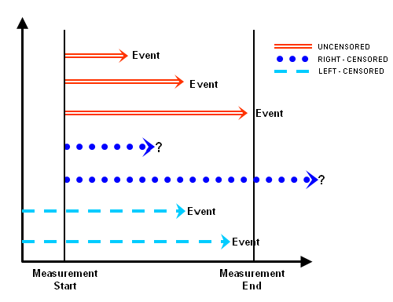

\newpage


# Cox proportional hazard regression (15 min)

Survival analysis is a common analysis in medicine. It also known as the time to event  analysis or duration analysis. It is a type of regression.  

In survival analysis, one of the most common modelling method is the Cox proportional hazard regression. 

In survival analysis, the outcome variable (dependent variable) is TIME TO THE OCCURRENCE OF AN EVENT or shortly known as the time-to-event variable.

## Survival data

In survival analysis, we follow a subject of interest until a certain time (the last follow up). Different patients will have different follow-up times.

For example, we observe a group of subjects; with the outcome variable named as 'status' and the outcome coded as 'death' or 'alive'. 

The status at the last follow up, can be an event either of 'death' or of other than death - 'non-death'. 

Any other subjects who are under  the same follow-up and still survive until the latest follow-up is known as a 'censor' case.


## Read data

For our example, data comes from a group of stroke patients. 

Data is in the stata format. 

```{r}
stroke <- read_dta(here('datasets', 'stroke_outcome.dta'))
```

Let's get a brief view 

- class of variables
- observations and variables 

```{r}
str(stroke)
glimpse(stroke)
```

## Data wrangling

We can convert many variables; in this case all labelled variable to factors variables.

```{r}
stroke2 <- stroke %>% mutate_if(is.labelled, ~as_factor(.)) 
glimpse(stroke2)
```

Collapse stroke types (variable icd10) from 3 categories to 2 categories 

```{r}
table(stroke2$icd10)
stroke2 <- stroke2 %>% mutate(icd10 = recode(icd10, 'SAH' = 'HS', 'ICB, Other Haemorrhage' = 'HS'))
```

Remember, data must have at least

1.  duration taken to develop event of interest (time variable)
2.  event of interest (event variable)

Data can have censor observations too. 



```{r  censoring, echo=FALSE, out.width='70%', fig.cap='Types of censoring', fig.align='center'}
knitr::include_graphics(here('image', 'censor2.png')) 
```

Figure \@ref(fig:censoring) shows types of censoring.


## Estimation

### The Cox proportional haazard regression

In medicine and epidemiology, the most used survival model uses the Cox proportional hazard regression. 

It is a semi-parametric model. 

This is because we do not specify the exact distribution of the baseline hazard. But the other covariates follow some form or assumed distribution.

The formula for Cox PH model $h(t,X) = h_0(t)\exp^{\sum_{i=1}^p\beta_iX_i}$

where $h_0(t)$ is the baseline hazard and $\exp^{\sum_{i=1}^p\beta_iX_i}$ is the exponential of the linear predictors.

### Null model

The null model contains no covariate.

```{r}
cox.null <- coxph(Surv(time = days, event = outcome == 'dead') ~ 1,
                 data = stroke2)
summary(cox.null)
```

### Conditional model

Main effect model

Let us include Glasgow Coma Scale as the covariate

```{r}
cox.gcs <- coxph(Surv(time = days, event = outcome == 'dead') ~ gcs,
                 data = stroke2)
summary(cox.gcs)
```

Now, model the risk for death as a function of Glasgow Coma Scale and  age. 

```{r}
cox.gcs.age <- coxph(Surv(time = days, event = outcome == 'dead') ~ gcs +
                       age, data = stroke2)
summary(cox.gcs.age)
```

Model with interaction

We add an interaction between gcs and age into our covariate. 

```{r}
cox.gcs.age.ia <- coxph(Surv(time = days, event = outcome == 'dead') ~ gcs +
                       age + gcs:age, data = stroke2)
summary(cox.gcs.age.ia)
```

### A more elaborate model

```{r}
cox.mv <- coxph(Surv(time = days, event = outcome == 'dead') ~ gcs + age +
                icd10 + sex, data = stroke2)
summary(cox.mv)
```

The problems when you have both GCS and stroke types (icd10)

```{r}
cox.mv2 <- coxph(Surv(time = days, event = outcome == 'dead') ~ age +
                icd10 + sex, data = stroke2)
summary(cox.mv2)
```

## Tidy output

Model 1

```{r}
tidy(cox.mv, exponentiate = TRUE, conf.int = TRUE)
```

Model 2

```{r}
tidy(cox.mv2, exponentiate = TRUE, conf.int = TRUE)
```


## Model checking

One of the most important assumption in Cox proportional hazars regression is the proportional hazard assumptions. 

### Testing the assumption of proportional hazard 

We can use `survival::cox.zph()`

```{r}
prop.h <- cox.zph(cox.mv2, transform = 'km', global = TRUE)
prop.h
```

